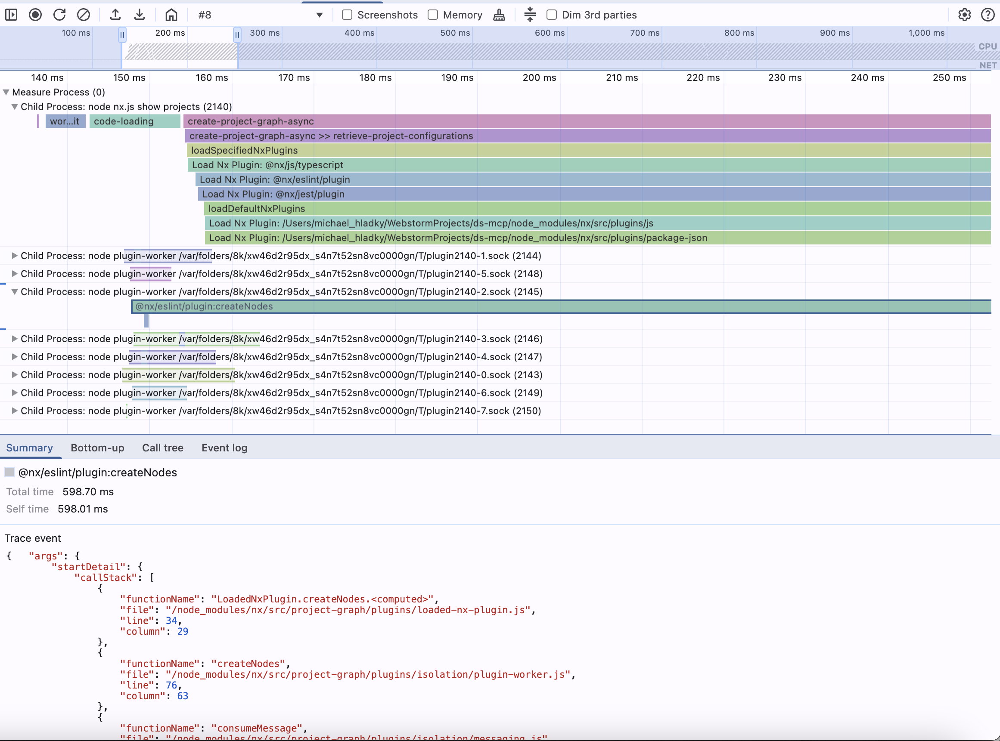

# Advanced Performance profiling for Nx

## Main Process Logging

1. Copy the `tools` folder into your workspace root.
2. Run `node ./tools/nx-advanced-profile.bin.js`.  
   The script will create a file named `.nx-profiling/nx-show-projects.<Date.now()>.profile.json`.
3. Open Chrome browser
   1. Open DevTools (F12)
   2. Go to the `Performance` tab
4. Drag and drop the `./.nx-profiling/tools/nx-advanced-profile.bin.js` file into the DevTools window.


## Main and Forked Process Logging

1. Run `node ./tools/nx-advanced-profile.postinstall.js`. This modifies the Nx sourcecode to be patched. (Don't forget
   to revert your changes)
2. Run `node ./tools/nx-advanced-profile.bin.js --noPatch`. (As it is now patched inside the file directly)
3. Drag and drop the `./.nx-profiling/tools/nx-advanced-profile.bin.js` file into the DevTools window.



## Terminal Arguments

| Option      | Shorthand | Description                   |
| ----------- | --------- | ----------------------------- |
| `--verbose` | `-v`      | Show verbose output           |
| `--noPatch` | `-p`      | Don't patch the Nx sourcecode |
| `--outDir`  | `-d`      | Output directory              |
| `--outFile` | `-f`      | Output file                   |

**Example**

```sh
node ./tools/nx-advanced-profile.bin.js --verbose --noPatch --outDir=./tools/demo --outFile=nx-show-projects
```
