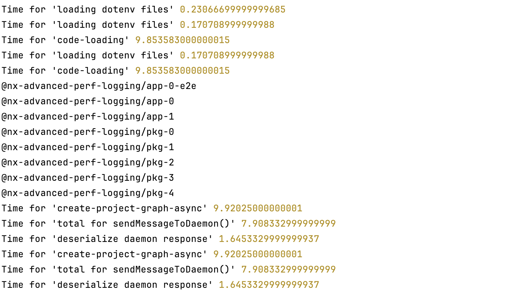
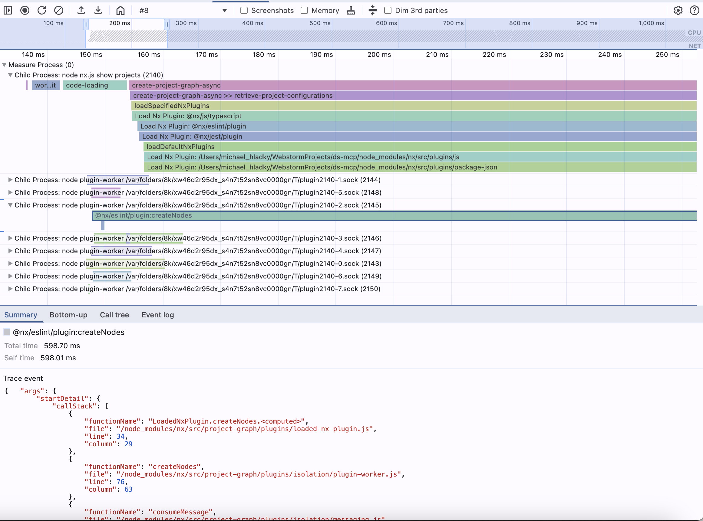
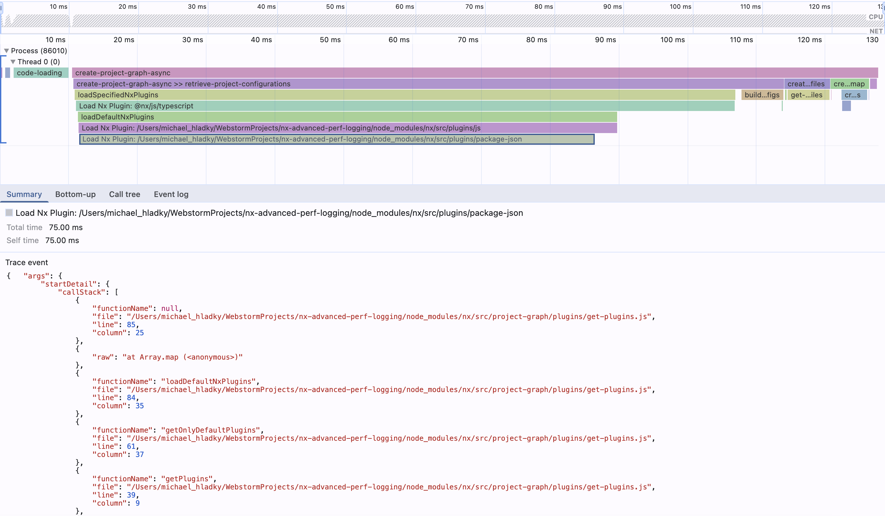

# Advanced Performance profiling for Nx

| Default                                                                | Advanced                                                                   |
| ---------------------------------------------------------------------- | -------------------------------------------------------------------------- |
|                |  |
| `NX_DAEMON=false NX_PERF_LOGGING=true NX_CACHE=false nx show projects` | `node ./nx-advanced-profile.js --args=show,projects`                       |

Nx it boosting performance, yet when there is a question, it is not always easy to understand where the time is spent.
By default, Nx provides a way to profile the performance of the CLI commands using `NX_PERF_LOGGING=true` and `NX_DAEMON=false`.
This will create a minimal text log in the terminal.

This script provides a way to profile the performance of the Nx CLI commands in high detail and in a great UI, the Chrome DevTools.
It will create a flame graph that shows the time spent in each function and the call stack, including the ones from child processes

## Main Process Logging

1. Copy the `tools` folder into your workspace root.
2. Run `node ./tools/nx-advanced-profile.bin.js`.  
   The script will create a file named `.nx-profiling/nx-show-projects.<Date.now()>.profile.json`.
3. Open Chrome browser
   1. Open DevTools
   2. Go to the `Performance` tab
   3. Drag and drop the `<process>.profile.json` file into the DevTools window.



## Main and Forked Process Logging

1. Run `node ./tools/nx-advanced-profile.postinstall.js`. This modifies the Nx sourcecode to be patched. (Don't forget
   to revert your changes)
2. Run `node ./tools/nx-advanced-profile.bin.js --noPatch`. (As it is now patched inside the file directly)
3. Open DevTools


## Terminal Arguments

| Option      | Shorthand | Description                               |
| ----------- | --------- |-------------------------------------------|
| `--args`    |           | comma separated process `--args=-t,build` |
| `--verbose` | `-v`      | Show verbose output                       |
| `--noPatch` | `-p`      | Don't patch the Nx sourcecode             |
| `--outDir`  | `-d`      | Output directory                          |
| `--outFile` | `-f`      | Output file                               |

**Example**

```sh
node ./tools/nx-advanced-profile.bin.js --verbose --noPatch --outDir=./tools/demo --outFile=nx-show-projects
```
