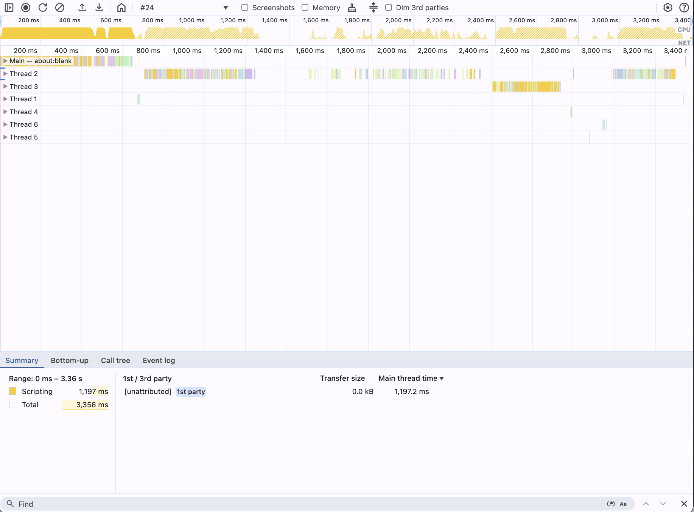

# @push-based/cpu-prof

---

## Node.js CPU Profiling and Profile Composition

The `@push-based/cpu-prof` package provides tools and utilities for collecting, and merging Node.js CPU profiles and and
visualize them as Chrome trace files.
Measure, drag & drop into Chrome, voilà.

## Features

- **CPU Profiling Support**:
    - Smart defaults to reduce friction
    - Intuitive error messages as well as actionable feedback on how to fix the issue
    - _No extra magic_, use plain Node CPU profiling over `--cpu-prof` under the hood
    - All profiles can be dragged and dropped into Chrome DevTools
- **🔥CPU Profile Merging🔥**:
    - Merge multiple CPU profile files into a single trace for easier analysis.
    - Visualize CPU profiles as Chrome trace files.
    - Merge multiple CPU profile files into a single trace for easier analysis.
- **TypeScript API**:
    - Programmatic access to all core features.
    - Use it in your own tools and workflows.

> **Example Profile:** [Trace-20250622T203446.json](../cpu-prof-e2e/mocks/minimal/Trace-20250622T203446.json)

---

## Installation

```bash
npm install @push-based/cpu-prof
```

---

## CLI Usage

This guide provides instructions for using the `@push-based/cpu-prof` CLI.

### `measure` command

**Usage:**

```bash
npx @push-based/cpu-prof measure <positionals...> [args...]
```

**Description:**
Collects CPU profiles from a Node.js process. It will handle the profiling arguments so you don't need to think about
the order. Intuitive error messages as well as actionable feedback on how to fix the issue. All profiles end up in the
same folder independent of the CWD.
In addition, it prints the enriched command to the terminal for to have the plain command visible.

**Options:**  

| Option | Type | Default | Description |
|-------------------------|-----------|----------------|----------------------------------------------|
| **`--cpu-prof-dir <dir>`** | `string` | `./profiles` | Directory to save the profile |
| **`--cpu-prof-interval <ms>`**| `number` | (not specified)| The Sampling interval in milliseconds |
| **`--cpu-prof-name <name>`** | `string` | (auto-generated)| Name of the profile (auto-generated if not specified) |
| **`--flagMain`** | `boolean` | `true` | Adds prefix and command args to the profile name of the initial process |
| **`--merge`** | `boolean` | `true` | Merge the profile into a single file. You can run the command separately by
passing false and using the merge command |

**Examples:**

- `cpu-prof measure --help` - Print help
- `cpu-prof measure "node -e 'console.log(42)'"` - Profile node evel execution
- `cpu-prof measure node ./script.js` - Profile node script
- `cpu-prof measure npm -v` - Profile npm version check
- `cpu-prof measure npx eslint --print-config ./eslint.config.mjs` - Profile eslint getConfig
- `cpu-prof measure npx eslint ./eslint.config.mjs` - Profile eslint getConfig + linting
- `cpu-prof measure nx show projects` - Profile Nx ProjsetGraph
- `cpu-prof measure nx show project cpu-prof --json` - Profile Nx TaskGraph
- `cpu-prof measure --no-merge node ./script.js` - Profile without automatic merging

#### Added DX for profiling

The CLI does nothing special to the existing Node tooling but makes it easier to use.
By default, it will apply to ensure cpu profiling arguments are applied to all childprocesses and threads and the fildes end
up in the same directory.

For smart defaults visit the [Troublshooting section](./docs/cpu-profiling.md).

If you use a Node version lower than 22 it will not thow a unintuitive error but explains the situatuion and suggests
you to update to Node >=22.

Then you can run a short command to profile the script:

```bash
cpu-prof measure node ./script.js
# will run:
# NODE_OPTIONS="--cpu-prof --cpu-prof-dir Users/user/workspace/profiles" node ./script.js
# and save the profile in ./profiles
```

Instead of searchin the profiles across the code base:

```text
/root
├── CPU.20250601.191007.42154.0.001.cpuprofile
└── packages
    ├── pak1
    │   └── CPU.20250601.191007.42154.0.003.cpuprofile
    ├── pak2
    │   └── src
    │       └── lib
    │           └── CPU.20250601.191007.42154.0.002.cpuprofile
    └── pak3
        └── CPU.20250601.191007.42154.0.004.cpuprofile
└── ...
```

Now all of them are in one place:

```text
/root
└── profiles
    ├── MAIN-CPU--<command>.20250601.191007.42154.0.001.cpuprofile
    ├── CPU.20250601.191007.42154.0.002.cpuprofile
    ├── CPU.20250601.191007.42154.0.003.cpuprofile
    └── CPU.20250601.191007.42154.0.004.cpuprofile
```

### `merge <inputDir>` command

| All processes on Overview                                                                         | Selected Process Details                                                                               |
|---------------------------------------------------------------------------------------------------|--------------------------------------------------------------------------------------------------------|
|  |  |

**Usage:**

```bash
npx @push-based/cpu-prof merge <inputDir> [args...]
```

**Description:**
Merges multiple CPU profile files from a specified directory into a single trace file. This is useful for analyzing
combined CPU usage across different processes or time periods. The merged profile can be visualized in Chrome DevTools.

**Arguments:**

| Argument         | Type     | Default | Description                                     |
|------------------|----------|---------|-------------------------------------------------|
| **`<inputDir>`** | `string` |         | Directory containing CPU profile files to merge |

**Options:**

| Option                               | Type      | Default      | Description                                                                  |
|--------------------------------------|-----------|--------------|------------------------------------------------------------------------------|
| **`--outputDir <dir>`** (`-o`)       | `string`  | `<inputDir>` | Output directory for merged profiles. Defaults to inputDir if not specified. |
| **`--startTracingInBrowser`** (`-b`) | `boolean` | `false`      | Include `TracingStartedInBrowser` event for better DevTools visualization.   |
| **`--smosh <type>`** (`-s`)          | `boolean` | `false`      | Merge profiles into one PID and indexed TIDs.                                |
| **`--focusMain`**                    | `boolean` | `true`       | Shorthand for `--smosh` and `--startTracingInBrowser`.                       |
| **`--verbose`** (`-v`)               | `boolean` | `false`      | Enable verbose logging.                                                      |

**Examples:**

- `cpu-prof merge ./path/to/profiles` - Merge all profiles from a directory
- `cpu-prof merge ./profiles -o ./merged-profiles` - Merge profiles and save to a different output directory
- `cpu-prof merge ./profiles --smosh` - Merge profiles with PID and TID normalization
- `cpu-prof merge ./profiles --no-focus-main` - Merge profiles without focus main behavior

#### Added DX for profiling

By default, input directory is the same as the ``for the`measure` command, so you can run:

```bash
cpu-prof measure npm -v
cpu-prof merge
```

By default, the CPU profiles will get merged as they are, no changes to the PIDs or TIDs.
This is done to have a better DX when navigation the DevTools performance panels lanes.
The CLI shorthand options `--focusMain` (default `true`) is responsible for this behavior.

| `--smosh`                                        | `--no-smosh`                                     |
|--------------------------------------------------|--------------------------------------------------|
|  |  |

If we could detect the main process we could also add the `--startTracingInBrowser` flag to add the
`TracingStartedInBrowser` event to the profile.
This is useful for better DevTools visualization.

| `--startTracingInBrowser`                                         | `--no-startTracingInBrowser`                                      |
|-------------------------------------------------------------------|-------------------------------------------------------------------|
|  |  |

##### Documentation features across Lanes

| Annotation Spans Across Lanes                                                                                                   | Frame Comments in Detail                                                                                                                         | Sort and Hied Tracks                                                                                                  |
|---------------------------------------------------------------------------------------------------------------------------------|--------------------------------------------------------------------------------------------------------------------------------------------------|-----------------------------------------------------------------------------------------------------------------------|
|  |  |  |

## Additional Resources

- [CPU Profiling](./docs/cpu-profiling.md) - How to use the CLI and the API
- [Node.js CPU Profiling](https://nodejs.org/api/perf_hooks.html#performanceprofiling) - Node.js API for Profiling
- [Node.js --cpu-prof](https://nodejs.org/docs/v22.16.0/api/cli.html#--cpu-prof) - Node.js API for CPU Profiling args
