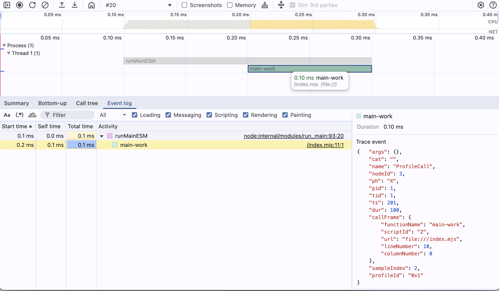
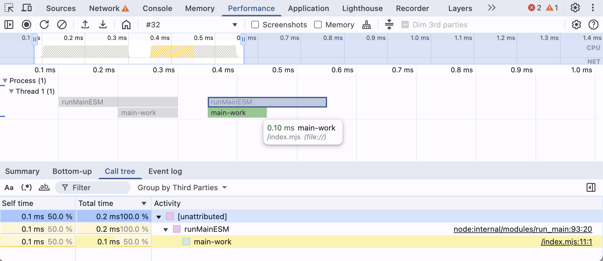

# Node CPU Profile Stitching

CPU profiling a real Node.js workload rarely yields a single file. Worker threads and child processes each emit their own `.cpuprofile`, often from different current working directories. Out of the box, there’s no native multi-profile viewer in DevTools to see all of these timelines together. This guide explains the problems that arise, and how to “stitch” multiple CPU profiles into a single coherent view you can load into Chrome DevTools.

## Table of Contents

---

- **[What are the main problems of CPU profiling of complex programs?](#what-are-the-main-problems-of-cpu-profiling-of-complex-programs)**
- **[What is profile stitching and why do we need it?](#what-is-profile-stitching-and-why-do-we-need-it)**
- **[Requirements and prerequisites](#requirements-and-prerequisites)**
- **[Stitching strategies](#stitching-strategies)**
   - [Merge multiple .cpuprofile files into one](#merge-multiple-cpuprofile-files-into-one)
   - [Align profiles on wall-clock time](#align-profiles-on-wall-clock-time)
   - [Map process and thread IDs](#map-process-and-thread-ids)
   - [Handle overlaps and gaps](#handle-overlaps-and-gaps)
   - [Normalize startTime, timeDeltas, and samples](#normalize-starttime-timedeltas-and-samples)
- **[Using the trace profiles trick to visualize multiple profiles](#using-the-trace-profiles-trick-to-visualize-multiple-profiles)**
   - [Emit Profile and ProfileChunk events](#emit-profile-and-profilechunk-events)
   - [Build a minimal trace file](#build-a-minimal-trace-file)
   - [Load in DevTools Performance panel](#load-in-devtools-performance-panel)
   - [Limitations](#limitations)
- **[Examples](#examples)**
   - [Stitch worker threads](#stitch-worker-threads)
   - [Stitch child processes (Nx build)](#stitch-child-processes-nx-build)
   - [Validate in DevTools](#validate-in-devtools)
- **[Troubleshooting](#troubleshooting)**
   - [Profiles saved in different folders (CWD differences)](#profiles-saved-in-different-folders-cwd-differences)
   - [Clock drift and time alignment issues](#clock-drift-and-time-alignment-issues)
   - [Duplicate node IDs or collisions](#duplicate-node-ids-or-collisions)

## What is profile stitching and why do we need it?

Profile stitching creates a coherent view from many CPU profiles captured across processes and threads. You generate a trace with multiple lanes using each representing a process or thread from a `.cpuprofile` file. This enables end-to-end reasoning about performance, lowers cognitive load, and makes comparisons and diffing easier. 

If you now use Chromes DevTools profile format, you get all features from the panel to visualize the trace for free. 

Ths following document describes how to stitch multiple CPU profiles into a single trace file and how to visualize it in Chrome DevTools.

## What are the main problems of CPU profiling of complex programs?

 - Many files (processes, threads); no native multi-profile viewer

   ```text
   root/
    └─ cpu-prof-threads/
       ├─ CPU.<timestamp>.<pid>.0.001.cpuprofile
       ├─ CPU.<timestamp>.<pid>.1.002.cpuprofile
       └─ CPU.<timestamp>.<pid>.2.003.cpuprofile
   ```

 - Different CWDs → scattered outputs; hard to collect

   ```text
   /root
   ├── CPU.20250601.191007.42154.0.001.cpuprofile
   └── packages
       ├── pak1
       │   └── CPU.20250601.191007.42154.0.003.cpuprofile
       ├── pak2
       │   └── src
       │       └── lib
       │           └── CPU.20250601.191007.42154.0.002.cpuprofile
       └── pak3
           └── CPU.20250601.191007.42154.0.004.cpuprofile
   ```

 - Custom transformations can introduce:
   - Clock offsets/drift
   - Overlaps/gaps across timelines
    - Duplicate node IDs; sequence is per-process (not global)
 - Mapping PID/TID to real work is unclear
 
   CPU profile filenames encode when and where a profile came from:
   
   ```text
   ┌────────────────────────────────────────────────────────────┐
   │  CPU.20250510.134625.51430.0.001.cpuprofile                │
   │      │        │      │     │   │                           │
   │      │        │      │     │   └────── %N = Sequence (001) ┘
   │      │        │      │     └────────── %T = Thread ID (0)
   │      │        │      └──────────────── %P = Process ID (51430)
   │      │        └─────────────────────── %H = Time (134625 → 13:46:25)
   │      └──────────────────────────────── %D = Start Date (20250510 → May 10, 2025)
   └─────────────────────────────────────── Fixed prefix = "CPU"
   ```
 - DevTools expects 1 profile per lane; no cross-file UX like search etc.

## Use profile stitching to visualize multiple profiles in DevTools Performance panel

- Build a minimal trace file with metadata lanes (`process_name`, `thread_name`) and emit `Profile` + `ProfileChunk` events.
- Assign each `.cpuprofile` to its own `(pid, tid)` lane; keep IDs stable per lane.
- Use different TraceEvents to represent the CPU profile chunks and to be able to visualize them in the DevTools Performance panel.
- Load the trace in DevTools Performance panel to get a multi-lane flame chart in one view.

## Using artificial ProfileChunk streaming events to trick DevTools to visualize multiple profiles

Recently Chrome added support for visualizing CPU profiles in DevTools Performance panel. This brought a couple of new trace events. One in Particular is the `ProfileChunk` event, which we will use to trick DevTools to visualize multiple profiles.

To do this, we will use the Profile and ProfileChunk events.

In shore, The performance panel groups frames into lanes based in the `pid` and `tid` of the process and thread:
 - One `Profile` per lane with stable `id`
 - First `ProfileChunk`: nodes; next chunks: `samples` + `timeDeltas`
 - Include `pid`, `tid`, `ts` (μs), `id` across chunks

To understand the data structure lets take a deep look into Sample Events.

### Sample Events

 The Profile and ProfileChunk events are here to visualize CPU profile chunks into DevTools process threads.

```ts
/** Sample Event (ph='P') – a sampling profiler event (e.g. CPU sample) */
export interface SampleEvent extends TraceEventBase {
  ph: 'P';
  name: string;
  id?: EventID;
  id2?: EventID2;
}

/** Special case: Profile start event (often ph='P', name='Profile') */
export interface ProfileEvent extends SampleEvent {
  name: 'Profile';
  args: {
    data: { startTime: number, [key: string]: any }
  };
}

/** Special case: Profile data chunk event (ph='P', name='ProfileChunk') */
export interface ProfileChunkEvent extends SampleEvent {
  name: 'ProfileChunk';
  args: {
    data: { cpuProfile: any, timeDeltas?: number[], [key: string]: any }
  };
}
```

#### ProfileEvent and ProfileChunkEvent

As CPU profiles require a couple of additional events to be present in the trace.

In the example, we include:
- `CpuProfiler::StartProfiling` - Start the CPU profiler.
- `Profile` - Register the profile chunk stream.
- `ProfileChunk` - Add a profile chunk to the stream.
- `CpuProfiler::StopProfiling` - Stop the CPU profiler.

Here we only focus on ProfileChunk events. To read about the other events, please refer to the [CpuProfiler::StartProfiling and CpuProfiler::StopProfiling](#cpuprofilerstartprofiling-and-cpuprofilerstopprofiling) section.

**Profile content:**

```json
{
  "traceEvents": [
    {
      "cat": "disabled-by-default-v8",
      "name": "CpuProfiler::StartProfiling",
      "ph": "I",
      "pid": 1,
      "tid": 1,
      "ts": 1,
      "args": {
        "data": {
          "startTime": 1
        }
      }
    },
    {
      "cat": "disabled-by-default-v8.cpu_profiler",
      "id": "0x1",
      "name": "Profile",
      "ph": "P",
      "pid": 1,
      "tid": 1,
      "ts": 1,
      "args": {
        "data": {
          "startTime": 1
        }
      }
    },
    {
      "cat": "disabled-by-default-v8.cpu_profiler",
      "name": "ProfileChunk",
      "id": "0x1",
      "ph": "P",
      "pid": 1,
      "tid": 1,
      "ts": 1,
      "args": {
        "data": {
          "cpuProfile": {
            "nodes": [
              {
                "id": 1,
                "callFrame": {
                  "functionName": "(root)",
                  "scriptId": "0",
                  "url": "",
                  "lineNumber": -1,
                  "columnNumber": -1
                },
                "children": [
                  2
                ]
              },
              {
                "id": 2,
                "callFrame": {
                  "functionName": "runMainESM",
                  "scriptId": "1",
                  "url": "node:internal/modules/run_main",
                  "lineNumber": 92,
                  "columnNumber": 19
                },
                "children": [
                  3
                ]
              },
              {
                "id": 3,
                "callFrame": {
                  "functionName": "main-work",
                  "scriptId": "2",
                  "url": "file:///index.mjs",
                  "lineNumber": 10,
                  "columnNumber": 0
                }
              }
            ],
            "samples": [
              1,
              2,
              3,
              3
            ]
          },
          "timeDeltas": [
            0,
            100,
            100,
            100
          ]
        }
      }
    },
    {
      "cat": "disabled-by-default-v8.cpu_profiler",
      "name": "ProfileChunk",
      "id": "0x1",
      "ph": "P",
      "pid": 1,
      "tid": 1,
      "ts": 1,
      "args": {
        "data": {
          "cpuProfile": {
            "samples": [
              1,
              2,
              3,
              3
            ]
          },
          "timeDeltas": [
            0,
            100,
            100,
            100
          ]
        }
      }
    },
    {
      "cat": "disabled-by-default-v8.cpu_profiler",
      "name": "ProfileChunk",
      "id": "0x1",
      "ph": "P",
      "pid": 1,
      "tid": 1,
      "ts": 1,
      "args": {
        "data": {
          "cpuProfile": {
            "samples": [
              1,
              3
            ]
          },
          "timeDeltas": [
            0,
            50
          ]
        }
      }
    },
    {
      "cat": "disabled-by-default-v8.cpu_profiler",
      "name": "ProfileChunk",
      "id": "0x1",
      "ph": "P",
      "pid": 1,
      "tid": 1,
      "ts": 1,
      "args": {
        "data": {
          "cpuProfile": {
            "samples": [
              3,
              2
            ]
          },
          "timeDeltas": [
            50,
            50
          ]
        }
      }
    },
    {
      "cat": "disabled-by-default-v8.cpu_profiler",
      "name": "ProfileChunk",
      "id": "0x1",
      "ph": "P",
      "pid": 1,
      "tid": 1,
      "ts": 1,
      "args": {
        "data": {
          "cpuProfile": {
            "samples": [
              2,
              2
            ]
          },
          "timeDeltas": [
            50,
            50
          ]
        }
      }
    },
    {
      "cat": "disabled-by-default-v8",
      "name": "CpuProfiler::StopProfiling",
      "ph": "I",
      "pid": 1,
      "tid": 1,
      "ts": 400,
      "args": {
        "data": {
          "endTime": 400
        }
      }
    }
  ]
}
````

**DevTools Performance Tab:**  


#### Streaming Profile Chunks

As the DevTools always need to be able to process live streamed data, also ProfileChunk events are streamed.

The example below shows how a CPU profile can be scattered across multiple ProfileChunk events.

In the example, we include:

- `CpuProfiler::StartProfiling` - Start the CPU profiler.
- `Profile` - Register the CPU profile to a thread.
- `ProfileChunk` - Adds only the nodes to the profile thread.
- `ProfileChunk` - Adds a sequence of samples and timeDeltas that have a complete end to the profile thread.
- `ProfileChunk` - Adds a sequence of samples and timeDeltas to the profile thread that connects with the end of the next profile chunk.
- `ProfileChunk` - Adds a sequence of samples and timeDeltas to the profile thread that connects with the start of the last profile chunk.
- `CpuProfiler::StopProfiling` - Stop the CPU profiler.

**Profile content:**

```json
{
  "traceEvents": [
    {
      "cat": "disabled-by-default-v8",
      "name": "CpuProfiler::StartProfiling",
      "ph": "I",
      "dur": 0,
      "pid": 1,
      "tid": 1,
      "ts": 1
    },
    {
      "cat": "disabled-by-default-v8.cpu_profiler",
      "id": "0x1",
      "name": "Profile",
      "ph": "P",
      "pid": 1,
      "tid": 1,
      "ts": 2,
      "args": {
        "data": {
          "startTime": 1
        }
      }
    },
    {
      "cat": "disabled-by-default-v8.cpu_profiler",
      "name": "ProfileChunk",
      "id": "0x1",
      "ph": "P",
      "pid": 1,
      "tid": 1,
      "ts": 3,
      "args": {
        "data": {
          "cpuProfile": {
            "nodes": [
              {
                "id": 1,
                "callFrame": {
                  "functionName": "(root)",
                  "scriptId": "0",
                  "url": "",
                  "lineNumber": -1,
                  "columnNumber": -1
                },
                "children": [2]
              },
              {
                "id": 2,
                "callFrame": {
                  "functionName": "runMainESM",
                  "scriptId": "1",
                  "url": "node:internal/modules/run_main",
                  "lineNumber": 92,
                  "columnNumber": 19
                },
                "children": [3]
              },
              {
                "id": 3,
                "callFrame": {
                  "functionName": "main-work",
                  "scriptId": "2",
                  "url": "file:///index.mjs",
                  "lineNumber": 10,
                  "columnNumber": 0
                }
              }
            ]
          }
        }
      }
    },
    {
      "cat": "disabled-by-default-v8.cpu_profiler",
      "name": "ProfileChunk",
      "id": "0x1",
      "ph": "P",
      "pid": 1,
      "tid": 1,
      "ts": 4,
      "args": {
        "data": {
          "cpuProfile": {
            "samples": [1, 2, 3, 3]
          },
          "timeDeltas": [0, 100, 100, 100]
        }
      }
    },
    {
      "cat": "disabled-by-default-v8.cpu_profiler",
      "name": "ProfileChunk",
      "id": "0x1",
      "ph": "P",
      "pid": 1,
      "tid": 1,
      "ts": 1,
      "args": {
        "data": {
          "cpuProfile": {
            "samples": [1, 3]
          },
          "timeDeltas": [0, 50]
        }
      }
    },
    {
      "cat": "disabled-by-default-v8.cpu_profiler",
      "name": "ProfileChunk",
      "id": "0x1",
      "ph": "P",
      "pid": 1,
      "tid": 1,
      "ts": 1,
      "args": {
        "data": {
          "cpuProfile": {
            "samples": [3, 2]
          },
          "timeDeltas": [50, 50]
        }
      }
    },
    {
      "cat": "disabled-by-default-v8.cpu_profiler",
      "name": "ProfileChunk",
      "id": "0x1",
      "ph": "P",
      "pid": 1,
      "tid": 1,
      "ts": 1,
      "args": {
        "data": {
          "cpuProfile": {
            "samples": [2, 2]
          },
          "timeDeltas": [50, 50]
        }
      }
    },
    {
      "cat": "disabled-by-default-v8",
      "name": "CpuProfiler::StopProfiling",
      "ph": "I",
      "pid": 1,
      "tid": 1,
      "ts": 1400,
      "args": {
        "data": {
          "endTime": 1400
        }
      }
    }
  ]
}
```

**DevTools Performance Tab:**  


In the image we see that the bottom up chart is available and correctly calculated across chunks.

### Limitations
 - No true cross-lane stack merge; lanes remain independent
 - Clock skew may misalign very short spans
 - Very large traces are heavy to render

## Examples

### Stitch worker threads
 - Same PID; TIDs `0..N` → N+1 lanes
 - Command:

```shell
NODE_OPTIONS="--cpu-prof --cpu-prof-dir=$PWD/profiles" node ./exmpl-create-threads.js
cpu-prof merge ./profiles -o ./out
```

### Stitch child processes (Nx build)
 - Multiple PIDs; name lanes by target/project
 - Command:

```shell
NODE_OPTIONS="--cpu-prof --cpu-prof-dir=$PWD/profiles" nx run-many -t build --skip-nx-cache
cpu-prof merge ./profiles -o ./out
```

### Validate in DevTools
 - Lanes count matches threads/processes
 - Gaps filled with idle; durations match window
 - Colors grouped by URL (source/module)

## Troubleshooting

### Profiles saved in different folders (CWD differences)
 - Use absolute `--cpu-prof-dir`; avoid relative paths per process

### Clock drift and time alignment issues
 - Prefer filename timestamps; else manual offsets
 - Clip to shared window for comparisons

### Duplicate node IDs or collisions
 - Always remap per file; dedupe by callFrame key
 - Validate `samples` reference existing nodes

