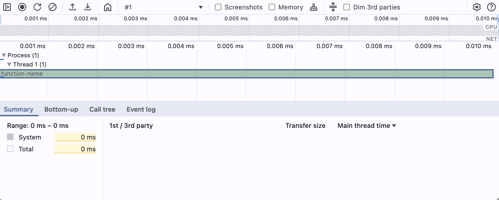
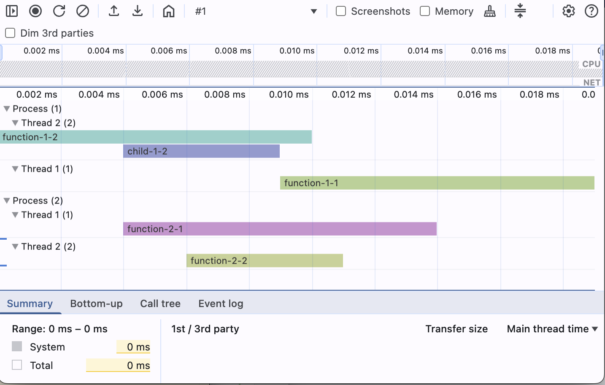
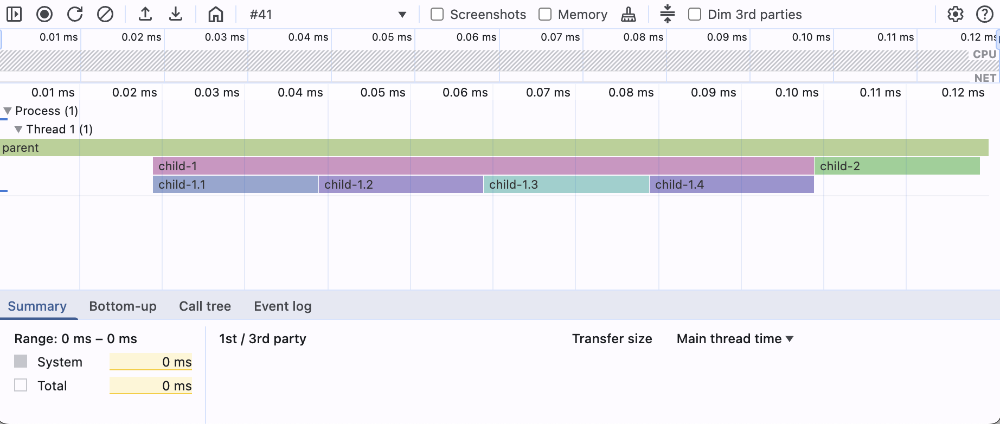
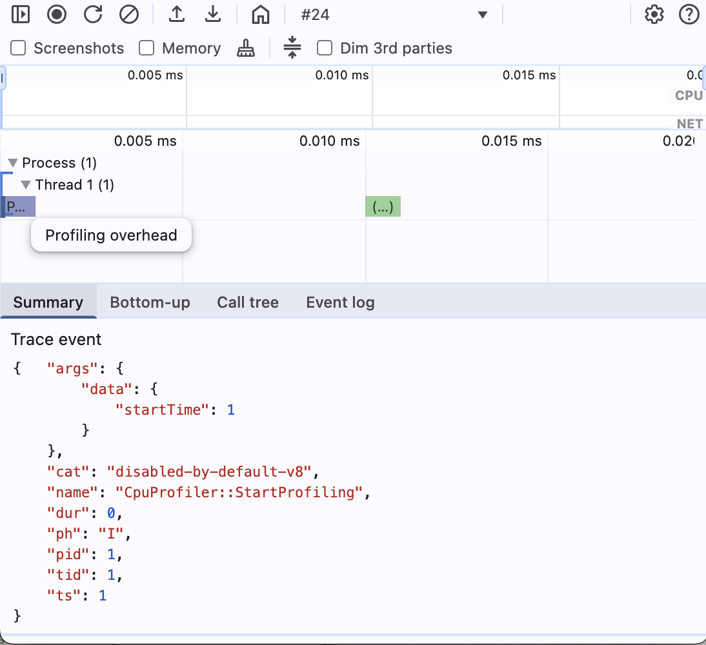
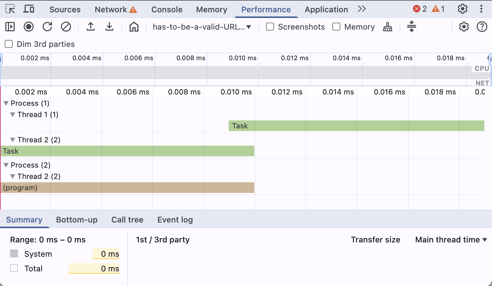
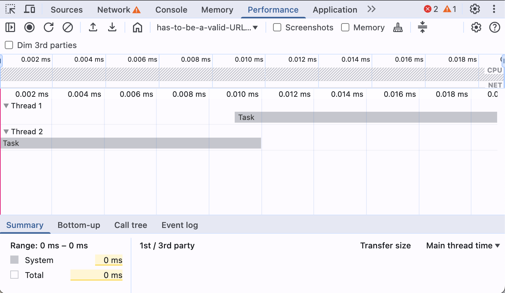
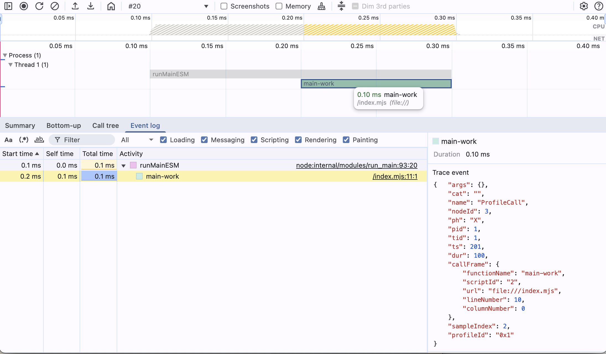
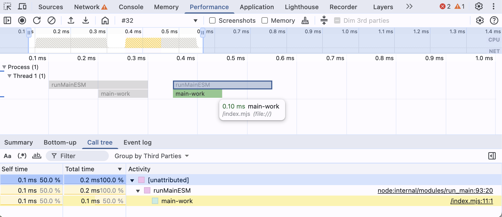
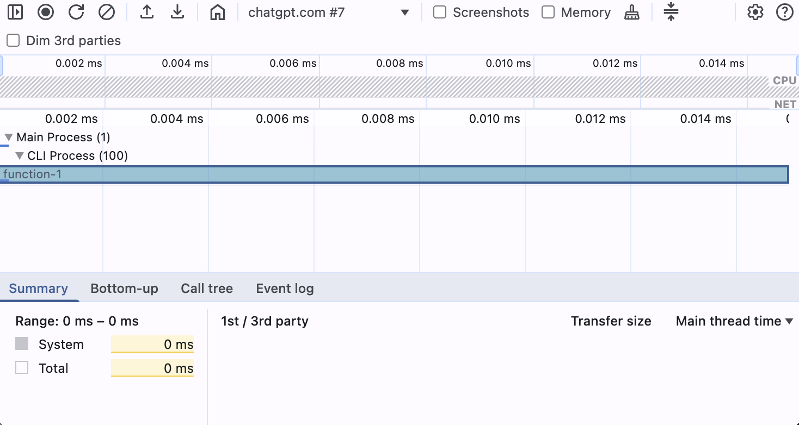

# Chrome DevTools Trace Event Profiling

This document provides a comprehensive guide to the Chrome DevTools Trace Event Format, detailing its structure, event types, and practical applications. It is intended for developers who want to generate or understand trace files for performance analysis in Chrome DevTools.

## Table of Contents

---

- **[Loading a profile](#loading-a-profile)**
- **[Top-Level Minimal Trace File Structure](#top-level-minimal-trace-file-structure)**
- **[Base Event Interface and Common Fields](#base-event-interface-and-common-fields)**
- **[Minimal Trace Profile with Duration Events](#minimal-trace-profile-with-duration-events)**
- **[PID and TID](#pid-and-tid)**
- **[Event Phase and Scope Enumerations](#event-phase-and-scope-enumerations)**
- **[Event Types in Detail](#event-types-in-detail)**
  - [Duration Events](#duration-events)
  - [Instant Events](#instant-events)
    - [CpuProfiler::StartProfiling and CpuProfiler::StopProfiling](#cpuprofilerstartprofiling-and-cpuprofilerstopprofiling)
    - [TracingStartedInBrowser](#tracingstartedinbrowser)
  - [Counter Events](#counter-events)
  - [Async (Nestable) Events](#async-nestable-events)
  - [Flow Events](#flow-events)
  - [Sample Events](#sample-events)
    - [ProfileEvent and ProfileChunkEvent](#profileevent-and-profilechunkevent)
    - [Streaming Profile Chunks](#streaming-profile-chunks)
  - [Object Events](#object-events)
  - [Metadata Events](#metadata-events)
    - [Highlighting Lanes with ThreadName metadata event](#highlighting-lanes-with-threadname-metadata-event)

---

## Loading a profile in DevTools

**In practice, when DevTools loads your JSON it:**

1. Reads the initialBreadcrumb window to set the zoomed-in range.
2. Applies any hidden/expandable rules.
3. Groups events into tracks by their cat value.
4. Renders slices for all X events, vertical lines for all R marks, and counter graphs for C events.

## Top-Level Minimal Trace File Structure

A trace file can be either a JSON array of events or an object containing a traceEvents array and additional metadata.
We define a union type `TraceFile` to accept both:

```
export type TraceFile = TraceEvent[] | TraceEventContainer;

export interface TraceEventContainer {
  traceEvents: TraceEvent[];
}
```

## Base Event Interface and Common Fields

All trace events share some common fields like `pid`, `tid`, `ts`, etc. The `sf`/`stack` fields optionally attach a stack trace to an event by referencing entries in the `stackFrames` dictionary. The `cname` field can assign a predefined color name to the event in the viewer. We define a base interface `TraceEventBase` for these:

```
/** Base interface for common trace event fields */
interface TraceEventBase {
  ph: Phase;
  name?: string;
  cat?: string;
  pid?: number;
  tid?: number;
  ts: number;
  tts?: number;
  args?: Record<string, any>;
  dur?: number;
  tdur?: number;
  /** Optional stack trace fields (for events that can carry stack info) */
  sf?: string | number;
  stack?: Array<string|number>;
  cname?: string;
}

> **Note**
> While the `args` field is defined as `Record<string, any>` for flexibility, specific event types often expect particular nested structures within `args`. These expected structures are detailed in the examples for each relevant event type throughout this document.
```

## Minimal Trace Profile with Duration Events

**Profile content:**

```json
{
  "traceEvents": [
    {
      "ph": "X",
      "name": "function-name",
      "pid": 1,
      "tid": 1,
      "dur": 10,
      "ts": 1
    }
  ]
}
```

**DevTools Performance Tab:**  


---

## PID and TID

Every trace event has a `pid` and `tid` field. The DevTools performance panel will group events by those 2 IDs and nest them accordingly.

**Profile content:**

```json
{
  "traceEvents": [
    {
      "dur": 10,
      "name": "function-1-1",
      "ph": "X",
      "pid": 1,
      "tid": 1,
      "ts": 10
    },
    {
      "dur": 10,
      "name": "function-1-2",
      "ph": "X",
      "pid": 1,
      "tid": 2,
      "ts": 1
    },
    {
      "dur": 5,
      "name": "child-1-2",
      "ph": "X",
      "pid": 1,
      "tid": 2,
      "ts": 5
    },
    {
      "dur": 10,
      "name": "function-2-1",
      "ph": "X",
      "pid": 2,
      "tid": 1,
      "ts": 5
    },
    {
      "dur": 5,
      "name": "function-2-2",
      "ph": "X",
      "pid": 2,
      "tid": 2,
      "ts": 7
    }
  ]
}
```

**DevTools Performance Tab:**  


## Event Phase and Scope Enumerations

Each trace event has a one-letter phase (`ph`) indicating its type.
We define a union of all allowed phase codes (excluding legacy/deprecated):

**Legend for Table Symbols:**

- **Support Column:**

  - ✅ **(Recommended):** The event type is well-supported, standard, and generally recommended for use.
  - ⚠️ **(Conditional/Limited):** The event type is supported but may have specific conditions, limitations, or is intended for advanced/specific use cases. Its behavior or rendering might depend on other events or configurations.
  - ❌ **(Not Recommended/Deprecated):** The event type is deprecated, not standard, has significant issues, or is generally not recommended for creating new traces.

- **Visible in DevTools Column:**
  - ✅ **(Directly Visible):** The event directly renders a distinct visual element in the main DevTools Performance panel timeline (e.g., a bar for 'X', a marker for 'I', a flame chart segment for 'P').
  - ⚠️ **(Indirectly Visible/Affects Display):** The event itself might not be a primary bar/marker, but it influences the display (e.g., creating connections like flow events, affecting track names like metadata, generating counter graphs), or its visibility depends on specific contexts or DevTools settings.
  - ❌ **(Not Visible):** The event is processed internally by DevTools but does not typically render a distinct visual element in the main timeline views.

| Phase               | Description                         | Support | Visible in DevTools |
| ------------------- | ----------------------------------- | ------- | ------------------- |
| **Duration Events** |                                     |         |                     |
| `X`                 | Complete event (begin + end in one) | ✅      | ✅                  |
| `B`                 | Duration begin                      | ⚠️      | ❌                  |
| `E`                 | Duration end                        | ⚠️      | ❌                  |
| **Instant Events**  |                                     |         |                     |
| `I`                 | Instant event                       | ✅      | ✅                  |
| **Counter Events**  |                                     |         |                     |
| `C`                 | Counter event                       | ✅      | ❌                  |
| **Async Events**    |                                     |         |                     |
| `b`                 | Async begin (nestable)              | ✅      | ❌                  |
| `n`                 | Async instant (nestable)            | ✅      | ❌                  |
| `e`                 | Async end (nestable)                | ✅      | ❌                  |
| **Flow Events**     |                                     |         |                     |
| `s`                 | Flow start                          | ✅      | ⚠️                  |
| `t`                 | Flow step                           | ✅      | ⚠️                  |
| `f`                 | Flow end                            | ✅      | ⚠️                  |
| **Sample Events**   |                                     |         |                     |
| `P`                 | Sample event                        | ✅      | ✅                  |
| **Object Events**   |                                     |         |                     |
| `N`                 | Object created                      | ✅      | ❌                  |
| `O`                 | Object snapshot                     | ✅      | ❌                  |
| `D`                 | Object destroyed                    | ✅      | ❌                  |
| **Metadata Events** |                                     |         |                     |
| `M`                 | Metadata event                      | ✅      | ⚠️                  |

---

## Event Types in Detail

### Duration Events

Duration events are by default visible in the panel. They maintain start and end duration information.

```
/** Complete Event (ph='X') – combined begin/end in one event */
export interface CompleteEvent extends TraceEventBase {
  ph: 'X';
  name: string;
  dur: number;
  tdur?: number;
}
```

The properties `dur`/`tdur` are only valid for Complete events (`ph = 'X'`) to specify elapsed time. Events (of the same `pid` and `tid`) are automatically nested based on `ts` and `dur`.

**Profile content:**

```json
{
  "traceEvents": [
    {
      "ph": "X",
      "name": "parent",
      "pid": 1,
      "tid": 1,
      "dur": 120,
      "ts": 1
    },
    {
      "ph": "X",
      "name": "child-1",
      "pid": 1,
      "tid": 1,
      "dur": 80,
      "ts": 20
    },
    {
      "ph": "X",
      "name": "child-2",
      "pid": 1,
      "tid": 1,
      "dur": 20,
      "ts": 100
    },
    {
      "ph": "X",
      "name": "child-1.1",
      "pid": 1,
      "tid": 1,
      "dur": 20,
      "ts": 20
    },
    {
      "ph": "X",
      "name": "child-1.2",
      "pid": 1,
      "tid": 1,
      "dur": 20,
      "ts": 40
    },
    {
      "ph": "X",
      "name": "child-1.3",
      "pid": 1,
      "tid": 1,
      "dur": 20,
      "ts": 60
    },
    {
      "ph": "X",
      "name": "child-1.4",
      "pid": 1,
      "tid": 1,
      "dur": 20,
      "ts": 80
    }
  ]
}
```

**DevTools Performance Tab:**  


### Instant Events

For instant events (`ph: 'I'`), a scope field `s` specifies whether the instant is thread, process, or global in scope.
We define an `InstantScope` type for this:

```
/** Scope values for instant events (ph='i') */
export type InstantScope = 't' | 'p' | 'g';
```

```
/** Instant Event (ph='i') – momentary event with scope */
export interface InstantEvent extends TraceEventBase {
  ph: 'I';
  name: string;
  s?: InstantScope;
}
```

Here's an example of a minimal trace profile with instant events as well as 1 completed duration event centered in the
trace.

**Profile content:**

```json
{
  "traceEvents": [
    {
      "ph": "I",
      "name": "marker-start",
      "pid": 1,
      "tid": 1,
      "ts": 1
    },
    {
      "ph": "X",
      "name": "main",
      "pid": 1,
      "tid": 1,
      "dur": 50,
      "ts": 25
    },
    {
      "ph": "I",
      "name": "marker-end",
      "pid": 1,
      "tid": 1,
      "ts": 100
    }
  ]
}
```

**DevTools Performance Tab:**  


Instant events default to thread scope if `s` is omitted.

> **Note**
> Instant events are used to mark the beginning and end of a trace.
> This is important to know when you are looking at the trace in DevTools.
> Specific trace events will not be visible in DevTools if it does not have an instant event at the beginning and end.

In the following, a list of noteworthy instant events is provided. Some events have dedicated sub-sections with detailed explanations and examples:

- `CpuProfiler::StartProfiling`
- `CpuProfiler::StopProfiling`
- `TracingStartedInBrowser`
- `TracingStartedInRenderer`
- `TracingStartedInProcess`
- `TracingStarted`

#### CpuProfiler::StartProfiling and CpuProfiler::StopProfiling

The example below focuses on the `CpuProfiler::StartProfiling` and `CpuProfiler::StopProfiling` events. The profile chunk events render, but are incomplete.
Profile and ProfileChunk events are not visible in DevTools if there is no `CpuProfiler::StartProfiling` event before the start of the CPU profile. The `CpuProfiler::StopProfiling` event is optional.

Read more about Profile and ProfileChunk events in the [Phases - Sample Events](#sample-events) section documentation.

**Profile content:**

```json
{
  "traceEvents": [
    {
      "cat": "disabled-by-default-v8",
      "name": "CpuProfiler::StartProfiling",
      "dur": 0,
      "ph": "I",
      "pid": 1,
      "tid": 1,
      "ts": 1,
      "args": {
        "data": {
          "startTime": 1
        }
      }
    },
    {
      "cat": "disabled-by-default-v8.cpu_profiler",
      "id": "0x1",
      "name": "Profile",
      "ph": "P",
      "pid": 1,
      "tid": 1,
      "ts": 1,
      "args": {
        "data": {
          "startTime": 1
        }
      }
    },
    {
      "cat": "disabled-by-default-v8.cpu_profiler",
      "name": "ProfileChunk",
      "id": "0x1",
      "ph": "P",
      "pid": 1,
      "tid": 1,
      "ts": 0,
      "args": {
        "data": {
          "cpuProfile": {
            "nodes": [
              {
                "id": 1,
                "callFrame": {},
                "children": [2]
              },
              {
                "id": 2,
                "callFrame": {}
              }
            ],
            "samples": [2]
          },
          "timeDeltas": [10]
        }
      }
    },
    {
      "cat": "disabled-by-default-v8",
      "name": "CpuProfiler::StopProfiling",
      "dur": 0,
      "ph": "I",
      "pid": 1,
      "tid": 1,
      "ts": 20,
      "args": {
        "data": {
          "endTime": 20
        }
      }
    }
  ]
}
```

**DevTools Performance Tab:**  


#### TracingStartedInBrowser

The example below focuses on the `TracingStartedInBrowser` event.

The content of the profile contains:

- `TracingStartedInBrowser` - The event that starts the tracing.
- `RunTask` - A `CompletedTraceEvent` with `RunTask` as `name`
  - `pid`:1, `tid`: 1, `ts`: 10, `dur`: 10
- `RunTask` - A `CompletedTraceEvent` with `RunTask` as `name`
  - `pid`:1, `tid`: 2, `ts`: 1, `dur`: 10
- `RunTask` - A `CompletedTraceEvent` with `RunTask` as `name`
  - `pid`:2, `tid`: 2, `ts`: 1, `dur`: 10

Without the `TracingStartedInBrowser` event, the DevTools will display:

- Process 1
  - Thread 1 `-X`
  - Thread 2 `X-`
- Process 2
  - Thread 1 `X-`

Adding the `TracingStartedInBrowser` event will display:

- Process 1
  - Thread 1 `-X`
  - Thread 2 `X-`

Also the events have now the highlighting we know and love form recorded traces in the browser.

**Profile content:**

```json
{
  "traceEvents": [
    {
      "cat": "devtools.timeline",
      "name": "TracingStartedInBrowser",
      "ph": "I",
      "pid": 1,
      "tid": 1,
      "ts": 1,
      "s": "t",
      "args": {
        "data": {
          "frames": [
            {
              "processId": 1,
              "url": "file://has-to-be-a-valid-URL-pattern"
            }
          ]
        }
      }
    },
    {
      "args": {},
      "cat": "disabled-by-default-devtools.timeline",
      "dur": 10,
      "name": "RunTask",
      "ph": "X",
      "pid": 1,
      "tid": 1,
      "ts": 10
    },
    {
      "args": {},
      "cat": "disabled-by-default-devtools.timeline",
      "dur": 10,
      "name": "RunTask",
      "ph": "X",
      "pid": 1,
      "tid": 2,
      "ts": 1
    },
    {
      "args": {},
      "cat": "disabled-by-default-devtools.timeline",
      "dur": 10,
      "name": "(program)",
      "ph": "X",
      "pid": 2,
      "tid": 2,
      "ts": 1
    }
  ]
}
```

**DevTools Performance Tab:**

| No tracing started in browser                                                                                                                                                                  | Tracing started in browser                                                                                                                                                                                                          |
| ---------------------------------------------------------------------------------------------------------------------------------------------------------------------------------------------- | ----------------------------------------------------------------------------------------------------------------------------------------------------------------------------------------------------------------------------------- |
|  |  |

### Counter Events

As per the Event Phase and Scope Enumerations table, Counter events are not directly visible in the DevTools timeline. They are processed internally and can be used to track numeric values over time, often visualized in separate graphs or summaries if supported by the specific trace viewer or analysis tool, rather than as distinct visual elements in the main timeline views.

```
/** Counter Event (ph='C') – tracks one or more numeric values over time */
export interface CounterEvent extends TraceEventBase {
  ph: 'C';
  name: string;
  id?: EventID;
  args: { [series: string]: number };
}
```

### Async (Nestable) Events

```
/** Async Nestable Begin (ph='b') – start of an async operation */
export interface AsyncBeginEvent extends TraceEventBase {
  ph: 'b';
  name: string;
  id?: EventID; // Represents a unique identifier for the async operation. Can be a string or number.
  id2?: EventID2; // Represents a secondary identifier, often for distinguishing local vs. global scope. Can be a string or number.
  scope?: string;
}

/** Async Nestable Instant (ph='n') – instantaneous event in an async operation */
export interface AsyncInstantEvent extends TraceEventBase {
  ph: 'n';
  name: string;
  id?: EventID; // Represents a unique identifier for the async operation. Can be a string or number.
  id2?: EventID2; // Represents a secondary identifier, often for distinguishing local vs. global scope. Can be a string or number.
  scope?: string;
}

/** Async Nestable End (ph='e') – end of an async operation */
export interface AsyncEndEvent extends TraceEventBase {
  ph: 'e';
  name?: string;
  id?: EventID; // Represents a unique identifier for the async operation. Can be a string or number.
  id2?: EventID2; // Represents a secondary identifier, often for distinguishing local vs. global scope. Can be a string or number.
  scope?: string;
}
```

### Flow Events

```
/** Flow Start event (ph='s') – indicates the beginning of a flow */
export interface FlowStartEvent extends TraceEventBase {
  ph: 's';
  name: string;
  id?: EventID; // Represents a unique identifier for the flow. Can be a string or number.
  id2?: EventID2; // Represents a secondary identifier for the flow. Can be a string or number.
}

/** Flow Step event (ph='t') – intermediate step in a flow */
export interface FlowStepEvent extends TraceEventBase {
  ph: 't';
  name: string;
  id?: EventID; // Represents a unique identifier for the flow. Can be a string or number.
  id2?: EventID2; // Represents a secondary identifier for the flow. Can be a string or number.
}

/** Flow End event (ph='f') – termination of a flow */
export interface FlowEndEvent extends TraceEventBase {
  ph: 'f';
  name: string;
  id?: EventID; // Represents a unique identifier for the flow. Can be a string or number.
  id2?: EventID2; // Represents a secondary identifier for the flow. Can be a string or number.
}
```

### Sample Events

If you ever wondered what is the best way to get a CPU profile into DevTools, this is your place. The Profile and ProfileChunk events are here to visualize CPU profile chunks into DevTools process threads.

````
/** Sample Event (ph='P') – a sampling profiler event (e.g. CPU sample) */
export interface SampleEvent extends TraceEventBase {
  ph: 'P';
  name: string;
  id?: EventID;
  id2?: EventID2;
}

/** Special case: Profile start event (often ph='P', name='Profile') */
export interface ProfileEvent extends SampleEvent {
  name: 'Profile';
  args: {
    data: { startTime: number, [key: string]: any }
  };
}

/** Special case: Profile data chunk event (ph='P', name='ProfileChunk') */
export interface ProfileChunkEvent extends SampleEvent {
  name: 'ProfileChunk';
  args: {
    data: { cpuProfile: any, timeDeltas?: number[], [key: string]: any }
  };
}

#### ProfileEvent and ProfileChunkEvent

As CPU profiles require a couple of additional events to be present in the trace.

In the example, we include:
- `CpuProfiler::StartProfiling` - Start the CPU profiler.
- `Profile` - Register the profile chunk stream.
- `ProfileChunk` - Add a profile chunk to the stream.
- `CpuProfiler::StopProfiling` - Stop the CPU profiler.

Here we only focus on ProfileChunk events. To read about the other events, please refer to the [CpuProfiler::StartProfiling and CpuProfiler::StopProfiling](#cpuprofilerstartprofiling-and-cpuprofilerstopprofiling) section.

**Profile content:**

```json
{
  "traceEvents": [
    {
      "cat": "disabled-by-default-v8",
      "name": "CpuProfiler::StartProfiling",
      "ph": "I",
      "pid": 1,
      "tid": 1,
      "ts": 1,
      "args": {
        "data": {
          "startTime": 1
        }
      }
    },
    {
      "cat": "disabled-by-default-v8.cpu_profiler",
      "id": "0x1",
      "name": "Profile",
      "ph": "P",
      "pid": 1,
      "tid": 1,
      "ts": 1,
      "args": {
        "data": {
          "startTime": 1
        }
      }
    },
    {
      "cat": "disabled-by-default-v8.cpu_profiler",
      "name": "ProfileChunk",
      "id": "0x1",
      "ph": "P",
      "pid": 1,
      "tid": 1,
      "ts": 1,
      "args": {
        "data": {
          "cpuProfile": {
            "nodes": [
              {
                "id": 1,
                "callFrame": {
                  "functionName": "(root)",
                  "scriptId": "0",
                  "url": "",
                  "lineNumber": -1,
                  "columnNumber": -1
                },
                "children": [
                  2
                ]
              },
              {
                "id": 2,
                "callFrame": {
                  "functionName": "runMainESM",
                  "scriptId": "1",
                  "url": "node:internal/modules/run_main",
                  "lineNumber": 92,
                  "columnNumber": 19
                },
                "children": [
                  3
                ]
              },
              {
                "id": 3,
                "callFrame": {
                  "functionName": "main-work",
                  "scriptId": "2",
                  "url": "file:///index.mjs",
                  "lineNumber": 10,
                  "columnNumber": 0
                }
              }
            ],
            "samples": [
              1,
              2,
              3,
              3
            ]
          },
          "timeDeltas": [
            0,
            100,
            100,
            100
          ]
        }
      }
    },
    {
      "cat": "disabled-by-default-v8.cpu_profiler",
      "name": "ProfileChunk",
      "id": "0x1",
      "ph": "P",
      "pid": 1,
      "tid": 1,
      "ts": 1,
      "args": {
        "data": {
          "cpuProfile": {
            "samples": [
              1,
              2,
              3,
              3
            ]
          },
          "timeDeltas": [
            0,
            100,
            100,
            100
          ]
        }
      }
    },
    {
      "cat": "disabled-by-default-v8.cpu_profiler",
      "name": "ProfileChunk",
      "id": "0x1",
      "ph": "P",
      "pid": 1,
      "tid": 1,
      "ts": 1,
      "args": {
        "data": {
          "cpuProfile": {
            "samples": [
              1,
              3
            ]
          },
          "timeDeltas": [
            0,
            50
          ]
        }
      }
    },
    {
      "cat": "disabled-by-default-v8.cpu_profiler",
      "name": "ProfileChunk",
      "id": "0x1",
      "ph": "P",
      "pid": 1,
      "tid": 1,
      "ts": 1,
      "args": {
        "data": {
          "cpuProfile": {
            "samples": [
              3,
              2
            ]
          },
          "timeDeltas": [
            50,
            50
          ]
        }
      }
    },
    {
      "cat": "disabled-by-default-v8.cpu_profiler",
      "name": "ProfileChunk",
      "id": "0x1",
      "ph": "P",
      "pid": 1,
      "tid": 1,
      "ts": 1,
      "args": {
        "data": {
          "cpuProfile": {
            "samples": [
              2,
              2
            ]
          },
          "timeDeltas": [
            50,
            50
          ]
        }
      }
    },
    {
      "cat": "disabled-by-default-v8",
      "name": "CpuProfiler::StopProfiling",
      "ph": "I",
      "pid": 1,
      "tid": 1,
      "ts": 400,
      "args": {
        "data": {
          "endTime": 400
        }
      }
    }
  ]
}
````

**DevTools Performance Tab:**  


#### Streaming Profile Chunks

As the DevTools always need to be able to process live streamed data, also ProfileChunk events are streamed.

The example below shows how a CPU profile can be scattered across multiple ProfileChunk events.

In the example, we include:

- `CpuProfiler::StartProfiling` - Start the CPU profiler.
- `Profile` - Register the CPU profile to a thread.
- `ProfileChunk` - Adds only the nodes to the profile thread.
- `ProfileChunk` - Adds a sequence of samples and timeDeltas that have a complete end to the profile thread.
- `ProfileChunk` - Adds a sequence of samples and timeDeltas to the profile thread that connects with the end of the next profile chunk.
- `ProfileChunk` - Adds a sequence of samples and timeDeltas to the profile thread that connects with the start of the last profile chunk.
- `CpuProfiler::StopProfiling` - Stop the CPU profiler.

**Profile content:**

```json
{
  "traceEvents": [
    {
      "cat": "disabled-by-default-v8",
      "name": "CpuProfiler::StartProfiling",
      "ph": "I",
      "dur": 0,
      "pid": 1,
      "tid": 1,
      "ts": 1
    },
    {
      "cat": "disabled-by-default-v8.cpu_profiler",
      "id": "0x1",
      "name": "Profile",
      "ph": "P",
      "pid": 1,
      "tid": 1,
      "ts": 2,
      "args": {
        "data": {
          "startTime": 1
        }
      }
    },
    {
      "cat": "disabled-by-default-v8.cpu_profiler",
      "name": "ProfileChunk",
      "id": "0x1",
      "ph": "P",
      "pid": 1,
      "tid": 1,
      "ts": 3,
      "args": {
        "data": {
          "cpuProfile": {
            "nodes": [
              {
                "id": 1,
                "callFrame": {
                  "functionName": "(root)",
                  "scriptId": "0",
                  "url": "",
                  "lineNumber": -1,
                  "columnNumber": -1
                },
                "children": [2]
              },
              {
                "id": 2,
                "callFrame": {
                  "functionName": "runMainESM",
                  "scriptId": "1",
                  "url": "node:internal/modules/run_main",
                  "lineNumber": 92,
                  "columnNumber": 19
                },
                "children": [3]
              },
              {
                "id": 3,
                "callFrame": {
                  "functionName": "main-work",
                  "scriptId": "2",
                  "url": "file:///index.mjs",
                  "lineNumber": 10,
                  "columnNumber": 0
                }
              }
            ]
          }
        }
      }
    },
    {
      "cat": "disabled-by-default-v8.cpu_profiler",
      "name": "ProfileChunk",
      "id": "0x1",
      "ph": "P",
      "pid": 1,
      "tid": 1,
      "ts": 4,
      "args": {
        "data": {
          "cpuProfile": {
            "samples": [1, 2, 3, 3]
          },
          "timeDeltas": [0, 100, 100, 100]
        }
      }
    },
    {
      "cat": "disabled-by-default-v8.cpu_profiler",
      "name": "ProfileChunk",
      "id": "0x1",
      "ph": "P",
      "pid": 1,
      "tid": 1,
      "ts": 1,
      "args": {
        "data": {
          "cpuProfile": {
            "samples": [1, 3]
          },
          "timeDeltas": [0, 50]
        }
      }
    },
    {
      "cat": "disabled-by-default-v8.cpu_profiler",
      "name": "ProfileChunk",
      "id": "0x1",
      "ph": "P",
      "pid": 1,
      "tid": 1,
      "ts": 1,
      "args": {
        "data": {
          "cpuProfile": {
            "samples": [3, 2]
          },
          "timeDeltas": [50, 50]
        }
      }
    },
    {
      "cat": "disabled-by-default-v8.cpu_profiler",
      "name": "ProfileChunk",
      "id": "0x1",
      "ph": "P",
      "pid": 1,
      "tid": 1,
      "ts": 1,
      "args": {
        "data": {
          "cpuProfile": {
            "samples": [2, 2]
          },
          "timeDeltas": [50, 50]
        }
      }
    },
    {
      "cat": "disabled-by-default-v8",
      "name": "CpuProfiler::StopProfiling",
      "ph": "I",
      "pid": 1,
      "tid": 1,
      "ts": 1400,
      "args": {
        "data": {
          "endTime": 1400
        }
      }
    }
  ]
}
```

**DevTools Performance Tab:**  


In the image we see that the bottom up chart is available and correctly calculated across chunks.

### Object Events

```
/** Object Created event (ph='N') – an object instance is created */
export interface ObjectCreatedEvent extends TraceEventBase {
  ph: 'N';
  name: string;
  id: EventID;
}

/** Object Snapshot event (ph='O') – state snapshot of an object */
export interface ObjectSnapshotEvent extends TraceEventBase {
  ph: 'O';
  name: string;
  id: EventID;
  args: { snapshot: any };
}

/** Object Destroyed event (ph='D') – an object is destroyed/freed */
export interface ObjectDestroyedEvent extends TraceEventBase {
  ph: 'D';
  name: string;
  id: EventID;
}
```

**Profile content:**

```json
{
  "traceEvents": [
    {
      "ph": "N",
      "name": "MyWidget",
      "id": "widget-123",
      "pid": 1,
      "tid": 1,
      "ts": 10
    },
    {
      "ph": "O",
      "name": "MyWidget",
      "id": "widget-123",
      "pid": 1,
      "tid": 1,
      "ts": 15,
      "args": {
        "snapshot": {
          "width": 200,
          "height": 100,
          "color": "blue"
        }
      }
    },
    {
      "ph": "D",
      "name": "MyWidget",
      "id": "widget-123",
      "pid": 1,
      "tid": 1,
      "ts": 20
    }
  ]
}
```

> **Note**
> DevTools Performance Tab omits object-lifecycle events entirely.

### Metadata Events

```
interface MetadataEventBase extends TraceEventBase {
  ph: 'M';
  pid?: number;
  tid?: number;
}

export interface ProcessNameEvent extends MetadataEventBase {
  name: 'process_name';
  args: { name: string };
}
export interface ThreadNameEvent extends MetadataEventBase {
  name: 'thread_name';
  args: { name: string };
}
```

**Profile content:**

```json
{
  "traceEvents": [
    {
      "ph": "M",
      "name": "process_name",
      "pid": 1,
      "args": {
        "name": "renderer"
      }
    },
    {
      "ph": "M",
      "name": "thread_name",
      "pid": 1,
      "tid": 100,
      "args": {
        "name": "MainThread"
      }
    }
  ]
}
```

**DevTools Performance Tab:**  


#### Highlighting Lanes with ThreadName metadata event

<!-- TODO: Add image showing focused CPU profile with CrRendererMain thread highlighting -->
<!--  -->

If placed, the tread name changes to "Main -- <URL:FROM_START_TRACING_IN_BROWSER_EVENT>". Also, Lane is focus by default in the DevTools Performance tab.

**Profile content:**

```json
    {
      "cat": "__metadata",
      "name": "thread_name",
      "ph": "M",
      "pid": 1,
      "tid": 1,
      "ts": 0,
      "args": {
        "name": "CrRendererMain"
      }
    },
```

**DevTools Performance Tab:**

<!-- TODO: Add image showing focused CPU profile with CrRendererMain thread highlighting -->
<!--  -->

---


# TODO SNIPPETS 


Might be responsible for coloring the main thread in the DevTools Performance tab.

> **NOTE:** Order of events is the same as in real tract. (Not sure if it matters so far)
```jsonc
[
  // Controles the process name aas url and 
  {
      "args": {
        "name": "CrRendererMain"
      },
      "cat": "__metadata",
      "name": "thread_name",
      "ph": "M",
      "pid": 10001,
      "tid": 0,
      "ts": 0
    },
  {"args":{"name":"CrBrowserMain"},"cat":"__metadata","name":"thread_name","ph":"M","pid":3415,"tid":17911,"ts":0},
  {
    "args": {
      "data": {
        "frameTreeNodeId": 6804,
        "frames": [
          {
            "frame": "F2145804653F1B7DEB75E1AA45F3EB51",
            "isInPrimaryMainFrame": true,
            "isOutermostMainFrame": true,
            "name": "",
            "processId": 60433,
            "url": "about:blank"
          }
        ],
        "persistentIds": true
      }
    },
    "cat": "disabled-by-default-devtools.timeline",
    "name": "TracingStartedInBrowser",
    "ph": "I",
    "pid": 3415,
    "s": "t",
    "tid": 17911,
    "ts": 522975545427,
    "tts": 11966070239
  },
  {
    "args": {
      "data": {
        "frame": "F2145804653F1B7DEB75E1AA45F3EB51",
        "isMainFrame": true,
        "isOutermostMainFrame": true,
        "name": "",
        "page": "F2145804653F1B7DEB75E1AA45F3EB51",
        "url": "https://ng-de.org/"
      }
    },
    "cat": "devtools.timeline",
    "dur": 10,
    "name": "CommitLoad",
    "ph": "X",
    "pid": 60433,
    "tdur": 10,
    "tid": 1004024184,
    "ts": 522975567416,
    "tts": 46904
  }
]
```

---

This is related to group threads into the "Thread pool" lane.

```json
[
  {"args":{"name":"ThreadPoolServiceThread"},"cat":"__metadata","name":"thread_name","ph":"M","pid":60433,"tid":1004024246,"ts":0},
  {"args":{"name":"ThreadPoolForegroundWorker"},"cat":"__metadata","name":"thread_name","ph":"M","pid":60433,"tid":1004024247,"ts":0},
  {"args":{"name":"ThreadPoolForegroundWorker"},"cat":"__metadata","name":"thread_name","ph":"M","pid":60433,"tid":1004024249,"ts":0},
  {"args":{"name":"ThreadPoolForegroundWorker"},"cat":"__metadata","name":"thread_name","ph":"M","pid":60433,"tid":1004024432,"ts":0},
  {"args":{"name":"ThreadPoolForegroundWorker"},"cat":"__metadata","name":"thread_name","ph":"M","pid":60433,"tid":1004024285,"ts":0},
  {"args":{"name":"ThreadPoolForegroundWorker"},"cat":"__metadata","name":"thread_name","ph":"M","pid":60433,"tid":1004024553,"ts":0},
  {"args":{"name":"ThreadPoolForegroundWorker"},"cat":"__metadata","name":"thread_name","ph":"M","pid":60433,"tid":1004024562,"ts":0},
  {"args":{"name":"ThreadPoolForegroundWorker"},"cat":"__metadata","name":"thread_name","ph":"M","pid":60433,"tid":1004024563,"ts":0},
  {"args":{"name":"ThreadPoolForegroundWorker"},"cat":"__metadata","name":"thread_name","ph":"M","pid":3415,"tid":17961,"ts":0},
  {"args":{"name":"ThreadPoolForegroundWorker"},"cat":"__metadata","name":"thread_name","ph":"M","pid":3421,"tid":18039,"ts":0}
]
```
