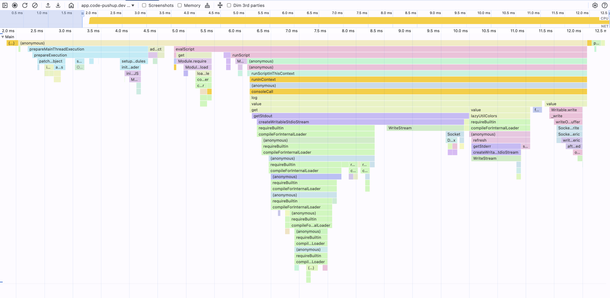
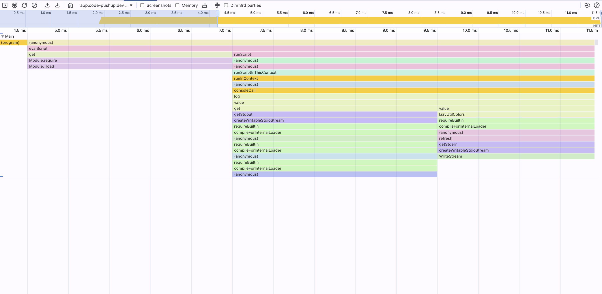
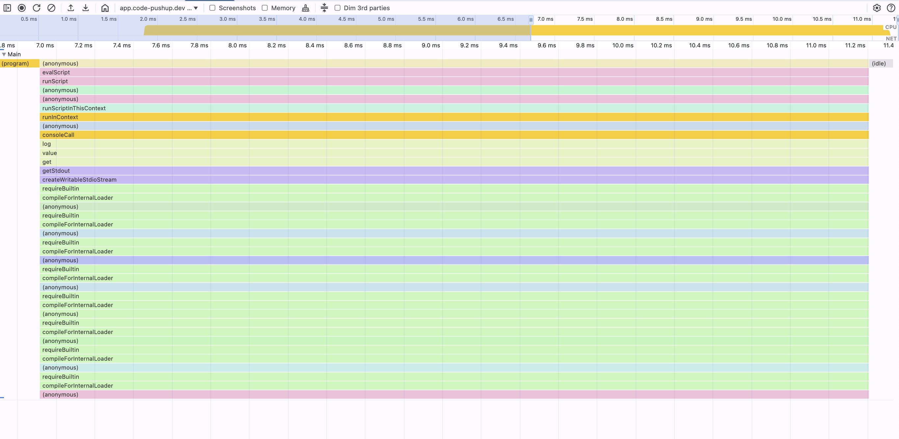
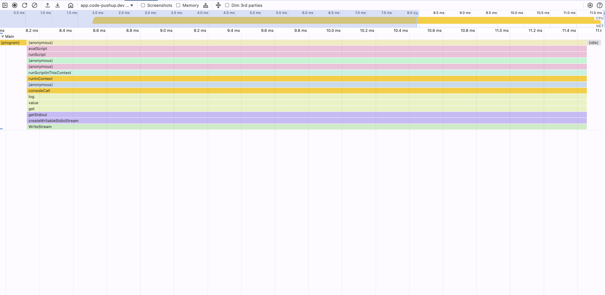
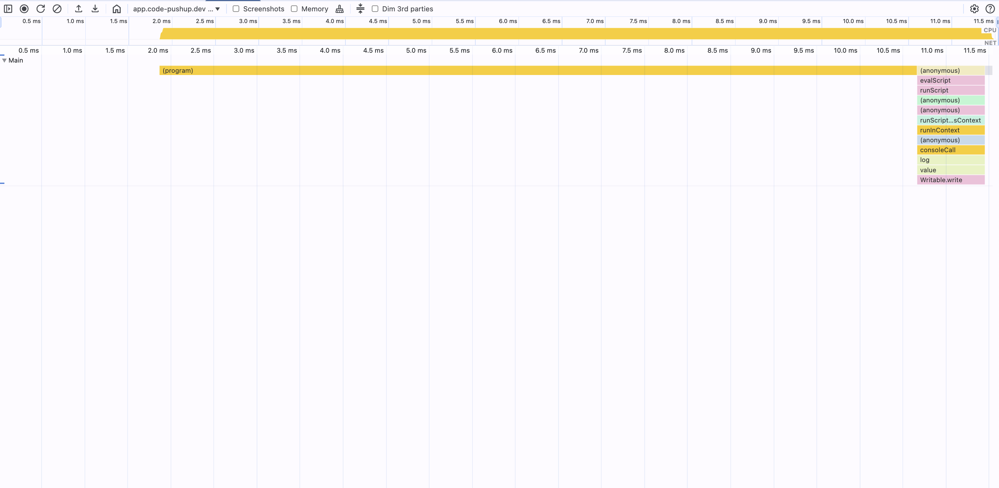

# Node CPU Profiling

## What is CPU profiling and why do we need it?

CPU profiling is a technique used to analyze the performance of a program by collecting data about its CPU usage. It
helps identify which parts of the code consume the most CPU resources, allowing developers to optimize performance.

## Create a CPU Profile

To create a CPU profile, you can use the `--cpu-prof` flag when running your Node.js application. This will generate a
`.cpuprofile` file containing the profiling data.

> **Official docs:**: [Node.js CPU Profiling](https://nodejs.org/api/inspector.html#inspector_cpu_profiling)

```shell
node --cpu-prof index.js
```

This command will create a file named `CPU.<timestamp>.<pid>.<tid>.<sequence>.cpuprofile` in the current working
directory.

### CPU Profile Filename

```shell
┌────────────────────────────────────────────────────────────┐
│  CPU.20250510.134625.51430.0.001.cpuprofile                │
│      │        │      │     │   │                           │
│      │        │      │     │   └────── %N = Sequence (001) ┘
│      │        │      │     └────────── %T = Thread ID (0)
│      │        │      └──────────────── %P = Process ID (51430)
│      │        └─────────────────────── %H = Time (134625 → 13:46:25)
│      └──────────────────────────────── %D = Start Date (20250510 → May 10, 2025)
└─────────────────────────────────────── Fixed prefix = "CPU"
```

The date and time are from when wall-clock write time (when the profile was flushed).

### Process and Thread IDs

As we see the file name contains a PID and TID, but what creates new `PID` and `TID` in `.cpuprofile` files?

A program (started process) can create new threads and processes inside it.
Every new process and thread gets a new ID, depending on the methods used to create new threads and processes.

The following script logs PID and TID of the started node program

```shell
node -e "const { spawn } = require('child_process'); 
const { threadId } = require(\"worker_threads\");
console.log(\"PID:\", process.pid, \"TID:\", threadId);"
```

_Outputs:_
`PID: 51430 TID: 0`

**`PID` → Process ID**

- Comes from the **OS-level process ID**
- A new PID is created whenever you start a new process, such as:
    - `child_process.fork()`
    - `child_process.spawn()`
    - `child_process.exec()`
    - Running `node` directly (CLI, script)

```shell
node -e "const { spawn } = require('child_process');
spawn(
  process.execPath,
  ['-e','const { threadId } = require(\"worker_threads\"); console.log(\"PID:\", process.pid, \"TID:\", threadId);'],
  { stdio: 'inherit' }
);
spawn(
  process.execPath,
  ['-e','const { threadId } = require(\"worker_threads\"); console.log(\"PID:\", process.pid, \"TID:\", threadId);'],
  { stdio: 'inherit' }
);
"
```

_Outputs:_
`PID: 51430 TID: 0`
`PID: 51431 TID: 0`

The generated profiles if we add `--cpu-prof` to the command would look like this:

- `CPU.20250510.135416.51430.0.001.cpuprofile`
- `CPU.20250510.135416.51431.0.001.cpuprofile`

**`TID` → Thread ID**

- Comes from V8's internal thread registry
- Most Node.js apps are single-threaded → TID = `0` or `1`
- A new TID is created only when you spawn a `Worker`:
    - `new Worker()` from `node:worker_threads`
    - Each worker gets a new `threadId` from the runtime

```shell
node -e 'const { Worker } = require("worker_threads");
new Worker(
  `const { threadId } = require("worker_threads");
   console.log("PID: " + process.pid + "  TID: " + threadId);`,
  { eval: true }
);
'
```

_Outputs:_
`PID: 51430 TID: 1`
`PID: 51430 TID: 2`

The generated profiles if we add `--cpu-prof` to the command would look like this:

- `CPU.20250510.135416.51430.1.001.cpuprofile`
- `CPU.20250510.135416.51430.2.002.cpuprofile`

### CPU Profiling arguments

> **Note:** The "Added in" versions indicate when these flags were introduced. Some flags were initially experimental. Always consult the official [Node.js documentation](https://nodejs.org/api/cli.html) for the most current information on their status and behavior in your Node.js version.

| Flag                  | Added in      | Default                                                     | Description                                                               |
|-----------------------|---------------|-------------------------------------------------------------|---------------------------------------------------------------------------|
| `--cpu-prof`          | v12.0.0 (Exp) | off                                                         | Starts the V8 CPU profiler on startup and writes a `.cpuprofile` on exit. |
| `--cpu-prof-dir`      | v12.0.0 (Exp) | Current working directory. If `--diagnostic-dir` is set, it defaults to that directory. | Directory where `--cpu-prof` outputs are written.                         |
| `--cpu-prof-name`     | v12.0.0 (Exp) | `CPU.${yyyymmdd}.${hhmmss}.${pid}.${tid}.${seq}.cpuprofile` | Filename to use for the CPU profile.                                      |
| `--cpu-prof-interval` | v12.2.0 (Exp) | `1000` (microseconds/µs)                                    | Sampling interval in microseconds for the CPU profiler.                   |

The following command-line arguments can be used to control CPU profiling in Node.js. These options can also be set using the `NODE_OPTIONS` environment variable (e.g., `NODE_OPTIONS="--cpu-prof --cpu-prof-interval=50" node index.js`).

#### `--cpu-prof`

*   **Purpose**: Starts the V8 CPU profiler on application startup. When the Node.js process exits, a `.cpuprofile` file containing the profiling data is written.
*   **Default**: `off`
*   **Usage Example**:
    ```shell
    node --cpu-prof my-app.js
    ```
    This command will profile `my-app.js` and generate a profile file (e.g., `CPU.<timestamp>.<pid>.<tid>.<sequence>.cpuprofile`) in the current working directory upon exit.

#### `--cpu-prof-dir`

*   **Purpose**: Specifies the directory where CPU profile files generated by `--cpu-prof` will be saved.
*   **Default**: The current working directory. If `--diagnostic-dir` is set, it defaults to that directory instead.
*   **Usage Example**:
    ```shell
    node --cpu-prof --cpu-prof-dir=./profiles my-app.js
    ```
    This will save the CPU profile for `my-app.js` into the `./profiles` subdirectory (relative to the current working directory). If the directory doesn't exist, Node.js will attempt to create it.
*   **Notes**:
    *   If `--cpu-prof-name` specifies an absolute path, `--cpu-prof-dir` is ignored.
    *   Ensure the specified directory is writable by the Node.js process.

#### `--cpu-prof-name`

*   **Purpose**: Specifies a custom filename for the generated CPU profile.
*   **Default**: `CPU.<yyyymmdd>.<hhmmss>.<pid>.<tid>.<seq>.cpuprofile` (see [CPU Profile Filename](#cpu-profile-filename) for details on the pattern).
*   **Usage Example**:
    ```shell
    node --cpu-prof --cpu-prof-name="my-custom-profile.cpuprofile" my-app.js
    ```
    This will generate a profile file named `my-custom-profile.cpuprofile`. If `--cpu-prof-dir` is also specified, the file will be placed in that directory; otherwise, it will be in the current working directory.
*   **Notes**:
    *   You can include the same placeholders available in the default filename (e.g., `${pid}`, `${timestamp}`) in your custom name.
    *   If an absolute path is provided (e.g., `/tmp/my-custom-profile.cpuprofile`), the file will be saved there, and `--cpu-prof-dir` will be ignored.

#### `--cpu-prof-interval`

*   **Purpose**: Sets the sampling interval for the CPU profiler in microseconds (µs). This determines how frequently the profiler captures the state of the JavaScript call stack.
*   **Default**: `1000` (microseconds/µs), which is 1 millisecond.
*   **Usage Example**:
    ```shell
    node --cpu-prof --cpu-prof-interval=100 -e "console.log('CPU')"
    ```
    This command profiles an inline script (`console.log('CPU')`) with a sampling interval of 100 microseconds.
*   **Considerations for Choosing a Sampling Interval**:

##### How to use interval?

    The `--cpu-prof-interval` flag specifies the sampling frequency in microseconds.
    *   A **smaller interval** (e.g., `50` µs, `100` µs) collects more samples, providing a **highly detailed profile**. This is useful for short-running processes or identifying fine-grained bottlenecks. However, it results in **larger `.cpuprofile` files** and can add slightly **more overhead** to the profiled application.
    *   A **larger interval** (e.g., `1000` µs, `5000` µs) collects fewer samples, leading to **smaller profile files** and **less overhead**. This is suitable for longer-running processes or when a high-level overview of CPU usage is sufficient.

    Start with the default (`1000` µs) and adjust based on the granularity of data you need and the acceptable size of the generated profile files. The table below illustrates the impact of different intervals on a sample application.

##### Illustrative Example: Impact of Interval Choice

The following example demonstrates the practical impact of varying the `--cpu-prof-interval`. We'll generate profiles for a very simple script using different intervals and then analyze the resulting `.cpuprofile` files to observe these effects.

Generate profiles:
```shell
for interval in 5000 6000 7000; do echo "Profiling with interval: ${interval}μs" && node --cpu-prof --cpu-prof-interval=${interval} --cpu-prof-dir=./profiles --cpu-prof-name="empty-${interval}.cpuprofile" -e "console.log('Hello CPU Profile with ${interval}μs interval!')"; done
```

Analyze and print:
```shell
node -e "const fs=require('fs');const path=require('path');const dir='./profiles';const files=fs.readdirSync(dir).filter(f=>f.endsWith('.cpuprofile')).sort((a,b)=>{const aNum=parseInt(a.match(/(\d+)/)?.[1]||0);const bNum=parseInt(b.match(/(\d+)/)?.[1]||0);return aNum-bNum||a.localeCompare(b);});console.log('| Profile File | Interval | Duration (Script) | Nodes | Samples | Size |');console.log('|-------------|----------|-------------------|-------|---------|-----|');files.forEach(file=>{const data=JSON.parse(fs.readFileSync(path.join(dir,file),'utf8'));const stats=fs.statSync(path.join(dir,file));const interval=file.match(/(\d+)/)?.[1]||'?';const duration=(data.endTime-data.startTime)/1000;const nodes=data.nodes?.length||0;const samples=data.samples?.length||0;const size=(stats.size/1024).toFixed(1);console.log('| '+file+' | '+interval+' us | '+duration.toFixed(1)+' ms | '+nodes+' | '+samples+' | '+size+' KB |');});"
```

| Profile File             | Sampling Interval | Duration (Script) | Total Nodes | Total Samples | File Size | Visual Example |
|--------------------------|-------------------|-------------------|-------------|---------------|-----------|----------------|
| `empty-1.cpuprofile`     | 1 µs              | 58.5 ms           | 472         | 10,514        | 162.0 KB  |  |
| `empty-10.cpuprofile`    | 10 µs             | 17.5 ms           | 338         | 931           | 73.3 KB   |  |
| `empty-50.cpuprofile`    | 50 µs             | 16.0 ms           | 245         | 312           | 45.2 KB   |  |
| `empty-100.cpuprofile`   | 100 µs            | 15.0 ms           | 153         | 100           | 28.9 KB   |  |
| `empty-1000.cpuprofile`  | 1000 µs (1 ms)    | 13.9 ms           | 49          | 10            | 8.6 KB    |  |
| `empty-2000.cpuprofile`  | 2000 µs (2 ms)    | 14.2 ms           | 32          | 7             | 5.8 KB    |  |
| `empty-4000.cpuprofile`  | 4000 µs (4 ms)    | 13.5 ms           | 18          | 4             | 3.2 KB    |  |
| `empty-5000.cpuprofile`  | 5000 µs (5 ms)    | 14.8 ms           | 15          | 3             | 2.7 KB    |  |
| `empty-7000.cpuprofile`  | 7000 µs (7 ms)    | 13.2 ms           | 9           | 2             | 1.8 KB    |  |
| `empty-10000.cpuprofile` | 10000 µs (10 ms)  | 14.0 ms           | 3           | 2             | 0.5 KB    |  |

> **Note:** The "Duration (Script)" column reflects the execution time of the very simple example script profiled. Real-world applications will have different durations, file sizes, and node/sample counts.

--

### Examples of Combining Arguments

Here are a few examples demonstrating how these flags can be used together:

1.  **Profile an inline script with a custom interval, output directory, and name:**
    ```shell
    node --cpu-prof --cpu-prof-interval=50 --cpu-prof-dir=./profiles --cpu-prof-name="my-inline-script-profile.cpuprofile" -e "for(let i=0; i<1e7; i++); console.log('Done')"
    ```
    This will:
    *   Enable CPU profiling (`--cpu-prof`).
    *   Set the sampling interval to 50 microseconds (`--cpu-prof-interval=50`).
    *   Save the profile to the `./profiles` directory (`--cpu-prof-dir=./profiles`).
    *   Name the profile `my-inline-script-profile.cpuprofile` (`--cpu-prof-name`).
    *   Execute a short inline script.

2.  **Profile an existing script file `my-app.js` with default settings for name and interval, but a specific output directory:**
    ```shell
    node --cpu-prof --cpu-prof-dir=./app-profiles my-app.js
    ```
    This will generate a profile file with the default naming convention (e.g., `CPU.<timestamp>.<pid>.<tid>.<sequence>.cpuprofile`) inside the `./app-profiles` directory.

3.  **Using `NODE_OPTIONS` to set profiling flags:**
    ```shell
    NODE_OPTIONS="--cpu-prof --cpu-prof-interval=200 --cpu-prof-dir=/tmp/node_profiles" node my-app.js
    ```
    This is equivalent to passing the flags directly on the command line. The profile for `my-app.js` will be saved in `/tmp/node_profiles` with a 200µs interval.

```shell
node --cpu-prof --cpu-prof-interval=100 --cpu-prof-dir=tmp-prof-intervals --cpu-prof-name="empty-100.cpuprofile" packages/cpu-profiling/mocks/minimal-child-process.mjs
node -e "const p=JSON.parse(require('fs').readFileSync('empty-100.cpuprofile').size/1024).toFixed(1) + 'KB');"
```

## Data Structure

```ts
/**
 * Represents a single call frame in the CPU profile.
 * Each call frame contains information about the function being executed,
 * the script it belongs to, and its location in the script.
 */
type CallFrame = {
  // Name of the function e.g. "child-work-1"
  functionName: string;
  // unique identifier for the script e.g. 0
  scriptId: string;
  // URL of the script e.g. "file:///index.mjs"
  url: string;
  // Line number in the script e.g. 10
  lineNumber: number;
  // Column number in the script e.g. 2
  columnNumber: number;
};

/**
 * Represents a node in the CPU profile.
 * Each node corresponds to a function call and contains information about
 * the call frame, its children, and an optional hit count.
 */
type Node = {
  // Unique identifier for the node e.g. 1
  id: number;
  // Call frame information for the node
  callFrame: CallFrame;
  // Optional parent node ID, indicating the node that called this one. e.g. 1
  parent?: number;
  // List of child node IDs called by this node. e.g. [2,3]
  children: number[];
  // Optional hit count for the node, indicating how many times it was executed
  hitCount?: number;
};

type CpuProfile = {
  // List of nodes in the CPU profile
  nodes: Node[];
  // Start time of the profile in microseconds (μs)
  startTime: number;
  // End time of the profile in microseconds (μs)
  endTime: number;
  // List of node IDs indicating which nodes were active during the profile. e.g. [2,4,5]
  samples: number[];
  // List of time deltas between samples in microseconds (μs)
  timeDeltas: number[];
};
```

## Example for a Minimal CPU Profile

**Filename:**
`CPU.20250510.135416.51623.0.001.cpuprofile`

**Profile content:**

```json
{
  "nodes": [
    {
      "id": 1,
      "callFrame": {
        "functionName": "(root)",
        "scriptId": "0",
        "url": "",
        "lineNumber": -1,
        "columnNumber": -1
      },
      "children": [
        2
      ]
    },
    {
      "id": 2,
      "callFrame": {
        "functionName": "runMainESM",
        "scriptId": "1",
        "url": "node:internal/modules/run_main",
        "lineNumber": 92,
        "columnNumber": 19
      },
      "children": [
        3
      ]
    },
    {
      "id": 3,
      "callFrame": {
        "functionName": "main-work",
        "scriptId": "2",
        "url": "file:///index.mjs",
        "lineNumber": 10,
        "columnNumber": 0
      },
      "children": [
        4,
        5
      ]
    },
    {
      "id": 4,
      "callFrame": {
        "functionName": "child-work-1",
        "scriptId": "2",
        "url": "file:///index.mjs",
        "lineNumber": 11,
        "columnNumber": 2
      }
    },
    {
      "id": 5,
      "callFrame": {
        "functionName": "child-work-2",
        "scriptId": "2",
        "url": "file:///index.mjs",
        "lineNumber": 12,
        "columnNumber": 2
      }
    }
  ],
  "startTime": 100000000000,
  "endTime": 100000000300,
  "samples": [
    2,
    4,
    5
  ],
  "timeDeltas": [
    0,
    100,
    100
  ]
}
```

**DevTools Performance Tab:**


### Dimensions and Time

- **Time (horizontal axis)**
  - `startTime`: the microsecond timestamp when profiling began
  - `endTime`: equals `startTime + Σ timeDeltas`, **marking the profile's visible end**
  - `timeDeltas`: an array of intervals (μs) between each sample tick. Time deltas overflow the visible end of the measure.

- **Call-tree depth (vertical axis)**
  - Each sample's node-ID (from `samples[]`) points into `nodes[]`
  - The root node (`(root)`) is at depth 0; its `children` entries are depth 1, and so on
  - Stacking samples by their node's depth reconstructs the flame chart walking up their parents.

- **Samples**
  - One sample per interval: `samples[i]` occurred `timeDeltas[i]` μs after the previous one
  - Mapping `(time, nodeID)` pairs yields the full CPU usage timeline

> **NOTE**
> The samples array is the list of "visible" nodes looking from the bottom of the chart.  
> Listing a Node at a certain timeDelta (position on the samples array) will construct all its parents too.
> Therefore, the samples array is a list "leaf frame" in the chart.

```json
{
  "nodes": [
    {
      "id": 1,
      "callFrame": { "functionName": "(root)", "scriptId": "0", "url": "", "lineNumber": -1, "columnNumber": -1 },
      "children": [2]
    },
    {
      "id": 2,
      "callFrame": { "functionName": "runMainESM", "scriptId": "1", "url": "node:internal/modules/run_main", "lineNumber": 92, "columnNumber": 19 },
      "children": [3]
    }
  ],
  "startTime": 100000000000,
  "endTime":   100000000400,
  "samples":    [1,   2,   2,   1],
  "timeDeltas": [0, 100, 100, 100]
}
```

**DevTools Performance Tab:**


### Nodes, Frames, and Depth

- **Nodes**  
  Each entry in `cpuProfile.nodes` represents a **call‐frame** (a box in the chart). A node has:
  - `id`: unique identifier
  - `callFrame`: details (`functionName`, `scriptId`, `url`, `lineNumber`, `columnNumber`)
  - optional `parent` or `children` pointers to rebuild the call tree
  - optional `hitCount` for how many samples landed exactly on that frame

- **Frames**  
  The `callFrame` object inside each node (file, function name, line, column) that DevTools displays when exploring a profile (the boxes).

```json
{
  "nodes": [
    {
      "id": 1,
      "callFrame": {
        "functionName": "(root)",
        "scriptId": "0",
        "url": "",
        "lineNumber": -1,
        "columnNumber": -1
      },
      "children": [
        2
      ]
    },
    {
      "id": 2,
      "callFrame": {
        "functionName": "runMainESM",
        "scriptId": "1",
        "url": "node:internal/modules/run_main",
        "lineNumber": 92,
        "columnNumber": 19
      },
      "children": [
        3
      ]
    },
    {
      "id": 3,
      "callFrame": {
        "functionName": "main-work",
        "scriptId": "2",
        "url": "file:///index.mjs",
        "lineNumber": 10,
        "columnNumber": 0
      },
      "children": []
    }
  ],
  "startTime": 100000000000,
  "endTime":   100000000800,
  "samples":    [1,   3,   3,   1,   2,   3,  2,   1],
  "timeDeltas": [0, 100, 100, 100, 100, 100, 100, 100]
}
```

This example draws the same node (1->2->3) 2 times.

- The first time it draws them as a "tower", where each frame is the same width (takes the same time).  
  `"samples":    [1,   3,   3,   1], "timeDeltas": [0, 100, 100, 100]` (looks like ▀▀)
- The second time it draws them as a "flame", where each frame is slightly smaller nested into the parent one.  
  `"samples":    [1,   2,   3,  2,   1], "timeDeltas": [0, 100, 100, 100, 100]` (looks like ▔▀▔)
  
**DevTools Performance Tab:**


### Parent and child nodes

Each entry in cpuProfile.nodes represents a call‐frame and has a unique id.

**parent**
(Optional) The id of its immediate caller in the call tree.
Omitted on the root node.

**children**
An array of ids for the frames it directly invoked.
Mirrors the inverted parent relationships.

Traversal starts at the root (no parent), then recurse through children to rebuild the full call hierarchy.
Useful for flame chart rendering and aggregating inclusive vs. exclusive hit counts.

```json
[
  {
    "id": 1,
    "callFrame": {
      "functionName": "(root)",
      "scriptId": "0",
      "url": "",
      "lineNumber": -1,
      "columnNumber": -1
    },
    "children": [2]
  },
  {
    "id": 2,
    "callFrame": {
      "functionName": "runMainESM",
      "scriptId": "1",
      "url": "node:internal/modules/run_main",
      "lineNumber": 92,
      "columnNumber": 19
    },
    "parent": 1,
    "children": []
  }
]
```

### Synthetic and Internal Frames

The `functionName` in parentheses are **synthetic frames** that V8 inserts to represent things like "entry point",
"top-level script evaluation", "no JS running (idle)", and GC cycles.

The `scriptId` of synthetic frames is always `0`, the `url` is empty `""` and `lineNumber` and `columnNumber` is `-1`.

```json
{
  "id": 1,
  "callFrame": {
    "functionName": "(root)",
    "scriptId": "0",
    "url": "",
    "lineNumber": -1,
    "columnNumber": -1
  },
  "children": []
}
```

An incomplete list of synthetic frames is:

| Function                | Explanation                                                                                                             |
|-------------------------|-------------------------------------------------------------------------------------------------------------------------|
| Synthetic               | ---                                                                                                                     |
| **(root)**              | The synthetic root of the call tree. All other frames are descendants of this "function."                               |
| **(program)**           | The top‐level entry point of your script. Covers the module's initial evaluation before any functions are invoked.      |
| **openFileHandle**      | The underlying V8/Node function that opens a file descriptor. Called by high-level APIs like `fs.open`.                 |
| **(garbage collector)** | A special marker whenever V8's GC runs. No JavaScript code—just time spent reclaiming memory.                           |
| **(idle)**              | Indicates the event loop is idle—nothing JavaScript-related is executing, and the process is waiting for I/O or timers. |
| **lstat**               | The V8 binding for the `fs.lstat` syscall, used internally when you or a library check file or symlink metadata.        |
| Internal                | ---                                                                                                                     |
| **compileFunction**     | V8's internal routine that parses and compiles a JS function's source to bytecode.                                      |
| **link**                | V8's step of resolving closures and setting up function scopes ("linking" compiled code into the runtime).              |
| **evaluate**            | The execution of top-level script code or VM-compiled code; e.g. running your module's body.                            |
| **consoleCall**         | The built-in handler for `console.log` and other console methods—formats and writes to stdout/stderr.                   |
| **Worker**              | The entry for spinning up a `Worker` thread (Node's `worker_threads`), including setup and messaging plumbing.          |
| **startThread**         | Platform-level call to begin a new OS thread for a Worker, wrapping the native thread creation.                         |
| **postMessage**         | The V8/Node routine that serializes and posts data from the main thread to a Worker (or vice versa).                    |
| **writeUtf8String**     | The internal I/O function that writes a UTF-8 string (e.g. your log output) into a buffer or file descriptor.           |

### Example - CPU Profile including synthetic nodes

```json
{
  "nodes": [
    {
      "id": 1,
      "callFrame": {
        "functionName": "(root)",
        "scriptId": "0",
        "url": "",
        "lineNumber": -1,
        "columnNumber": -1
      },
      "children": [
        2,
        4,
        3
      ]
    },
    {
      "id": 2,
      "callFrame": {
        "functionName": "(program)",
        "scriptId": "0",
        "url": "",
        "lineNumber": -1,
        "columnNumber": -1
      }
    },
    {
      "id": 3,
      "callFrame": {
        "functionName": "(idle)",
        "scriptId": "0",
        "url": "",
        "lineNumber": -1,
        "columnNumber": -1
      }
    },
    {
      "id": 4,
      "callFrame": {
        "functionName": "runMainESM",
        "scriptId": "1",
        "url": "node:internal/modules/run_main",
        "lineNumber": 92,
        "columnNumber": 19
      },
      "children": [
        5
      ]
    },
    {
      "id": 5,
      "callFrame": {
        "functionName": "main-work",
        "scriptId": "2",
        "url": "file:///index.mjs",
        "lineNumber": 10,
        "columnNumber": 0
      },
      "children": [
        6,
        7
      ]
    },
    {
      "id": 6,
      "callFrame": {
        "functionName": "child-work-1",
        "scriptId": "2",
        "url": "file:///index.mjs",
        "lineNumber": 11,
        "columnNumber": 2
      }
    },
    {
      "id": 7,
      "callFrame": {
        "functionName": "child-work-2",
        "scriptId": "2",
        "url": "file:///index.mjs",
        "lineNumber": 12,
        "columnNumber": 2
      }
    }
  ],
  "startTime": 100000000000,
  "endTime": 100000000500,
  "samples": [
    2,
    3,
    4,
    5,
    3
  ],
  "timeDeltas": [
    0,
    100,
    100,
    100,
    100,
    100
  ]
}
```

**DevTools Performance Tab:**


### `callFrame`, Event Logs and call-tree view

- **callFrame**  
  Each node has a `callFrame` object with the function name, script ID, URL, line number, and column number.
  This information is used to display the function call in the DevTools UI.

If we select a node in the DevTools UI, it will show the call stack and the time spent in that function.


---

`