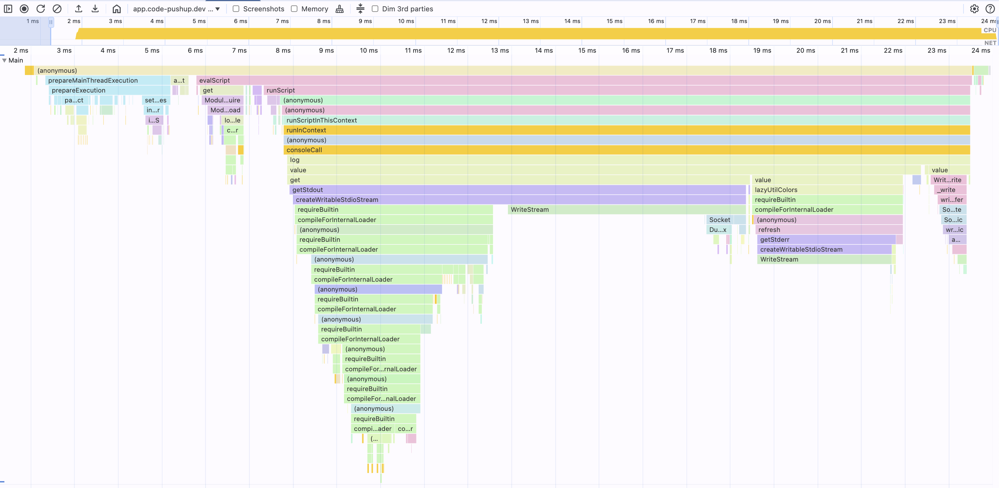
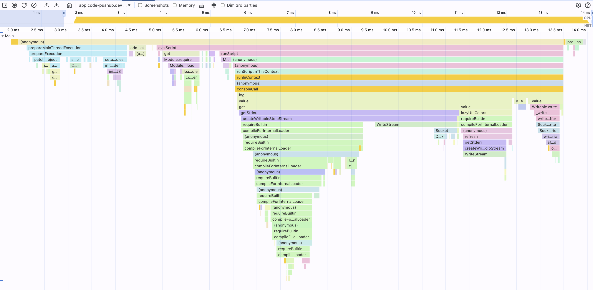
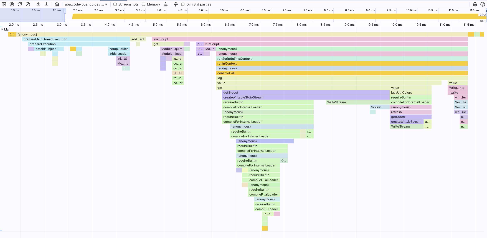
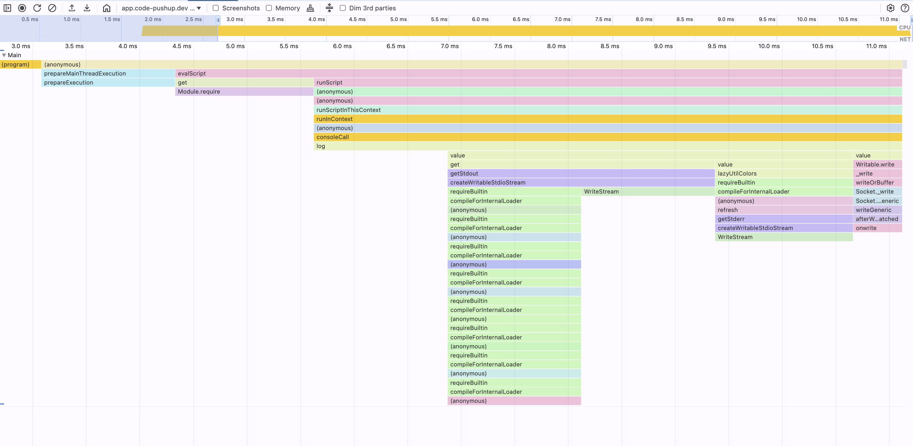
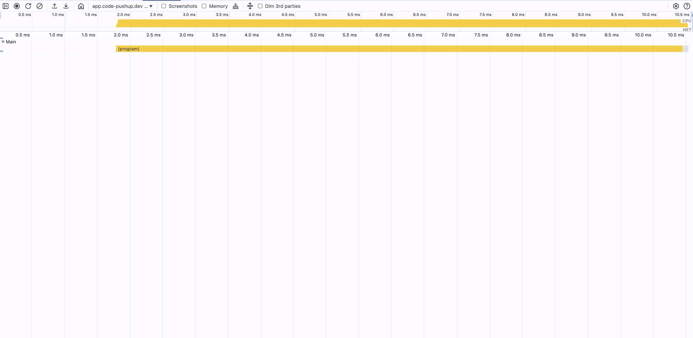
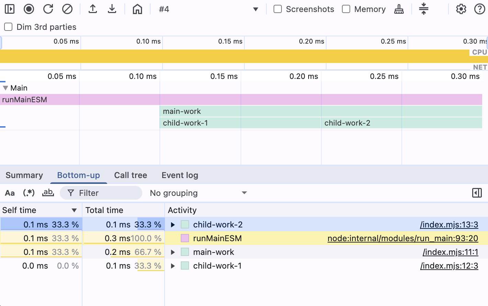
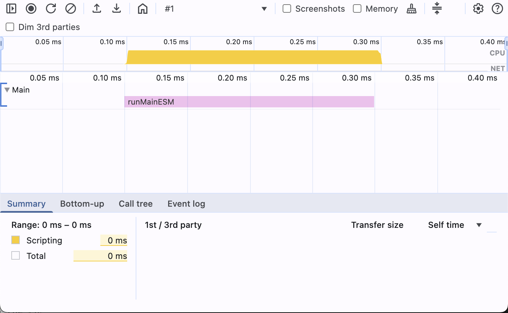
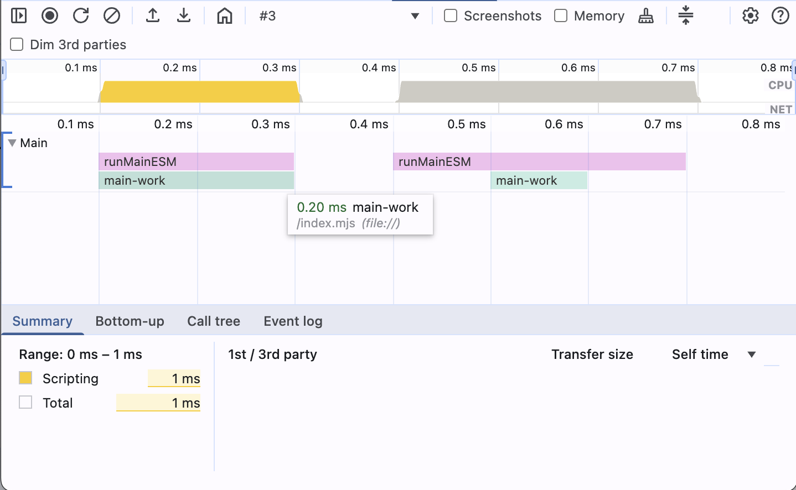
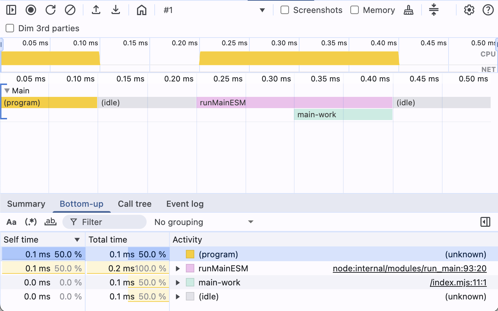
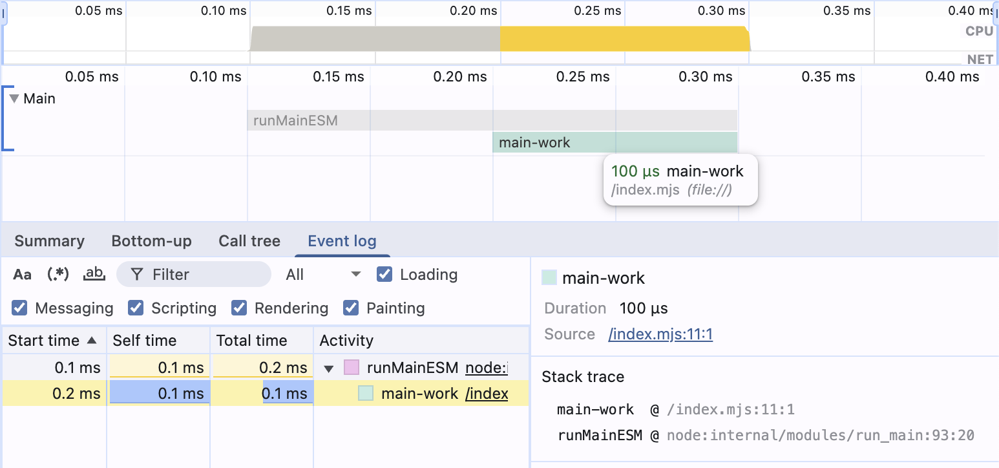

# Node CPU Profiling

## Table of Contents

---

- **[What is CPU profiling and why do we need it?](#what-is-cpu-profiling-and-why-do-we-need-it)**
- **[Create a CPU Profile](#create-a-cpu-profile)**
  - [CPU Profile Filename](#cpu-profile-filename)
  - [Process and Thread IDs](#process-and-thread-ids)
  - [CPU Profiling arguments](#cpu-profiling-arguments)
- **[Data Structure](#data-structure)**
  - [Synthetic and Internal Frames](#synthetic-and-internal-frames)
- **[Example for a Minimal CPU Profile](#example-for-a-minimal-cpu-profile)**
  - [Dimensions and Time](#dimensions-and-time)
  - [Nodes, Frames, and Depth](#nodes-frames-and-depth)
  - [Parent and child nodes](#parent-and-child-nodes)
  - [Example - CPU Profile including synthetic nodes](#example---cpu-profile-including-synthetic-nodes)
  - [`callFrame` and Call Tree View](#callframe-and-call-tree-view)

---

## What is CPU profiling and why do we need it?

CPU profiling is a technique used to analyze the performance of a program by collecting data about its CPU usage. It
helps identify which parts of the code consume the most CPU resources, allowing developers to optimize performance.
This is particularly useful for software developers and performance engineers when diagnosing performance bottlenecks,
understanding code execution hotspots, or optimizing critical code paths for better efficiency and responsiveness.

**Recent updates to Chrome DevTools have significantly enhanced its support for Node.js CPU profiling, making it a powerful and highly recommended tool for debugging and optimizing Node.js applications.**

## Create a CPU Profile

To create a CPU profile, you can use the `--cpu-prof` flag when running your Node.js application. This will generate a
`.cpuprofile` file containing the profiling data.

> **Official docs:**: [Node.js CPU Profiling](https://nodejs.org/api/inspector.html#inspector_cpu_profiling)

```shell
node --cpu-prof index.js
```

This command will create a file named `CPU.<timestamp>.<pid>.<tid>.<sequence>.cpuprofile` in the current working
directory.

### CPU Profile Filename

```shell
┌────────────────────────────────────────────────────────────┐
│  CPU.20250510.134625.51430.0.001.cpuprofile                │
│      │        │      │     │   │                           │
│      │        │      │     │   └────── %N = Sequence (001) ┘
│      │        │      │     └────────── %T = Thread ID (0)
│      │        │      └──────────────── %P = Process ID (51430)
│      │        └─────────────────────── %H = Time (134625 → 13:46:25)
│      └──────────────────────────────── %D = Start Date (20250510 → May 10, 2025)
└─────────────────────────────────────── Fixed prefix = "CPU"
```

The date and time are from when wall-clock write time (when the profile was flushed).

### Process and Thread IDs

When do you get different Process IDs (PID) and Thread IDs (TID) in CPU profile filenames?

A program (started process) can create new threads and processes inside it.
Every new process and thread gets a new ID, depending on the methods used to create new threads and processes.

| Scenario | PID | TID | Example Filename |
|----------|-----|-----|------------------|
| Main process | Unique OS PID | 0 | `CPU.xxx.12345.0.001.cpuprofile` |
| Child process | New unique PID | 0 | `CPU.xxx.12346.0.001.cpuprofile` |
| Worker thread | Same PID | 1, 2, 3... | `CPU.xxx.12345.1.001.cpuprofile` |

The following script logs PID and TID of the current Node.js process:

```shell
node -e "const { threadId } = require('worker_threads'); 
console.log('PID:', process.pid, 'TID:', threadId);"
```

_Outputs:_
`PID: 51430 TID: 0`

### PID → Process ID

- Comes from the **OS-level process ID**
- A new PID is created whenever you start a new process, such as:
    - `child_process.fork()`
    - `child_process.spawn()`
    - `child_process.exec()`
    - Running `node` directly (CLI, script)

```shell
node -e "
const { spawn } = require('child_process');
console.log('Parent PID:', process.pid);

spawn(process.execPath, ['-e', 
  'const { threadId } = require(\"worker_threads\"); console.log(\"Child PID:\", process.pid, \"TID:\", threadId);'
], { stdio: 'inherit' });

spawn(process.execPath, ['-e', 
  'const { threadId } = require(\"worker_threads\"); console.log(\"Child PID:\", process.pid, \"TID:\", threadId);'
], { stdio: 'inherit' });
"
```

_Outputs:_
```
Parent PID: 51430
Child PID: 51431 TID: 0
Child PID: 51432 TID: 0
```

The generated profiles if we add `--cpu-prof` to the child processes would look like this:

- `CPU.20250510.135416.51431.0.001.cpuprofile` (first child)
- `CPU.20250510.135416.51432.0.001.cpuprofile` (second child)

### TID → Thread ID

- Comes from Node.js's `worker_threads` module thread registry
- Main thread is always TID `0`
- Worker threads get sequential IDs starting from `1`
- A new TID is created only when you spawn a `Worker`:
    - `new Worker()` from `node:worker_threads`
    - Each worker gets a new `threadId` from the runtime

```shell
node -e "
const { Worker, threadId } = require('worker_threads');
console.log('Main thread - PID:', process.pid, 'TID:', threadId);

new Worker(\`
  const { threadId } = require('worker_threads');
  console.log('Worker 1 - PID: ' + process.pid + ' TID: ' + threadId);
\`, { eval: true });

new Worker(\`
  const { threadId } = require('worker_threads');
  console.log('Worker 2 - PID: ' + process.pid + ' TID: ' + threadId);
\`, { eval: true });
"
```

_Outputs:_
```
Main thread - PID: 51430 TID: 0
Worker 1 - PID: 51430 TID: 1
Worker 2 - PID: 51430 TID: 2
```

The generated profiles if we add `--cpu-prof` to the command would look like this:

- `CPU.20250510.135416.51430.0.001.cpuprofile` (main thread)
- `CPU.20250510.135416.51430.1.001.cpuprofile` (worker 1)
- `CPU.20250510.135416.51430.2.001.cpuprofile` (worker 2)

### Sequence Number

The sequence number (`.001`, `.002`, etc.) increments when multiple profiles are generated in the same process/thread during a single session. This can happen when:
- Profiling is started and stopped multiple times programmatically
- Multiple profiling sessions overlap
- The profiler is restarted within the same process

### Child Processes vs Worker Threads

Understanding the key differences helps explain when you'll see different PIDs vs TIDs:

| Aspect | Child Processes | Worker Threads |
|--------|-----------------|----------------|
| **Memory** | Isolated (separate memory space) | Shared (can share memory via SharedArrayBuffer) |
| **V8 Instance** | Separate V8 isolate | Same V8 instance |
| **Communication** | IPC (Inter-Process Communication) | Direct memory access + message passing |
| **Performance** | Higher overhead (process creation) | Lower overhead (thread creation) |
| **CPU Profile** | Separate PID, TID=0 | Same PID, TID=1,2,3... |
| **Use Case** | Isolation, fault tolerance | Parallel CPU-intensive tasks |

### Practical Implications for CPU Profiling

When analyzing performance:
- **Multiple PIDs**: Analyze each profile separately - they represent completely different processes
- **Multiple TIDs**: These profiles can be analyzed together to understand parallel execution patterns
- **Microservices**: Often generate multiple PID profiles when spawning child processes
- **Parallel processing**: Worker threads create multiple TID profiles for the same application logic

### CPU Profiling arguments

| Flag                  | Added in      | Default                                                     | Description                                                               |
|-----------------------|---------------|-------------------------------------------------------------|---------------------------------------------------------------------------|
| `--cpu-prof`          | v12.0.0 (Exp) | off                                                         | Starts the V8 CPU profiler on startup and writes a `.cpuprofile` on exit. |
| `--cpu-prof-dir`      | v12.0.0 (Exp) | Defaults to the value of `--diagnostic-dir` if set, otherwise the current working directory. | Directory where `--cpu-prof` outputs are written. If not set, it uses the directory specified by `--diagnostic-dir`, which defaults to the current working directory if also unset. |
| `--cpu-prof-name`     | v12.0.0 (Exp) | `CPU.${yyyymmdd}.${hhmmss}.${pid}.${tid}.${seq}.cpuprofile` | Filename to use for the CPU profile.                                      |
| `--cpu-prof-interval` | v12.2.0 (Exp) | `1000` μs                                                   | Sampling interval in microseconds for the CPU profiler.                   |

Example:

```shell
node --cpu-prof --cpu-prof-interval=50 --cpu-prof-dir=./profiles --cpu-prof-name="empty-50.cpuprofile" -e "console.log('Profile')"
```

> **NOTICE**
> The `--cpu-prof-interval` flag allows you to specify the sampling interval for CPU profiling. This can help you control
> the granularity of the profiling data and the size of the generated `.cpuprofile` file.
> 
> Be aware that a smaller sampling interval will result in a larger `.cpuprofile` file, as more samples will be collected. 

```shell
for interval in 1 10 50 100 1000 2000 4000 5000 7000; do echo "Profiling with interval: ${interval}μs" && node --cpu-prof --cpu-prof-interval=${interval} --cpu-prof-dir=./profiles --cpu-prof-name="interval-${interval}.cpuprofile" -e "console.log('Hello CPU Profile with ${interval}μs interval!')"; done
```

```shell
node -e "const fs=require('fs');const path=require('path');const dir='./profiles';const files=fs.readdirSync(dir).filter(f=>f.endsWith('.cpuprofile')).sort((a,b)=>{const aNum=parseInt(a.match(/(\d+)/)?.[1]||0);const bNum=parseInt(b.match(/(\d+)/)?.[1]||0);return aNum-bNum||a.localeCompare(b);});console.log('Profile File | Interval | Duration | Nodes | Samples | Size');console.log('-------------|----------|----------|-------|---------|-----');files.forEach(file=>{const data=JSON.parse(fs.readFileSync(path.join(dir,file),'utf8'));const stats=fs.statSync(path.join(dir,file));const interval=file.match(/(\d+)/)?.[1]||'?';const duration=(data.endTime-data.startTime)/1000;const nodes=data.nodes?.length||0;const samples=data.samples?.length||0;const size=(stats.size/1024).toFixed(1);console.log(file+' | '+interval+' us | '+duration.toFixed(1)+' ms | '+nodes+' | '+samples+' | '+size+' KB');});"
```

| Profile File             | Sampling Interval | Duration | Total Nodes | Total Samples | Avg Sample Interval | File Size | Visual Example | Use Case / Recommendation |
|--------------------------|-------------------|----------|-------------|---------------|---------------------|-----------|----------------|---------------------------|
| `empty-1.cpuprofile`     | 1 µs              | 58.5 ms  | 472         | 10,514        | 0.0 ms              | 162.0 KB  |  | **Micro-benchmarking**: Extremely detailed analysis for performance-critical functions. Very large files. |
| `empty-10.cpuprofile`    | 10 µs             | 17.5 ms  | 338         | 931           | 0.0 ms              | 73.3 KB   |  | **Detailed profiling**: High-resolution analysis for optimization work. Large files but manageable. |
| `empty-100.cpuprofile`   | 100 µs            | 15.0 ms  | 153         | 100           | 0.1 ms              | 28.9 KB   |  | **Standard profiling**: Good balance of detail vs file size. Recommended for most use cases. |
| `empty-1000.cpuprofile`  | 1000 µs (1 ms)    | 13.9 ms  | 49          | 10            | 1.3 ms              | 8.6 KB    |  | **High-level analysis**: Quick overview of hot paths. Small files, good for CI/CD environments. |
| `empty-10000.cpuprofile` | 10000 µs (10 ms)  | 14.0 ms  | 3           | 2             | 6.9 ms              | 0.5 KB    |  | **Coarse profiling**: Basic performance overview. Minimal detail, very small files. |

> Note: "Avg Sample Interval" is calculated as `Duration / Total Samples`. Values like "0.0 ms" result from rounding to one decimal place when the actual average is very small (e.g., less than 0.05 ms).

## Data Structure

```ts
/**
 * Represents a single call frame in the CPU profile.
 * Each call frame contains information about the function being executed,
 * the script it belongs to, and its location in the script.
 */
type CallFrame = {
  // Name of the function e.g. "child-work-1"
  functionName: string;
  // unique identifier for the script e.g. 0
  scriptId: string;
  // URL of the script e.g. "file:///index.mjs"
  url: string;
  // Line number in the script e.g. 10
  lineNumber: number;
  // Column number in the script e.g. 2
  columnNumber: number;
};

/**
 * Represents a node in the CPU profile.
 * Each node corresponds to a function call and contains information about
 * the call frame, its children, and an optional hit count.
 */
type Node = {
  // Unique identifier for the node e.g. 1
  id: number;
  // Call frame information for the node
  callFrame: CallFrame;
  // Optional parent node ID, indicating the node that called this one. e.g. 1
  parent?: number;
  // List of child node IDs called by this node. e.g. [2,3]
  children: number[];
  // Optional hit count for the node, indicating how many times it was executed
  hitCount?: number;
};

type CpuProfile = {
  // List of nodes in the CPU profile
  nodes: Node[];
  // Start time of the profile in microseconds (μs)
  startTime: number;
  // End time of the profile in microseconds (μs)
  endTime: number;
  // List of node IDs indicating which nodes were active during the profile. e.g. [2,4,5]
  samples: number[];
  // List of time deltas between samples in microseconds (μs)
  timeDeltas: number[];
};

### Synthetic and Internal Frames

The `functionName` in parentheses are **synthetic frames** that V8 inserts to represent things like "entry point",
"top-level script evaluation", "no JS running (idle)", and GC cycles.

The `scriptId` of synthetic frames is always `0`, the `url` is empty `"` and `lineNumber` and `columnNumber` is `-1`.

```json
{
  "id": 1,
  "callFrame": {
    "functionName": "(root)",
    "scriptId": "0",
    "url": "",
    "lineNumber": -1,
    "columnNumber": -1
  },
  "children": []
}
```

Synthetic frames, such as `(root)` or `(idle)`, are placeholders inserted by V8 to represent states or meta-processes. Internal frames, such as `compileFunction`, represent actual V8 or Node.js engine functions.
Both synthetic and most internal/native frames typically share `scriptId: "0"`, an empty `url`, and `lineNumber: -1`, `columnNumber: -1`. They are distinguished by their `functionName`.
An incomplete list of synthetic and internal frames is:

| Function                | Explanation                                                                                                             |
|-------------------------|-------------------------------------------------------------------------------------------------------------------------|
| Synthetic               | ---                                                                                                                     |
| **(root)**              | The synthetic root of the call tree. All other frames are descendants of this "function."                               |
| **(program)**           | The top‐level entry point of your script. Covers the module's initial evaluation before any functions are invoked.      |
| **openFileHandle**      | The underlying V8/Node function that opens a file descriptor. Called by high-level APIs like `fs.open`.                 |
| **(garbage collector)** | A special marker whenever V8's GC runs. No JavaScript code—just time spent reclaiming memory.                           |
| **(idle)**              | Indicates the event loop is idle—nothing JavaScript-related is executing, and the process is waiting for I/O or timers. |
| **lstat**               | The V8 binding for the `fs.lstat` syscall, used internally when you or a library check file or symlink metadata.        |
| Internal                | ---                                                                                                                     |
| **compileFunction**     | V8's internal routine that parses and compiles a JS function's source to bytecode.                                      |
| **link**                | V8's step of resolving closures and setting up function scopes ("linking" compiled code into the runtime).              |
| **evaluate**            | The execution of top-level script code or VM-compiled code; e.g. running your module's body.                            |
| **consoleCall**         | The built-in handler for `console.log` and other console methods—formats and writes to stdout/stderr.                   |
| **Worker**              | The entry for spinning up a `Worker` thread (Node's `worker_threads`), including setup and messaging plumbing.          |
| **startThread**         | Platform-level call to begin a new OS thread for a Worker, wrapping the native thread creation.                         |
| **postMessage**         | The V8/Node routine that serializes and posts data from the main thread to a Worker (or vice versa).                    |
| **writeUtf8String**     | The internal I/O function that writes a UTF-8 string (e.g. your log output) into a buffer or file descriptor.           |

## Example for a Minimal CPU Profile

**Filename:**
`CPU.20250510.135416.51623.0.001.cpuprofile`

**Profile content:**

```json
{
  "nodes": [
    {
      "id": 1,
      "callFrame": {
        "functionName": "(root)",
        "scriptId": "0",
        "url": "",
        "lineNumber": -1,
        "columnNumber": -1
      },
      "children": [
        2
      ]
    },
    {
      "id": 2,
      "callFrame": {
        "functionName": "runMainESM",
        "scriptId": "1",
        "url": "node:internal/modules/run_main",
        "lineNumber": 92,
        "columnNumber": 19
      },
      "children": [
        3
      ]
    },
    {
      "id": 3,
      "callFrame": {
        "functionName": "main-work",
        "scriptId": "2",
        "url": "file:///index.mjs",
        "lineNumber": 10,
        "columnNumber": 0
      },
      "children": [
        4,
        5
      ]
    },
    {
      "id": 4,
      "callFrame": {
        "functionName": "child-work-1",
        "scriptId": "2",
        "url": "file:///index.mjs",
        "lineNumber": 11,
        "columnNumber": 2
      }
    },
    {
      "id": 5,
      "callFrame": {
        "functionName": "child-work-2",
        "scriptId": "2",
        "url": "file:///index.mjs",
        "lineNumber": 12,
        "columnNumber": 2
      }
    }
  ],
  "startTime": 100000000000,
  "endTime": 100000000200,
  "samples": [
    2,
    4,
    5
  ],
  "timeDeltas": [
    0,
    100,
    100
  ]
}
```

**DevTools Performance Tab:**  


### Dimensions and Time

- **Time (horizontal axis)**
  - `startTime`: The microsecond timestamp when profiling began. All `timeDeltas` are relative to this.
  - `timeDeltas`: An array of microsecond (μs) intervals. `timeDeltas[i]` is the time elapsed since the previous sample (`samples[i-1]`) was taken, or since `startTime` if `i` is 0. The timestamp of `samples[i]` is `startTime + sum(timeDeltas[0]...timeDeltas[i])`.
  - `endTime`: The microsecond timestamp when profiling ended. This is typically `startTime + sum of all timeDeltas`. If there's an additional delay after the last sample before the profiler stops, `endTime` might be slightly larger. For the example above, `startTime (100000000000) + timeDeltas[0] (0) + timeDeltas[1] (100) + timeDeltas[2] (100) = 100000000200`, which matches `endTime`.

- **Call-tree depth (vertical axis)**
  - Each sample's node-ID (from `samples[]`) points into `nodes[]`
  - The root node (`(root)`) is at depth 0; its `children` entries are depth 1, and so on
  - Stacking samples by their node's depth reconstructs the flame chart walking up their parents.

- **Samples**
  - `samples`: An array of `nodeId`s. Each `samples[i]` indicates which node was at the top of the call stack when the `i`-th sample was taken.
  - The `i`-th sample (`samples[i]`) occurred at `startTime + sum(timeDeltas[0]...timeDeltas[i])` microseconds.
  - Mapping these `(timestamp, nodeId)` pairs reconstructs the CPU usage timeline.

> **NOTE**
> The samples array is the list of "visible" nodes looking from the bottom of the chart.  
> Listing a Node at a certain timeDelta (position on the samples array) will construct all its parents too.
> Therefore, the samples array is a list "leaf frame" in the chart.

```json
{
  "nodes": [
    {
      "id": 1,
      "callFrame": { "functionName": "(root)", "scriptId": "0", "url": "", "lineNumber": -1, "columnNumber": -1 },
      "children": [2]
    },
    {
      "id": 2,
      "callFrame": { "functionName": "runMainESM", "scriptId": "1", "url": "node:internal/modules/run_main", "lineNumber": 92, "columnNumber": 19 },
      "children": [3]
    }
  ],
  "startTime": 100000000000,
  "endTime":   100000000400,
  "samples":    [1,   2,   2,   1],
  "timeDeltas": [0, 100, 100, 100]
}
```

**DevTools Performance Tab:**  



### Nodes, Frames, and Depth

- **Nodes**  
  Each entry in `cpuProfile.nodes` represents a **call‐frame** (a box in the chart). A node has:
  - `id`: unique identifier
  - `callFrame`: details (`functionName`, `scriptId`, `url`, `lineNumber`, `columnNumber`)
  - optional `parent` or `children` pointers to rebuild the call tree
  - optional `hitCount` for how many samples landed exactly on that frame

- **Frames**  
  The `callFrame` object inside each node (file, function name, line, column) that DevTools displays when exploring a profile (the boxes).

```json
{
  "nodes": [
    {
      "id": 1,
      "callFrame": {
        "functionName": "(root)",
        "scriptId": "0",
        "url": "",
        "lineNumber": -1,
        "columnNumber": -1
      },
      "children": [
        2
      ]
    },
    {
      "id": 2,
      "callFrame": {
        "functionName": "runMainESM",
        "scriptId": "1",
        "url": "node:internal/modules/run_main",
        "lineNumber": 92,
        "columnNumber": 19
      },
      "children": [
        3
      ]
    },
    {
      "id": 3,
      "callFrame": {
        "functionName": "main-work",
        "scriptId": "2",
        "url": "file:///index.mjs",
        "lineNumber": 10,
        "columnNumber": 0
      },
      "children": []
    }
  ],
  "startTime": 100000000000,
  "endTime":   100000000800,
  "samples":    [1,   3,   3,   1,   2,   3,  2,   1],
  "timeDeltas": [0, 100, 100, 100, 100, 100, 100, 100]
}
```

This example draws the same node (1->2->3) 2 times.

- The first time it draws them as a "tower", where each frame is the same width (takes the same time).  
  `"samples":    [1,   3,   3,   1], "timeDeltas": [0, 100, 100, 100]` (looks like ▀▀)
- The second time it draws them as a "flame", where each frame is slightly smaller nested into the parent one.  
  `"samples":    [1,   2,   3,  2,   1], "timeDeltas": [0, 100, 100, 100, 100]` (looks like ▔▀▔)
  
**DevTools Performance Tab:**  


### Parent and child nodes

Each entry in cpuProfile.nodes represents a call‐frame and has a unique id.

**parent**
(Optional) The id of its immediate caller in the call tree.
Omitted on the root node.

**children**
An array of ids for the frames it directly invoked.
Mirrors the inverted parent relationships.

Traversal starts at the root (no parent), then recurse through children to rebuild the full call hierarchy.
Useful for flame chart rendering and aggregating inclusive vs. exclusive hit counts.

```json
[
  {
    "id": 1,
    "callFrame": {
      "functionName": "(root)",
      "scriptId": "0",
      "url": "",
      "lineNumber": -1,
      "columnNumber": -1
    },
    "children": [2]
  },
  {
    "id": 2,
    "callFrame": {
      "functionName": "runMainESM",
      "scriptId": "1",
      "url": "node:internal/modules/run_main",
      "lineNumber": 92,
      "columnNumber": 19
    },
    "parent": 1,
    "children": []
  }
]
```

### Example - CPU Profile including synthetic nodes

```json
{
  "nodes": [
    {
      "id": 1,
      "callFrame": {
        "functionName": "(root)",
        "scriptId": "0",
        "url": "",
        "lineNumber": -1,
        "columnNumber": -1
      },
      "children": [
        2,
        4,
        3
      ]
    },
    {
      "id": 2,
      "callFrame": {
        "functionName": "(program)",
        "scriptId": "0",
        "url": "",
        "lineNumber": -1,
        "columnNumber": -1
      }
    },
    {
      "id": 3,
      "callFrame": {
        "functionName": "(idle)",
        "scriptId": "0",
        "url": "",
        "lineNumber": -1,
        "columnNumber": -1
      }
    },
    {
      "id": 4,
      "callFrame": {
        "functionName": "runMainESM",
        "scriptId": "1",
        "url": "node:internal/modules/run_main",
        "lineNumber": 92,
        "columnNumber": 19
      },
      "children": [
        5
      ]
    },
    {
      "id": 5,
      "callFrame": {
        "functionName": "main-work",
        "scriptId": "2",
        "url": "file:///index.mjs",
        "lineNumber": 10,
        "columnNumber": 0
      },
      "children": [
        6,
        7
      ]
    },
    {
      "id": 6,
      "callFrame": {
        "functionName": "child-work-1",
        "scriptId": "2",
        "url": "file:///index.mjs",
        "lineNumber": 11,
        "columnNumber": 2
      }
    },
    {
      "id": 7,
      "callFrame": {
        "functionName": "child-work-2",
        "scriptId": "2",
        "url": "file:///index.mjs",
        "lineNumber": 12,
        "columnNumber": 2
      }
    }
  ],
  "startTime": 100000000000,
  "endTime": 100000000500,
  "samples": [
    2,
    3,
    4,
    5,
    3
  ],
  "timeDeltas": [
    0,
    100,
    100,
    100,
    100,
    100
  ]
}
```

**DevTools Performance Tab:**  



### `callFrame` and Call Tree View

- **callFrame**  
  Each node has a `callFrame` object with the function name, script ID, URL, line number, and column number.
  This information is used to display the function call details (like file, line, and function name) when a specific frame is selected in the DevTools UI.

When a profile is loaded in Chrome DevTools, selecting a frame in the flame chart will show its details. The tabs below (like "Bottom-Up" and "Call Tree") provide aggregated views:
- **Call Tree tab:** Shows a top-down representation of the call stacks. It helps understand the sequence of calls starting from the root, useful for tracing program execution flow through various functions.
- **Bottom-Up tab:** Aggregates time spent in functions, listing functions that consumed the most time at the top. This view is particularly useful for identifying specific functions that are performance hotspots, as it shows the total time spent in a function, including time spent in functions it called.

If we select a node in the DevTools UI, it will show the call stack and the time spent in that function.



---

```shell
NX_DAEMON=false NX_CLOUD=false node --cpu-prof --cpu-prof-interval=20 --cpu-prof-dir=./profiles \
node_modules/nx/bin/nx.js
```
