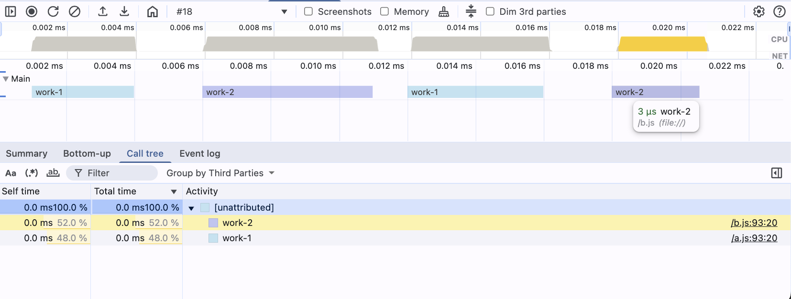
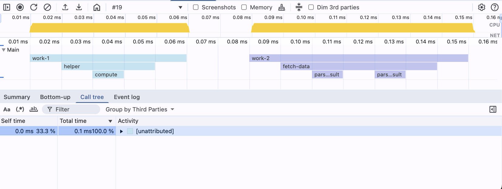
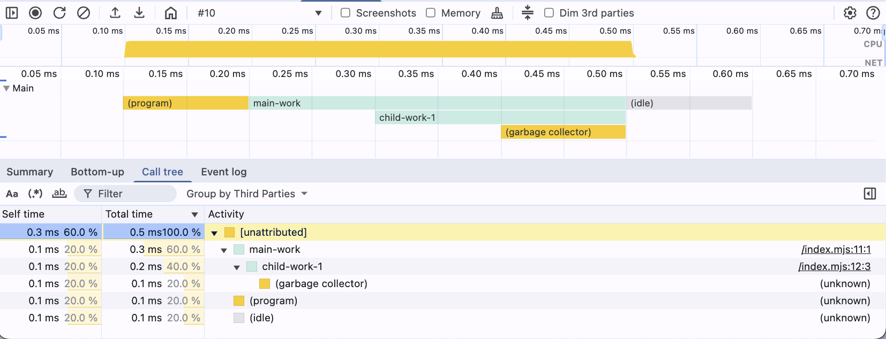

# Node CPU Profiling

## Table of Contents

---

- **[What is CPU profiling and why do we need it?](#what-is-cpu-profiling-and-why-do-we-need-it)**
- **[Create a CPU Profile](#create-a-cpu-profile)**
  - [You can start CPU profiling in different ways:](#you-can-start-cpu-profiling-in-different-ways)
  - [Troubleshooting](#troubleshooting)
    - [My profile files are appearing on different places in the file system based on the cwd of every process.](#my-profile-files-are-appearing-on-different-places-in-the-file-system-based-on-the-cwd-of-every-process)
    - [Error: `--cpu-prof is not allowed in NODE_OPTIONS`](#error---cpu-prof-is-not-allowed-in-node_options)
  - [CPU Profile Filename](#cpu-profile-filename)
  - [Process and Thread IDs](#process-and-thread-ids)
    - [What Determines the Process ID (PID)?](#what-determines-the-process-id-pid)
    - [What Determines the Thread ID (TID)?](#what-determines-the-thread-id-tid)
  - [CPU Profiling Arguments](#cpu-profiling-arguments)
    - [`--cpu-prof`](#--cpu-prof)
    - [`--cpu-prof-dir`](#--cpu-prof-dir)
    - [`--cpu-prof-name`](#--cpu-prof-name)
    - [`--cpu-prof-interval`](#--cpu-prof-interval)
      - [How to use interval?](#how-to-use-interval)
      - [Illustrative Example: Impact of Interval Choice](#illustrative-example-impact-of-interval-choice)
        - [Step 1: Generate Profiles with Different Intervals](#step-1-generate-profiles-with-different-intervals)
        - [Step 2: Analyze the Generated Profiles](#step-2-analyze-the-generated-profiles)
        - [Step 3: Results Analysis](#step-3-results-analysis)
  - [Examples of Combining Arguments](#examples-of-combining-arguments)
- **[Data Structure](#data-structure)**
  - [Dimensions and Timing Data](#dimensions-and-timing-data)
  - [Time deltas](#time-deltas)
  - [Samples](#samples)
  - [Nodes](#nodes)
    - [Parent and child nodes](#parent-and-child-nodes)
    - [CallFrame](#callframe)
      - [Source Location and label](#source-location-and-label)
      - [Synthetic and Internal Frames](#synthetic-and-internal-frames)

## What is CPU profiling and why do we need it?

CPU profiling is a technique used to analyze the performance of a program by collecting data about its CPU usage. It
helps identify which parts of the code consume the most CPU resources, allowing developers to optimize performance.

## Create a CPU Profile

To create a CPU profile, you can use the `--cpu-prof` flag when running your Node.js application. This will generate a
`.cpuprofile` file containing the profiling data.

> **Official docs:**: [Node.js CPU Profiling](https://nodejs.org/api/inspector.html#inspector_cpu_profiling)

### You can start CPU profiling in different ways:

**Direct command line flags:**
```shell
node --cpu-prof -e "console.log('CPU')"
```

**Using NODE_OPTIONS (Node.js v23.x+):**
```shell
NODE_OPTIONS="--cpu-prof" node -e "console.log('CPU')"
```

### Troubleshooting

#### My profile files are appearing on different places in the file system based on the cwd of every process.

This is because of the way Node.js handles the `--cpu-prof` flag. It will use the CWD of the process to determine the location of the profile file. To avoid this, you can use --cpu-prof-dir with a absolute path.

```shell
# Linux
node --cpu-prof --cpu-prof-dir=/Users/username/reponame/profiles -e "console.log('CPU')"

# Windows
node --cpu-prof --cpu-prof-dir=C:\Users\username\reponame\profiles -e "console.log('CPU')"
```

#### Error: `--cpu-prof is not allowed in NODE_OPTIONS`

Node.js maintains a security whitelist for `NODE_OPTIONS`. CPU profiling flags were historically blocked for security reasons.

**Version Support:**
- **≤ v22.x**: All CPU profiling flags blocked in `NODE_OPTIONS`
- **≥ v23.x**: All CPU profiling flags allowed ([PR #57018](https://github.com/nodejs/node/pull/57018))

**Test your Node.js version support:**
```bash
NODE_OPTIONS="--cpu-prof" node -e "console.log('test')" 2>/dev/null && echo "✅ Supported" || echo "❌ Not supported"
```

**Workarounds for v22.x and earlier:**
```bash
# Use the patch script. This will start profiling for every tread programatically.
node --require ./cpu-prof.js -e "console.log('CPU')"
```

### CPU Profile Filename

```shell
┌────────────────────────────────────────────────────────────┐
│  CPU.20250510.134625.51430.0.001.cpuprofile                │
│      │        │      │     │   │                           │
│      │        │      │     │   └────── %N = Sequence (001) ┘
│      │        │      │     └────────── %T = Thread ID (0)
│      │        │      └──────────────── %P = Process ID (51430)
│      │        └─────────────────────── %H = Time (134625 → 13:46:25)
│      └──────────────────────────────── %D = Start Date (20250510 → May 10, 2025)
└─────────────────────────────────────── Fixed prefix = "CPU"
```

The date and time are from when wall-clock write time (when the profile was flushed).

### Process and Thread IDs

The CPU profile filename includes both a Process ID (PID) and a Thread ID (TID). Understanding how these IDs are generated is crucial for interpreting profile files, especially in applications involving multiple processes or worker threads.

A Node.js application starts as a single process. This main process can then spawn child processes or create worker threads. Each new process and worker thread is assigned a distinct ID, which is reflected in the CPU profile filenames. Node.js provides built-in mechanisms to access these identifiers. For instance, `process.pid` gives the Process ID. For Thread IDs, `worker_threads.threadId` provides the ID for worker threads, while the main thread is conventionally identified as `0` in profiling contexts, as it doesn't have a `threadId` property in the same way.

The following script demonstrates how to retrieve these values:

```bash
node -p "const { threadId } = require('node:worker_threads'); 'PID: ' + process.pid + ', TID: ' + threadId"
```

Output:
`PID: 51430 TID: 0`

### What Determines the Process ID (PID)?

- Represents the **OS-level process ID**.
- A new PID is generated each time a new process is created. Common ways to create new processes in Node.js include:
    - `child_process.fork()`
    - `child_process.spawn()`
    - `child_process.exec()`
    - Directly running the `node` executable (e.g., starting a new script).

Consider the following script that spawns two child processes:
```bash
NODE_OPTIONS="--cpu-prof" node -e "
const { spawn } = require('child_process');
const { threadId: t } = require('worker_threads');
const cs = \"const { threadId: t } = require('worker_threads'); console.log('spawn PID:', process.pid, 'TID:', t);\";
spawn(process.execPath, ['-e', cs], { stdio: 'inherit' });
spawn(process.execPath, ['-e', cs], { stdio: 'inherit' });
console.log('Parent PID:' , process.pid, 'TID:', t);
"
```

Output (order may vary slightly due to asynchronous nature):
`Parent PID: 51430 TID: 0`
`spawn PID: 51431 TID: 0`
`spawn PID: 51432 TID: 0`

If `--cpu-prof` is added to the command (e.g., `node --cpu-prof script.js`), CPU profiles would be generated for the parent process and each child process, distinguishable by their PIDs in the filenames:
- `CPU.<timestamp>.51430.0.001.cpuprofile` (Parent process)
- `CPU.<timestamp>.51431.0.002.cpuprofile` (First child process)
- `CPU.<timestamp>.51432.0.003.cpuprofile` (Second child process)

### What Determines the Thread ID (TID)?

- Represents V8's internal thread identifier.
- By default, Node.js applications run in a single main thread, which typically has a TID of `0`.
- A new, unique TID is assigned when a `Worker` thread is created using the `node:worker_threads` module.

The following script creates two worker threads:

```bash
NODE_OPTIONS="--cpu-prof" node -e "
const { Worker, threadId, isMainThread } = require('worker_threads');
const workerScript = \"const { threadId: t } = require('worker_threads'); console.log('Worker PID:', process.pid, 'TID:', t);\";
new Worker(workerScript, { eval: true });
new Worker(workerScript, { eval: true });
console.log('Main PID:', process.pid, 'TID:', threadId);
"
```

Output (order of worker messages may vary):
`Main PID: 51430  TID: 0`
`Worker PID: 51430  TID: 1 (Worker 1)`
`Worker PID: 51430  TID: 2 (Worker 2)`

If `--cpu-prof` is used with this script, profiles are generated for the main thread and each worker thread, distinguished by their TIDs (and potentially sequence numbers if they exit around the same time):
- `CPU.<timestamp>.51430.0.001.cpuprofile` (Main thread)
- `CPU.<timestamp>.51430.1.002.cpuprofile` (Worker 1)
- `CPU.<timestamp>.51430.2.003.cpuprofile` (Worker 2)

### CPU Profiling Arguments

> **Note:** The "Added in" versions indicate when these flags were introduced. Some flags were initially experimental. Always consult the official [Node.js documentation](https://nodejs.org/api/cli.html) for the most current information on their status and behavior in your Node.js version.

| Flag                  | Added in      | Default                                                     | Description                                                               |
|-----------------------|---------------|-------------------------------------------------------------|---------------------------------------------------------------------------|
| `--cpu-prof`          | v12.0.0 (Exp) | off                                                         | Starts the V8 CPU profiler on startup and writes a `.cpuprofile` on exit. |
| `--cpu-prof-dir`      | v12.0.0 (Exp) | Current working directory. If `--diagnostic-dir` is set, it defaults to that directory. | Directory where `--cpu-prof` outputs are written.                         |
| `--cpu-prof-name`     | v12.0.0 (Exp) | `CPU.${yyyymmdd}.${hhmmss}.${pid}.${tid}.${seq}.cpuprofile` | Filename to use for the CPU profile.                                      |
| `--cpu-prof-interval` | v12.2.0 (Exp) | `1000` (microseconds/µs)                                    | Sampling interval in microseconds for the CPU profiler.                   |

#### `--cpu-prof`

*   **Purpose**: Starts the V8 CPU profiler on application startup. When the Node.js process exits, a `.cpuprofile` file containing the profiling data is written.
*   **Default**: `off`
*   **Usage Example**:
    ```shell
    node --cpu-prof -e "console.log('CPU')"
    ```
    This command will profile and generate a profile file (e.g., `CPU.<timestamp>.<pid>.<tid>.<sequence>.cpuprofile`) in the current working directory upon exit.

#### `--cpu-prof-dir`

*   **Purpose**: Specifies the directory where CPU profile files generated by `--cpu-prof` will be saved.
*   **Default**: The current working directory. If `--diagnostic-dir` is set, it defaults to that directory instead.
*   **Usage Example**:
    ```shell
    node --cpu-prof --cpu-prof-dir=./profiles -e "console.log('CPU')"
    ```
    This will save the CPU profile into the `./profiles` subdirectory (relative to the current working directory). If the directory doesn't exist, Node.js will attempt to create it.
*   **Notes**:
    *   If `--cpu-prof-name` specifies an absolute path, `--cpu-prof-dir` is ignored.
    *   Ensure the specified directory is writable by the Node.js process.

#### `--cpu-prof-name`

*   **Purpose**: Specifies a custom filename for the generated CPU profile.
*   **Default**: `CPU.<yyyymmdd>.<hhmmss>.<pid>.<tid>.<seq>.cpuprofile` (see [CPU Profile Filename](#cpu-profile-filename) for details on the pattern).
*   **Usage Example**:
    ```shell
    node --cpu-prof --cpu-prof-name="my-custom-profile.cpuprofile" -e "console.log('CPU')"
    ```
    This will generate a profile file named `my-custom-profile.cpuprofile`. If `--cpu-prof-dir` is also specified, the file will be placed in that directory; otherwise, it will be in the current working directory.
*   **Notes**:
    *   You can include the same placeholders available in the default filename (e.g., `${pid}`, `${timestamp}`) in your custom name.
    *   If an absolute path is provided (e.g., `/tmp/my-custom-profile.cpuprofile`), the file will be saved there, and `--cpu-prof-dir` will be ignored.

#### `--cpu-prof-interval`

*   **Purpose**: Sets the sampling interval for the CPU profiler in microseconds (µs). This determines how frequently the profiler captures the state of the JavaScript call stack.
*   **Default**: `1000` (microseconds/µs), which is 1 millisecond.
*   **Usage Example**:
    ```shell
    node --cpu-prof --cpu-prof-interval=100 -e "console.log('CPU')"
    ```
    This command profiles an inline script (`console.log('CPU')`) with a sampling interval of 100 microseconds.

##### How to use interval?

The `--cpu-prof-interval` flag specifies the sampling frequency in microseconds.
*   A **smaller interval** (e.g., `50` µs, `100` µs) collects more samples, providing a **highly detailed profile**. This is useful for short-running processes or identifying fine-grained bottlenecks. However, it results in **larger `.cpuprofile` files** and can add slightly **more overhead** to the profiled application.
*   A **larger interval** (e.g., `1000` µs, `5000` µs) collects fewer samples, leading to **smaller profile files** and **less overhead**. This is suitable for longer-running processes or when a high-level overview of CPU usage is sufficient.

Start with the default (`1000` µs) and adjust based on the granularity of data you need and the acceptable size of the generated profile files. The table below illustrates the impact of different intervals on a sample application.

##### Illustrative Example: Impact of Interval Choice

This example demonstrates how different `--cpu-prof-interval` values affect the resulting CPU profile files. We'll profile a simple script with various intervals and analyze the differences in detail, file size, and overhead.

###### Step 1: Generate Profiles with Different Intervals

Run the following command to create profiles with intervals ranging from 1μs to 10,000μs:

```shell
for interval in 1 10 50 100 1000 2000 3000 4000 5000 6000 7000 10000; do 
  echo "Profiling with interval: ${interval}μs" && \
  node --cpu-prof \
       --cpu-prof-interval=${interval} \
       --cpu-prof-dir=./profiles \
       --cpu-prof-name="interval${interval}.cpuprofile" \
       -e "console.log('Hello CPU Profile with ${interval}μs interval!')"
done
```

###### Step 2: Analyze the Generated Profiles

Use this command to compare the profiles and display their characteristics:

```shell
node -e "
const fs = require('fs');
console.table(fs.readdirSync('./profiles')
  .filter(f => f.endsWith('.cpuprofile'))
  .map(f => {
    let j = JSON.parse(fs.readFileSync('./profiles/' + f));
    let s = fs.statSync('./profiles/' + f);
    let i = f.match(/\d+/)?.[0] || '?';
    let d = ((j.endTime - j.startTime) / 1e3).toFixed(1);
    return { 
      File: f, 
      Interval: i + 'μs', 
      Duration: d + 'ms', 
      Nodes: j.nodes.length, 
      Samples: j.samples.length, 
      'Size(KB)': (s.size / 1024).toFixed(1) 
    };
  }));
"
```

###### Step 3: Results Analysis

The table below shows how sampling interval affects profile characteristics:

| Profile File             | Sampling Interval | Duration (Script) | Total Nodes | Total Samples | File Size | Visual Example |
|--------------------------|-------------------|-------------------|-------------|---------------|-----------|----------------|
| `empty-1.cpuprofile`     | 1 µs              | 58.5 ms           | 472         | 10,514        | 162.0 KB  |  |
| `empty-10.cpuprofile`    | 10 µs             | 17.5 ms           | 338         | 931           | 73.3 KB   |  |
| `empty-50.cpuprofile`    | 50 µs             | 16.0 ms           | 245         | 312           | 45.2 KB   |  |
| `empty-100.cpuprofile`   | 100 µs            | 15.0 ms           | 153         | 100           | 28.9 KB   |  |
| `empty-1000.cpuprofile`  | 1000 µs (1 ms)    | 13.9 ms           | 49          | 10            | 8.6 KB    |  |
| `empty-2000.cpuprofile`  | 2000 µs (2 ms)    | 14.2 ms           | 32          | 7             | 5.8 KB    |  |
| `empty-4000.cpuprofile`  | 4000 µs (4 ms)    | 13.5 ms           | 18          | 4             | 3.2 KB    |  |
| `empty-5000.cpuprofile`  | 5000 µs (5 ms)    | 14.8 ms           | 15          | 3             | 2.7 KB    |  |
| `empty-7000.cpuprofile`  | 7000 µs (7 ms)    | 13.2 ms           | 9           | 2             | 1.8 KB    |  |
| `empty-10000.cpuprofile` | 10000 µs (10 ms)  | 14.0 ms           | 3           | 2             | 0.5 KB    |  |

### Examples of Combining Arguments

1. **Experiment Comparison**  
Organized profiling for A/B testing or feature comparison experiments.
```shell
# Compare different implementations
node --cpu-prof --cpu-prof-name="version-a.cpuprofile" version-a.js
node --cpu-prof --cpu-prof-name="version-b.cpuprofile" version-b.js
```

2. **Production Monitoring**  
Low-overhead profiling with reduced sampling frequency.
```shell
node --cpu-prof --cpu-prof-interval=500 main.js
```

3. **Performance Benchmarking**  
High-detail profiling with frequent sampling for bottleneck analysis.
```shell
node --cpu-prof --cpu-prof-interval=20 --cpu-prof-dir=./microbench-graph-creation util.js
```

4. **CI/CD Performance Testing**  
Automated profiling in build pipelines using NODE_OPTIONS (Node.js v23.x+).  
- This works for spawning child processes as well as worker threads.
- All profiles end up in the same directory due to the absolute path.
- The sampling interval is very high to enable long running processes to be profiled.
```shell
NODE_OPTIONS="--cpu-prof --cpu-prof-interval=5000 --cpu-prof-dir=/Users/username/reponame/profiles" node -e main.js
```

5. **Handling options with .env**

```text
# .env
NODE_OPTIONS="--cpu-prof --cpu-prof-dir=/Users/username/reponame/profiles
```

```shell
node --env-file .env main.js
```

## Data Structure

CPU profiles are JSON files that contain structured data representing the execution timeline and call hierarchy of your Node.js application. The profile consists of nodes representing function calls, timing information, and sampling data that can be visualized in DevTools.

```ts
type CpuProfile = {
  // List of nodes in the CPU profile
  nodes: Node[];
  // Start time of the profile in microseconds (μs)
  startTime: number;
  // End time of the profile in microseconds (μs)
  endTime: number;
  // List of node IDs indicating which nodes were active during the profile. e.g. [2,4,5]
  samples: number[];
  // List of time deltas between samples in microseconds (μs)
  timeDeltas: number[];
};
```

In the example below, we see a minimal CPU profile.

**Profile:** [`minimal-cpu-profile.cpuprofile`](./examples/minimal-cpu-profile.cpuprofile)

**Profile content:**
```json
{
  "nodes": [
    {
      "id": 1,
      "callFrame": {
        "functionName": "(root)",
        "scriptId": "0",
        "url": "",
        "lineNumber": -1,
        "columnNumber": -1
      },
      "children": [2]
    },
    {
      "id": 2,
      "callFrame": {
        "functionName": "runMainESM",
        "scriptId": "1",
        "url": "node:internal/modules/run_main",
        "lineNumber": 92,
        "columnNumber": 19
      },
      "children": [3]
    },
    {
      "id": 3,
      "callFrame": {
        "functionName": "main-work",
        "scriptId": "2",
        "url": "file:///index.mjs",
        "lineNumber": 10,
        "columnNumber": 0
      },
      "children": [
        4,
        5
      ]
    },
    {
      "id": 4,
      "callFrame": {
        "functionName": "child-work-1",
        "scriptId": "2",
        "url": "file:///index.mjs",
        "lineNumber": 11,
        "columnNumber": 2
      }
    },
    {
      "id": 5,
      "callFrame": {
        "functionName": "child-work-2",
        "scriptId": "2",
        "url": "file:///index.mjs",
        "lineNumber": 12,
        "columnNumber": 2
      }
    }
  ],
  "startTime": 1,
  "endTime": 400,
  "samples": [
    2,
    4,
    5
  ],
  "timeDeltas": [
    0,
    100,
    100
  ]
}
```

**DevTools Performance Tab:**  


### Dimensions and Timing Data

CPU profiles represent execution data across two primary dimensions: time (horizontal axis) and call-tree depth (vertical axis). Understanding these dimensions is crucial for interpreting flame charts and performance data.

**Dimensions:**
- `startTime` - the microsecond timestamp when profiling began
- `endTime` - equals `startTime + Σ timeDeltas`, marking the profile's visible end
**Timing Data:**
- `timeDeltas` - an array of intervals (μs) between each sample tick. Time deltas overflow the visible end of the measure.
- `samples` - an array of node IDs indicating which nodes were active during the profile.

**Time (horizontal axis)** represents the execution timeline with `startTime` marking when profiling began, `endTime` marking the profile's visible end, and `timeDeltas` providing intervals between samples.  
**Call-tree depth (vertical axis)** shows the function call hierarchy where the root node is at depth 0, and each level represents nested function calls. The `samples` array contains the "leaf frames" - the deepest executing functions at each time interval, with their parent chain automatically reconstructed for visualization.

> **NOTE**  
> The samples array is the list of "visible" nodes looking from the bottom of the chart. Listing a Node at a certain timeDelta (position on the samples array) will construct all its parents too. Therefore, the samples array is a list "leaf frame" in the chart.

The example below shows a profile with 1 node (ID 2) centered in the middle of the chart. This is done by `timeDelta` to the node and `endTime` to the end of the profile.

**Profile:** [`minimal-cpu-profile-timing-data.cpuprofile`](./examples/minimal-cpu-profile-timing-data.cpuprofile)

```json
{
  "nodes": [
    {
      "id": 1,
      "callFrame": { "functionName": "(root)", "scriptId": "0", "url": "", "lineNumber": -1, "columnNumber": -1 },
      "children": [2]
    },
    {
      "id": 2,
      "callFrame": { "functionName": "runMainESM", "scriptId": "1", "url": "node:internal/modules/run_main", "lineNumber": 92, "columnNumber": 19 },
      "children": []
    }
  ],
  "startTime": 1,
  "endTime":   400,
  "samples":    [1,   2,   2,   1],
  "timeDeltas": [0, 100, 100, 100]
}
```

**DevTools Performance Tab:**  


### Time deltas

**Profile:** [`minimal-cpu-profile-timing-data-time-deltas.cpuprofile`](./examples/minimal-cpu-profile-timing-data-time-deltas.cpuprofile)
```json
{
  "nodes": [
    {
      "id": 1,
      "callFrame": {
        "functionName": "(root)",
        "scriptId": "0",
        "url": "",
        "lineNumber": -1,
        "columnNumber": -1
      },
      "children": [2, 3]
    },
    {
      "id": 2,
      "callFrame": {
        "functionName": "work-1",
        "scriptId": "1",
        "url": "file:///a.js",
        "lineNumber": 92,
        "columnNumber": 19
      }
    },
    {
      "id": 3,
      "callFrame": {
        "functionName": "work-2",
        "scriptId": "2",
        "url": "file:///b.js",
        "lineNumber": 92,
        "columnNumber": 19
      }
    }
  ],
  "startTime": 4,
  "endTime": 27,
  "samples": [
    1, 2, 1, 3, 1, 2, 1, 3
  ],
  "timeDeltas": [
    0, 1, 3, 2, 5, 1, 4, 2
  ]
}
```

**DevTools Performance Tab:**  
  

### Samples

Samples are the list of "visible" nodes looking from the bottom of the chart. Listing a Node at a certain timeDelta (position on the samples array) will construct all its parents too. Therefore, the samples array is a list "leaf frame" in the chart. 

**Profile:** [`minimal-cpu-profile-timing-data-samples.cpuprofile`](./examples/minimal-cpu-profile-timing-data-samples.cpuprofile)
```json
{
  "nodes": [
    {
      "id": 1,
      "callFrame": {
        "functionName": "(root)",
        "scriptId": "0",
        "url": "",
        "lineNumber": -1,
        "columnNumber": -1
      },
      "children": [2, 3]
    },
    {
      "id": 2,
      "callFrame": {
        "functionName": "work-1",
        "scriptId": "1",
        "url": "file:///a.js",
        "lineNumber": 92,
        "columnNumber": 19
      },
      "children": [4]
    },
    {
      "id": 4,
      "callFrame": {
        "functionName": "helper",
        "scriptId": "1",
        "url": "file:///a.js",
        "lineNumber": 98,
        "columnNumber": 5
      },
      "children": [5]
    },
    {
      "id": 5,
      "callFrame": {
        "functionName": "compute",
        "scriptId": "1",
        "url": "file:///a.js",
        "lineNumber": 99,
        "columnNumber": 5
      }
    },
    {
      "id": 3,
      "callFrame": {
        "functionName": "work-2",
        "scriptId": "2",
        "url": "file:///b.js",
        "lineNumber": 92,
        "columnNumber": 19
      },
      "children": [6]
    },
    {
      "id": 6,
      "callFrame": {
        "functionName": "fetch-data",
        "scriptId": "2",
        "url": "file:///b.js",
        "lineNumber": 120,
        "columnNumber": 3
      },
      "children": [7]
    },
    {
      "id": 7,
      "callFrame": {
        "functionName": "parse-result",
        "scriptId": "2",
        "url": "file:///b.js",
        "lineNumber": 121,
        "columnNumber": 5
      }
    }
  ],
  "startTime": 1,
  "endTime": 160,
  "samples": [
    1, 2, 4, 5, 4, 2, 1,
    1, 3, 6, 7, 6, 7, 6, 3, 1
  ],
  "timeDeltas": [
    0, 10, 10, 10, 10, 10, 10,
    10, 10, 10, 10, 10, 10, 10, 10, 10
  ]
}
```

This example draws the same node (1->2->3) 2 times.

- The first time it draws them as a "tower", where each frame is the same width (takes the same time).  
  `"samples":    [1,   3,   3,   1], "timeDeltas": [0, 100, 100, 100]` (looks like ▀▀)
- The second time it draws them as a "flame", where each frame is slightly smaller nested into the parent one.  
  `"samples":    [1,   2,   3,  2,   1], "timeDeltas": [0, 100, 100, 100, 100]` (looks like ▔▀▔)


**DevTools Performance Tab:**  
  

### Nodes

```ts
/**
 * Represents a node in the CPU profile.
 * Each node corresponds to a function call and contains information about
 * the call frame, its children, and an optional hit count.
 */
type Node = {
  // Unique identifier for the node e.g. 1
  id: number;
  // Call frame information for the node
  callFrame: CallFrame;
  // Optional parent node ID, indicating the node that called this one. e.g. 1
  parent?: number;
  // List of child node IDs called by this node. e.g. [2,3]
  children: number[];
  // Optional hit count for the node, indicating how many times it was executed
  hitCount?: number;
};
```

#### Parent and child nodes

Node relationships define the call hierarchy through parent-child references that mirror the JavaScript call stack. These relationships enable reconstruction of the complete call tree for flame chart visualization and performance analysis.

```ts
export interface Node {
  id: number;
  callFrame: CallFrame;
  parent?: number;
  children: number[];
  hitCount?: number;
}
```

`parent` contains the optional ID of the immediate caller in the call tree (omitted on the root node).  
`children` is an array of IDs for frames directly invoked by this node, mirroring the inverted parent relationships. 

Traversal starts at the root (no parent) and recurses through children to rebuild the full call hierarchy, useful for flame chart rendering and aggregating inclusive vs. exclusive hit counts.

**Profile:** [`minimal-cpu-profile-nodes-parent-child.cpuprofile`](./examples/minimal-cpu-profile-nodes-parent-child.cpuprofile)
```json
{
  "nodes": [
  {
    "id": 1,
    "callFrame": {
      "functionName": "(root)",
      "scriptId": "0",
      "url": "",
      "lineNumber": -1,
      "columnNumber": -1
    },
    "children": [2]
  },
  {
    "id": 2,
    "callFrame": {
      "functionName": "runMainESM",
      "scriptId": "1",
      "url": "node:internal/modules/run_main",
      "lineNumber": 92,
      "columnNumber": 19
    },
    "parent": 1,
    "children": [3]
  },
  {
    "id": 3,
    "callFrame": {
      "functionName": "main",
      "scriptId": "2",
      "url": "index.js",
      "lineNumber": 3,
      "columnNumber": 63
    },
    "parent": 2
  }
],
  "startTime": 1,
  "endTime":   400,
  "samples":    [1,   3,   1],
  "timeDeltas": [0, 100, 100]
}
```

**DevTools Performance Tab:**  


#### CallFrame

**Frames** are the `callFrame` objects containing source location information (file, function name, line, column) that DevTools displays. The depth determines vertical stacking in flame charts, with deeper calls appearing lower in the visualization.


```ts
type CallFrame = {
  // Name of the function being executed
  functionName: string;
  // Unique identifier for the script
  scriptId: string;
  // URL or path of the script file
  url: string;
  // Line number in the script
  lineNumber: number;
  // Column number in the script
  columnNumber: number;
};
```

##### Source Location and label

The `callFrame` object provides details about the source code location and helps identify functions in the DevTools profiler.

- `functionName`: The name of the executed function.
- `url`: The file path or URL of the script. This also determines the color-coding of frames in the flame chart (same URL means same color).
- `scriptId`: A unique identifier for the script.
- `lineNumber`: The line number within the script.
- `columnNumber`: The column number within the script.

**Profile:** [`minimal-cpu-profile-nodes-call-frame-source-location.cpuprofile`](./examples/minimal-cpu-profile-nodes-call-frame-source-location.cpuprofile)
```json
{
  "nodes": [
    {
      "id": 1,
      "callFrame": {
        "functionName": "(root)",
        "scriptId": "0",
        "url": "",
        "lineNumber": -1,
        "columnNumber": -1
      },
      "children": [2]
    },
    {
      "id": 2,
      "callFrame": {
        "functionName": "work-1",
        "scriptId": "1",
        "url": "file:///1.js",
        "lineNumber": 92,
        "columnNumber": 19
      },
      "children": [3, 4]
    },
    {
      "id": 3,
      "callFrame": {
        "functionName": "child-work-1",
        "scriptId": "1",
        "url": "file:///1.js",
        "lineNumber": 12,
        "columnNumber": 34
      }
    },
    {
      "id": 4,
      "callFrame": {
        "functionName": "work-2",
        "scriptId": "2",
        "url": "file:///2.js",
        "lineNumber": 12,
        "columnNumber": 34
      }
    }
  ],
  "startTime": 1,
  "endTime": 40,
  "samples": [
     1, 3, 4, 1
  ],
  "timeDeltas": [
    0, 10, 10, 10
  ]
}
```

**DevTools Performance Tab:**  


##### Synthetic and Internal Frames

Synthetic frames are special entries that V8 inserts to represent runtime states and operations that don't correspond to user JavaScript code. These frames provide important context about the execution environment and system-level operations.

Synthetic frames have `functionName` in parentheses representing entry points, top-level script evaluation, idle time, and GC cycles. The `scriptId` is always `"0"`, the `url` is empty `""`, and `lineNumber`/`columnNumber` are typically `-1`. These frames help distinguish between user code execution and runtime overhead in performance analysis.

**Profile:** [`minimal-cpu-profile-nodes-call-frame-synthetic-frames.cpuprofile`](./examples/minimal-cpu-profile-nodes-call-frame-synthetic-frames.cpuprofile)

```json
{
  "nodes": [
    {
      "id": 1,
      "callFrame": {
        "functionName": "(root)",
        "scriptId": "0",
        "url": "",
        "lineNumber": -1,
        "columnNumber": -1
      },
      "children": [2, 3, 5, 6]
    },
    {
      "id": 2,
      "callFrame": {
        "functionName": "(program)",
        "scriptId": "0",
        "url": "",
        "lineNumber": -1,
        "columnNumber": -1
      },
      "children": []
    },
    {
      "id": 3,
      "callFrame": {
        "functionName": "main-work",
        "scriptId": "2",
        "url": "file:///index.mjs",
        "lineNumber": 10,
        "columnNumber": 0
      },
      "children": [
        4
      ]
    },
    {
      "id": 4,
      "callFrame": {
        "functionName": "child-work-1",
        "scriptId": "2",
        "url": "file:///index.mjs",
        "lineNumber": 11,
        "columnNumber": 2
      }
    },
    {
      "id": 5,
      "callFrame": {
        "functionName": "(garbage collector)",
        "scriptId": "0",
        "url": "",
        "lineNumber": -1,
        "columnNumber": -1
      },
      "children": []
    },
    {
      "id": 6,
      "callFrame": {
        "functionName": "(idle)",
        "scriptId": "0",
        "url": "",
        "lineNumber": -1,
        "columnNumber": -1
      },
      "children": []
    }
  ],
  "startTime": 1,
  "endTime": 700,
  "samples":    [1,   2,   3,   4,   5,   6],
  "timeDeltas": [0, 100, 100, 100, 100, 100]
} 
```

**DevTools Performance Tab:**  


## Real life examples

```shell
# .env -> NODE_OPTIONS="--cpu-prof --cpu-prof-dir=./profiles --cpu-prof-interval=20"
# nx.json -> { "tui" : { "autoExit": 0 } }

node --env-file .env --cpu-prof-name=vanilla-eslint.cpuprofile ./node_modules/.bin/eslint --config eslint.config.mjs packages/cpu-profiling
node --env-file .env --cpu-prof-name=nx-eslint.cpuprofile ./node_modules/.bin/nx lint cpu-profiling
```

```shell
# fire off both profilers in the background…
node --env-file .env --cpu-prof-name=vanilla-eslint.cpuprofile \
  ./node_modules/.bin/eslint --config eslint.config.mjs packages/cpu-profiling &

node --env-file .env --cpu-prof-name=nx-eslint.cpuprofile \
  ./node_modules/.bin/nx lint cpu-profiling &

# …then wait for both to finish
wait
```
