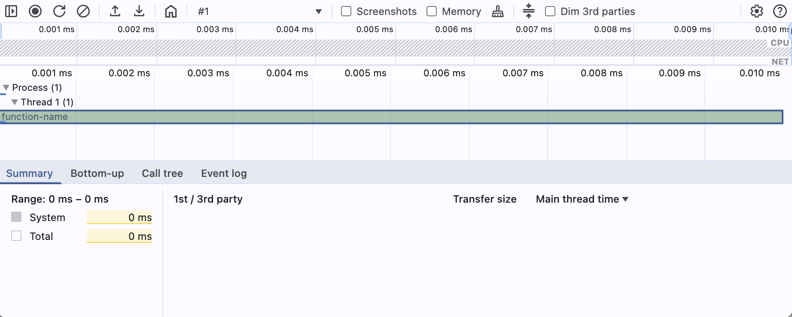
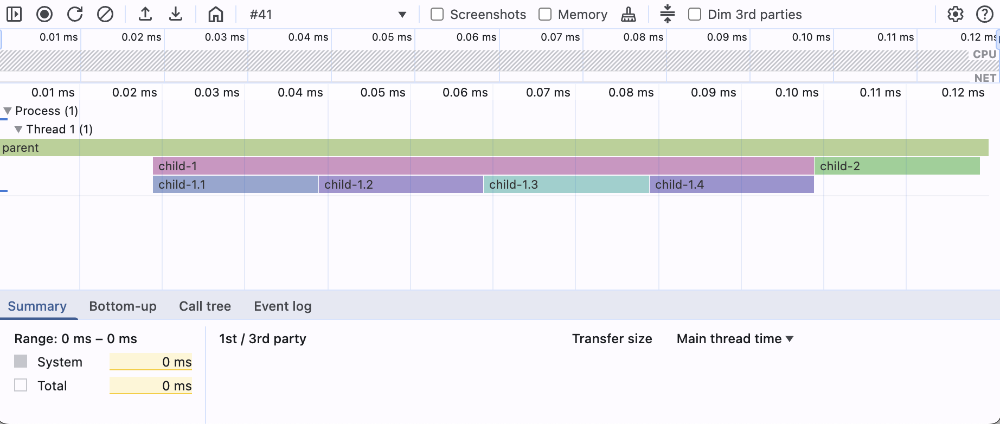
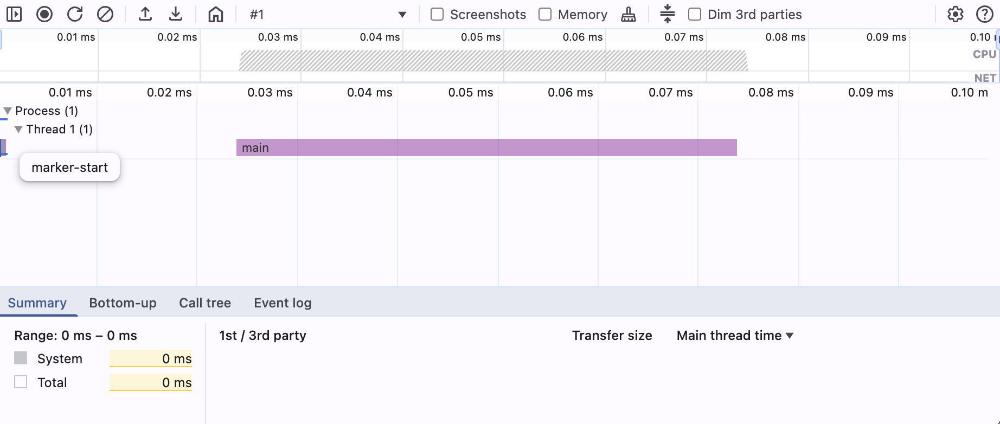
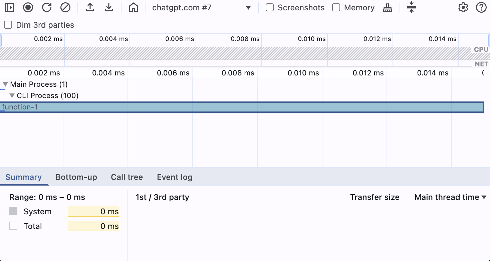

# Chrome DevTools Trace Event Profiling

Chrome DevTools Trace Event TypeScript Definitions
=================================================

---

## Loading a profile

**In practice, when DevTools loads your JSON it:**
1. Reads the initialBreadcrumb window to set the zoomed-in range.
2. Applies any hidden/expandable rules.
3. Groups events into tracks by their cat value.
4. Renders slices for all X events, vertical lines for all R marks, and counter graphs for C events.


## Top-Level Minimal Trace File Structure

A trace file can be either a JSON array of events or an object containing a traceEvents array and additional metadata.
We define a union type `TraceFile` to accept both:

```
/** Union of top-level trace file formats: Array vs Object form */
export type TraceFile = TraceEvent[] | TraceEventContainer;

/** JSON Object format (with traceEvents and optional metadata): */
export interface TraceEventContainer {
traceEvents: TraceEvent[];               // All trace event entries
}
```

## Minimal Trace Profile with Duration Events

**Profile content:**

```json
{
  "traceEvents": [
    {
      "ph": "X",
      "name": "function-name",
      "pid": 1,
      "tid": 1,
      "dur": 10,
      "ts": 1
    }
  ]
}
```

**DevTools Performance Tab:**


---

## Base Event Interface and Common Fields

All trace events share some common fields like `pid`, `tid`, `ts`, etc. We define a base interface `TraceEventBase` for
these:

```
/** Base interface for common trace event fields */
interface TraceEventBase {
  ph: Phase;                   // Event phase (type)
  name?: string;               // Event name (optional for some events)
  cat?: string;                // Event category tag(s)
  pid?: number;                // Process ID that emitted the event
  tid?: number;                // Thread ID that emitted the event
  ts: number;                  // Timestamp (microseconds)
  tts?: number;                // Thread clock timestamp (microseconds, optional)
  args?: Record<string, any>;  // Event arguments (phase-specific)
  dur?: number;                // Duration (for 'X' complete events)
  tdur?: number;               // Thread-duration (for 'X' events)
  /** Optional stack trace fields (for events that can carry stack info) */
  sf?: string | number;        // Stack frame ID (to reference stackFrames dictionary)
  stack?: Array<string|number>;// Full stack trace frame IDs (alternative to sf)
  cname?: string;              // Optional color name for event display
}
```

@TODO move notes

Notes:

- `dur`/`tdur` are only valid for Complete events (`ph = 'X'`) to specify elapsed time.
- The `sf`/`stack` fields optionally attach a stack trace to an event by referencing entries in the `stackFrames`
  dictionary.
- The `cname` field can assign a predefined color name to the event in the viewer.

---

## Event Phase and Scope Enumerations

Each trace event has a one-letter phase (`ph`) indicating its type.  
We define a union of all allowed phase codes (excluding legacy/deprecated):

| Phase               | Description                         | Support | Visible in DevTools |
|---------------------|-------------------------------------|---------|---------------------|
| **Duration Events** |                                     |         |                     |
| `X`                 | Complete event (begin + end in one) | ✅       | 👁                  |
| `B`                 | Duration begin                      | ⚠️      | 🚫                  |
| `E`                 | Duration end                        | ⚠️      | 🚫                  |
| **Instant Events**  |                                     |         |                     |
| `I`                 | Instant event                       | ✅       | 👁                  |
| **Counter Events**  |                                     |         |                     |
| `C`                 | Counter event                       | ✅       | 🚫                  |
| **Async Events**    |                                     |         |                     |
| `b`                 | Async begin (nestable)              | ✅       | 🚫                  |
| `n`                 | Async instant (nestable)            | ✅       | 🚫                  |
| `e`                 | Async end (nestable)                | ✅       | 🚫                  |
| **Flow Events**     |                                     |         |                     |
| `s`                 | Flow start                          | ✅       | 🚫                  |
| `t`                 | Flow step                           | ✅       | 🚫                  |
| `f`                 | Flow end                            | ✅       | 🚫                  |
| **Sample Events**   |                                     |         |                     |
| `P`                 | Sample event                        | ✅       | 👁                  |
| **Object Events**   |                                     |         |                     |
| `N`                 | Object created                      | ✅       | 🚫                  |
| `O`                 | Object snapshot                     | ✅       | 🚫                  |
| `D`                 | Object destroyed                    | ✅       | 🚫                  |
| **Metadata Events** |                                     |         |                     |
| `M`                 | Metadata event                      | ✅       | 👁                  |

---

### Duration Events

```

/** Complete Event (ph='X') – combined begin/end in one event */
export interface CompleteEvent extends TraceEventBase {
ph: 'X';
name: string;
dur: number; // Duration of the event (microseconds)
tdur?: number; // Thread-duration (optional)
}

```

**Profile content:**

```json
{
  "traceEvents": [
    {
      "ph": "X",
      "name": "parent",
      "pid": 1,
      "tid": 1,
      "dur": 120,
      "ts": 1
    },
    {
      "ph": "X",
      "name": "child-1",
      "pid": 1,
      "tid": 1,
      "dur": 80,
      "ts": 20
    },
    {
      "ph": "X",
      "name": "child-2",
      "pid": 1,
      "tid": 1,
      "dur": 20,
      "ts": 100
    },
    {
      "ph": "X",
      "name": "child-1.1",
      "pid": 1,
      "tid": 1,
      "dur": 20,
      "ts": 20
    },
    {
      "ph": "X",
      "name": "child-1.2",
      "pid": 1,
      "tid": 1,
      "dur": 20,
      "ts": 40
    },
    {
      "ph": "X",
      "name": "child-1.3",
      "pid": 1,
      "tid": 1,
      "dur": 20,
      "ts": 60
    },
    {
      "ph": "X",
      "name": "child-1.4",
      "pid": 1,
      "tid": 1,
      "dur": 20,
      "ts": 80
    }
  ]
}
```

**DevTools Performance Tab:**



---

### Instant Events

For instant events (`ph: 'I'`), a scope field `s` specifies whether the instant is thread, process, or global in scope.
We define an `InstantScope` type for this:

```
/** Scope values for instant events (ph='i') */
export type InstantScope = 't' | 'p' | 'g';  // 't'=thread, 'p'=process, 'g'=global
```

```
/** Instant Event (ph='i') – momentary event with scope */
export interface InstantEvent extends TraceEventBase {
  ph: 'I';
  name: string;
  s?: InstantScope;       // Scope: 't','p','g' (thread default if omitted)
}
```

Here's an example of a minimal trace profile with instant events as well as 1 completed duration event centered in the
trace.

**Profile content:**

```json
{
  "traceEvents": [
    {
      "ph": "I",
      "name": "marker-start",
      "pid": 1,
      "tid": 1,
      "ts": 1
    },
    {
      "ph": "X",
      "name": "main",
      "pid": 1,
      "tid": 1,
      "dur": 50,
      "ts": 25
    },
    {
      "ph": "I",
      "name": "marker-end",
      "pid": 1,
      "tid": 1,
      "ts": 100
    }
  ]
}
```

**DevTools Performance Tab:**


Instant events default to thread scope if `s` is omitted.

### Counter Events

```
/** Counter Event (ph='C') – tracks one or more numeric values over time */
export interface CounterEvent extends TraceEventBase {
  ph: 'C';
  name: string;
  id?: EventID;           // Optional counter ID
  args: { [series: string]: number };  // Key-value pairs of series names to values
}
```

@TODO: check if they are visible in DevTools

### Async (Nestable) Events

```
/** Async Nestable Begin (ph='b') – start of an async operation */
export interface AsyncBeginEvent extends TraceEventBase {
  ph: 'b';
  name: string;
  id?: EventID;
  id2?: EventID2;
  scope?: string;         // Optional scope string to avoid ID conflicts
}

/** Async Nestable Instant (ph='n') – instantaneous event in an async operation */
export interface AsyncInstantEvent extends TraceEventBase {
ph: 'n';
name: string;
id?: EventID;
id2?: EventID2;
scope?: string;
}

/** Async Nestable End (ph='e') – end of an async operation */
export interface AsyncEndEvent extends TraceEventBase {
ph: 'e';
name?: string;          // Name usually optional (matches the begin event)
id?: EventID;
id2?: EventID2;
scope?: string;
}
```

@TODO: check if they are visible in DevTools

### Flow Events

```
/** Flow Start event (ph='s') – indicates the beginning of a flow */
export interface FlowStartEvent extends TraceEventBase {
  ph: 's';
  name: string;
  id?: EventID;
  id2?: EventID2;
}

/** Flow Step event (ph='t') – intermediate step in a flow */
export interface FlowStepEvent extends TraceEventBase {
ph: 't';
name: string;
id?: EventID;
id2?: EventID2;
}

/** Flow End event (ph='f') – termination of a flow */
export interface FlowEndEvent extends TraceEventBase {
ph: 'f';
name: string;
id?: EventID;
id2?: EventID2;
}
```

**Profile content:**

```json
{
  "traceEvents": [
    {
      "ph": "I",
      "name": "marker-start",
      "pid": 1,
      "tid": 1,
      "ts": 1
    },
    {
      "ph": "s",
      "name": "user-click-flow",
      "id": 42,
      "pid": 1,
      "tid": 1,
      "ts": 10
    },
    {
      "ph": "t",
      "name": "user-click-flow",
      "id": 42,
      "pid": 1,
      "tid": 1,
      "ts": 15
    },
    {
      "ph": "f",
      "name": "user-click-flow",
      "id": 42,
      "pid": 1,
      "tid": 1,
      "ts": 20
    },
    {
      "ph": "I",
      "name": "marker-end",
      "pid": 1,
      "tid": 1,
      "ts": 100
    }
  ]
}
```

**DevTools Performance Tab:**
@TODO: add image

### Sample Events

```
/** Sample Event (ph='P') – a sampling profiler event (e.g. CPU sample) */
export interface SampleEvent extends TraceEventBase {
  ph: 'P';
  name: string;
  id?: EventID;
  id2?: EventID2;
}

/** Special case: Profile start event (often ph='P', name='Profile') */
export interface ProfileEvent extends SampleEvent {
name: 'Profile';
args: {
data: { startTime: number, [key: string]: any }
};
}

/** Special case: Profile data chunk event (ph='P', name='ProfileChunk') */
export interface ProfileChunkEvent extends SampleEvent {
name: 'ProfileChunk';
args: {
data: { cpuProfile: any, timeDeltas?: number[], [key: string]: any }
};
}
```

### Object Events

```
/** Object Created event (ph='N') – an object instance is created */
export interface ObjectCreatedEvent extends TraceEventBase {
  ph: 'N';
  name: string;
  id: EventID;
}

/** Object Snapshot event (ph='O') – state snapshot of an object */
export interface ObjectSnapshotEvent extends TraceEventBase {
ph: 'O';
name: string;
id: EventID;
args: { snapshot: any };
}

/** Object Destroyed event (ph='D') – an object is destroyed/freed */
export interface ObjectDestroyedEvent extends TraceEventBase {
ph: 'D';
name: string;
id: EventID;
}
```

**Profile content:**

```json
{
  "traceEvents": [
    {
      "ph": "N",
      "name": "MyWidget",
      "id": "widget-123",
      "pid": 1,
      "tid": 1,
      "ts": 10
    },
    {
      "ph": "O",
      "name": "MyWidget",
      "id": "widget-123",
      "pid": 1,
      "tid": 1,
      "ts": 15,
      "args": {
        "snapshot": {
          "width": 200,
          "height": 100,
          "color": "blue"
        }
      }
    },
    {
      "ph": "D",
      "name": "MyWidget",
      "id": "widget-123",
      "pid": 1,
      "tid": 1,
      "ts": 20
    }
  ]
}
```

> **Note**
> DevTools Performance Tab omits object-lifecycle events entirely.

### Metadata Events

```
interface MetadataEventBase extends TraceEventBase {
  ph: 'M';
  pid?: number;
  tid?: number;
}

export interface ProcessNameEvent extends MetadataEventBase {
name: 'process_name';
args: { name: string };
}
export interface ThreadNameEvent extends MetadataEventBase {
name: 'thread_name';
args: { name: string };
}
```

**Profile content:**

```json
{
  "traceEvents": [
    {
      "ph": "M",
      "name": "process_name",
      "pid": 1,
      "args": {
        "name": "renderer"
      }
    },
    {
      "ph": "M",
      "name": "thread_name",
      "pid": 1,
      "tid": 100,
      "args": {
        "name": "MainThread"
      }
    }
  ]
}
```

**DevTools Performance Tab:**


---

## Lanes


## Stack Frame and Sample Data Types

When stack traces are recorded, trace files can include a `stackFrames` dictionary mapping stack frame IDs to details. A
`StackFrame` object typically contains:

```
/** Stack frame information for stackFrames dictionary entries */
export interface StackFrame {
  name?: string;       // Function or symbol name for this frame
  category?: string;   // Category or module of the frame
  file?: string;       // Source file URL or script name
  line?: number;       // Line number in source
  column?: number;     // Column number in source
  parent?: string;     // ID of the parent frame
}
```

The optional `samples` array contains sampled stack events that augment the timeline:

```
/** Sampling profiler data record (for top-level samples array) */
export interface Sample {
  cpu?: number;        // CPU core number where sample was taken
  name: string;        // Name of the sample (e.g., event or function name)
  ts: number;          // Timestamp of the sample
  pid: number;         // Process ID
  tid: number;         // Thread ID
  weight?: number;     // Sample weight
  sf?: string;         // Stack frame ID
  stack?: string[];    // Full stack frame ID array
}
```

---

### Usage

These types can be used to validate and build trace data in TypeScript. For example, a trace parsed as `TraceFile` will
be correctly typed whether it's an array or an object with metadata. Each event in `traceEvents` will be narrowed based
on its `ph` field, enabling strict access to the appropriate fields. This helps ensure any generated trace JSON conforms
to Chrome's Trace Event format specifications.

---

### Sources

- Chrome Trace Event Format documentation
- Chromium source (`trace_event_common.h`) definitions
- DevTools trace export examples (Profile events, etc.)
- Catapult Trace Event Format spec (Google Doc)

---

`dur`: 1313
The wall-clock duration of the event—i.e. it ran for 1 313 μs from start to finish.

`tdur`: 3249
The thread-clock duration, measuring CPU time on that thread—3 249 μs here, which can exceed `dur` if the work was
parallelized or preempted.

{
"args": {},
"cat": "v8",
"dur": 10,
"name": "CpuProfiler::StartProfiling",
"ph": "I",
"pid": 10001,
"tid": 20001,
"ts": 100000000000
},

{
"args": {},
"cat": "v8",
"dur": 10,
"name": "CpuProfiler::EndProfiling",
"ph": "I",
"pid": 10001,
"tid": 20001,
"ts": 100000000210
},
