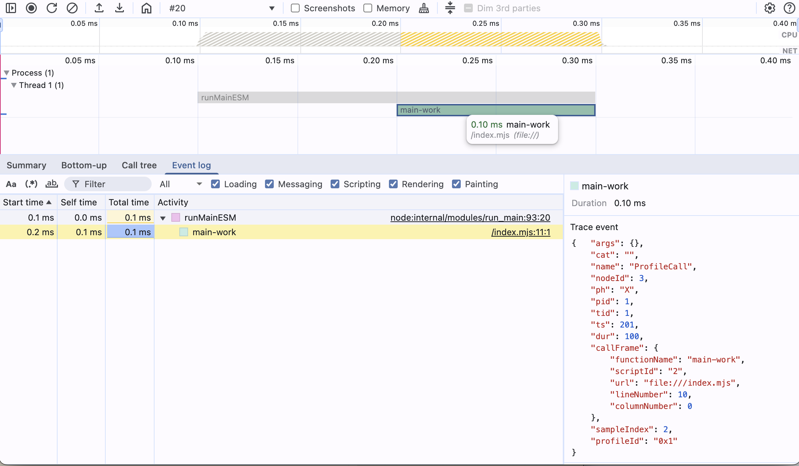
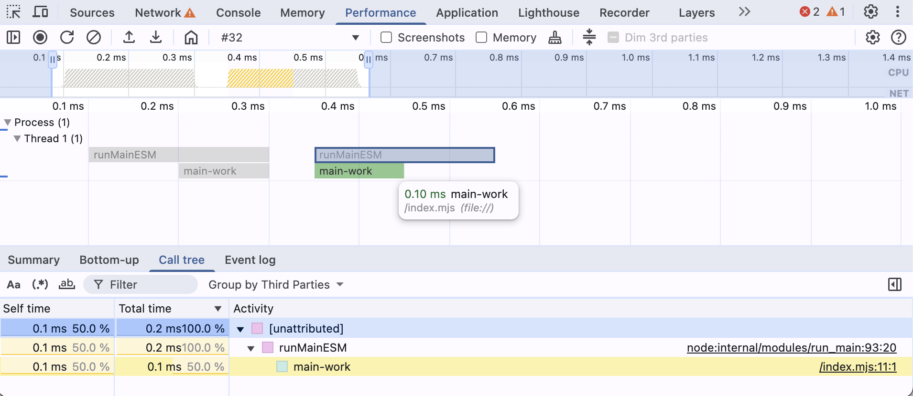

# Chrome DevTools Trace Event Profiling

Chrome DevTools Trace Event TypeScript Definitions
=================================================

---

## Loading a profile

**In practice, when DevTools loads your JSON it:**
1. Reads the initialBreadcrumb window to set the zoomed-in range.
2. Applies any hidden/expandable rules.
3. Groups events into tracks by their cat value.
4. Renders slices for all X events, vertical lines for all R marks, and counter graphs for C events.


## Top-Level Minimal Trace File Structure

A trace file can be either a JSON array of events or an object containing a traceEvents array and additional metadata.
We define a union type `TraceFile` to accept both:

```
/** Union of top-level trace file formats: Array vs Object form */
export type TraceFile = TraceEvent[] | TraceEventContainer;

/** JSON Object format (with traceEvents and optional metadata): */
export interface TraceEventContainer {
traceEvents: TraceEvent[];               // All trace event entries
}
```

## Minimal Trace Profile with Duration Events

**Profile content:**

```json
{
  "traceEvents": [
    {
      "ph": "X",
      "name": "function-name",
      "pid": 1,
      "tid": 1,
      "dur": 10,
      "ts": 1
    }
  ]
}
```

**DevTools Performance Tab:**


---

## PID and TID

Every trace event has a `pid` and `tid` field. The DevTools performance panel will group events by those 2 IDs and nest them accordingly.

**Profile content:**

```json
{
  "traceEvents": [
    {
      "dur": 10,
      "name": "function-1-1",
      "ph": "X",
      "pid": 1,
      "tid": 1,
      "ts": 10
    },
    {
      "dur": 10,
      "name": "function-1-2",
      "ph": "X",
      "pid": 1,
      "tid": 2,
      "ts": 1
    },
    {
      "dur": 5,
      "name": "child-1-2",
      "ph": "X",
      "pid": 1,
      "tid": 2,
      "ts": 5
    },
    {
      "dur": 10,
      "name": "function-2-1",
      "ph": "X",
      "pid": 2,
      "tid": 1,
      "ts": 5
    },
    {
      "dur": 5,
      "name": "function-2-2",
      "ph": "X",
      "pid": 2,
      "tid": 2,
      "ts": 7
    }
  ]
}
```

**DevTools Performance Tab:**


## Base Event Interface and Common Fields

All trace events share some common fields like `pid`, `tid`, `ts`, etc. We define a base interface `TraceEventBase` for
these:

```
/** Base interface for common trace event fields */
interface TraceEventBase {
  ph: Phase;                   // Event phase (type)
  name?: string;               // Event name (optional for some events)
  cat?: string;                // Event category tag(s)
  pid?: number;                // Process ID that emitted the event
  tid?: number;                // Thread ID that emitted the event
  ts: number;                  // Timestamp (microseconds)
  tts?: number;                // Thread clock timestamp (microseconds, optional)
  args?: Record<string, any>;  // Event arguments (phase-specific)
  dur?: number;                // Duration (for 'X' complete events)
  tdur?: number;               // Thread-duration (for 'X' events)
  /** Optional stack trace fields (for events that can carry stack info) */
  sf?: string | number;        // Stack frame ID (to reference stackFrames dictionary)
  stack?: Array<string|number>;// Full stack trace frame IDs (alternative to sf)
  cname?: string;              // Optional color name for event display
}
```

@TODO move notes

**Notes:**

- The `sf`/`stack` fields optionally attach a stack trace to an event by referencing entries in the `stackFrames`
  dictionary.
- The `cname` field can assign a predefined color name to the event in the viewer.

---

## Event Phase and Scope Enumerations

Each trace event has a one-letter phase (`ph`) indicating its type.  
We define a union of all allowed phase codes (excluding legacy/deprecated):

| Phase               | Description                         | Support | Visible in DevTools |
|---------------------|-------------------------------------|---------|---------------------|
| **Duration Events** |                                     |         |                     |
| `X`                 | Complete event (begin + end in one) | ✅       | 👁                  |
| `B`                 | Duration begin                      | ⚠️      | 🚫                  |
| `E`                 | Duration end                        | ⚠️      | 🚫                  |
| **Instant Events**  |                                     |         |                     |
| `I`                 | Instant event                       | ✅       | 👁                  |
| **Counter Events**  |                                     |         |                     |
| `C`                 | Counter event                       | ✅       | 🚫                  |
| **Async Events**    |                                     |         |                     |
| `b`                 | Async begin (nestable)              | ✅       | 🚫                  |
| `n`                 | Async instant (nestable)            | ✅       | 🚫                  |
| `e`                 | Async end (nestable)                | ✅       | 🚫                  |
| **Flow Events**     |                                     |         |                     |
| `s`                 | Flow start                          | ✅       | 🚫                  |
| `t`                 | Flow step                           | ✅       | 🚫                  |
| `f`                 | Flow end                            | ✅       | 🚫                  |
| **Sample Events**   |                                     |         |                     |
| `P`                 | Sample event                        | ✅       | 👁                  |
| **Object Events**   |                                     |         |                     |
| `N`                 | Object created                      | ✅       | 🚫                  |
| `O`                 | Object snapshot                     | ✅       | 🚫                  |
| `D`                 | Object destroyed                    | ✅       | 🚫                  |
| **Metadata Events** |                                     |         |                     |
| `M`                 | Metadata event                      | ✅       | 👁                  |

---

### Duration Events


Duration events are by default visible in the panel. They maintain start end end turation information. 

We skip beginning and end events as there is more research to do on my side.

```
/** Complete Event (ph='X') – combined begin/end in one event */
export interface CompleteEvent extends TraceEventBase {
ph: 'X';
name: string;
dur: number; // Duration of the event (microseconds)
tdur?: number; // Thread-duration (optional)
}
```

The properties `dur`/`tdur` are only valid for Complete events (`ph = 'X'`) to specify elapsed time. Events (of the same `pid` and `tid`) are automatically nested based on `ts` and `dur`.

**Profile content:**

```json
{
  "traceEvents": [
    {
      "ph": "X",
      "name": "parent",
      "pid": 1,
      "tid": 1,
      "dur": 120,
      "ts": 1
    },
    {
      "ph": "X",
      "name": "child-1",
      "pid": 1,
      "tid": 1,
      "dur": 80,
      "ts": 20
    },
    {
      "ph": "X",
      "name": "child-2",
      "pid": 1,
      "tid": 1,
      "dur": 20,
      "ts": 100
    },
    {
      "ph": "X",
      "name": "child-1.1",
      "pid": 1,
      "tid": 1,
      "dur": 20,
      "ts": 20
    },
    {
      "ph": "X",
      "name": "child-1.2",
      "pid": 1,
      "tid": 1,
      "dur": 20,
      "ts": 40
    },
    {
      "ph": "X",
      "name": "child-1.3",
      "pid": 1,
      "tid": 1,
      "dur": 20,
      "ts": 60
    },
    {
      "ph": "X",
      "name": "child-1.4",
      "pid": 1,
      "tid": 1,
      "dur": 20,
      "ts": 80
    }
  ]
}
```

**DevTools Performance Tab:**


---

### Instant Events

For instant events (`ph: 'I'`), a scope field `s` specifies whether the instant is thread, process, or global in scope.
We define an `InstantScope` type for this:

```
/** Scope values for instant events (ph='i') */
export type InstantScope = 't' | 'p' | 'g';  // 't'=thread, 'p'=process, 'g'=global
```

```
/** Instant Event (ph='i') – momentary event with scope */
export interface InstantEvent extends TraceEventBase {
  ph: 'I';
  name: string;
  s?: InstantScope;       // Scope: 't','p','g' (thread default if omitted)
}
```

Here's an example of a minimal trace profile with instant events as well as 1 completed duration event centered in the
trace.

**Profile content:**

```json
{
  "traceEvents": [
    {
      "ph": "I",
      "name": "marker-start",
      "pid": 1,
      "tid": 1,
      "ts": 1
    },
    {
      "ph": "X",
      "name": "main",
      "pid": 1,
      "tid": 1,
      "dur": 50,
      "ts": 25
    },
    {
      "ph": "I",
      "name": "marker-end",
      "pid": 1,
      "tid": 1,
      "ts": 100
    }
  ]
}
```

**DevTools Performance Tab:**


Instant events default to thread scope if `s` is omitted.

> **Note**
> Instant events are used to mark the beginning and end of a trace.
> This is important to know when you are looking at the trace in DevTools.
> Specific trace events will not be visible in DevTools if it does not have an instant event at the beginning and end.

In the followingI will list all relevant instant events that i discovered so far:

- `CpuProfiler::StartProfiling`
- `CpuProfiler::StopProfiling`
- `TracingStartedInBrowser`
- `TracingStartedInRenderer`
- `TracingStartedInProcess`
- `TracingStarted`

#### CpuProfiler::StartProfiling and CpuProfiler::StopProfiling

The example below focuses on the `CpuProfiler::StartProfiling` and `CpuProfiler::StopProfiling` events. The proile chunk event render, but are incomplete. 
Profile and ProfileChunk events are not visible in DevTools if there is no `CpuProfiler::StartProfiling` event before the start of the CPU profile. The `CpuProfiler::StopProfiling` event is optional.

Read more about Profile and ProfileChunk events in the [Phases - Sample Events](#sample-events) section documentation.

**Profile content:**

```json
{
    "traceEvents": [
      {
        "cat": "disabled-by-default-v8",
        "name": "CpuProfiler::StartProfiling",
        "dur": 0,
        "ph": "I",
        "pid": 1,
        "tid": 1,
        "ts": 1,
        "args": {
          "data": {
            "startTime": 1
          }
        }
      },
      {
        "cat": "disabled-by-default-v8.cpu_profiler",
        "id": "0x1",
        "name": "Profile",
        "ph": "P",
        "pid": 1,
        "tid": 1,
        "ts": 1,
        "args": {
          "data": {
            "startTime": 1
          }
        }
      },
      {
        "cat": "disabled-by-default-v8.cpu_profiler",
        "name": "ProfileChunk",
        "id": "0x1",
        "ph": "P",
        "pid": 1,
        "tid": 1,
        "ts": 0,
        "args": {
          "data": {
            "cpuProfile": {
              "nodes": [
                {
                  "id": 1,
                  "callFrame": {},
                  "children": [2]
                },
                {
                  "id": 2,
                  "callFrame": {}
                }
             ],
              "samples": [2]
            },
            "timeDeltas": [10]
          }
        }
      },
      {
        "cat": "disabled-by-default-v8",
        "name": "CpuProfiler::StopProfiling",
        "dur": 0,
        "ph": "I",
        "pid": 1,
        "tid": 1,
        "ts": 20,
        "args": {
          "data": {
            "endTime": 20
          }
        }
      }
    ]
}
```

**DevTools Performance Tab:**


#### TracingStartedInBrowser

The example below focuses on the `TracingStartedInBrowser` event.

The content of the profile contains:
- `TracingStartedInBrowser` - The event that starts the tracing.
- `RunTask` - A `CompletedTraceEvent` with `RunTask` as  `name` 
  - `pid`:1, `tid`: 1, `ts`: 10, `dur`: 10
- `RunTask` - A `CompletedTraceEvent` with `RunTask` as  `name` 
  - `pid`:1, `tid`: 2, `ts`: 1, `dur`: 10
- `RunTask` - A `CompletedTraceEvent` with `RunTask` as  `name` 
  - `pid`:2, `tid`: 2, `ts`: 1, `dur`: 10

Without the `TracingStartedInBrowser` event, the DevTools will display:
- Process 1
  - Thread 1 `-X`
  - Thread 2 `X-`
- Process 2
  - Thread 1 `X-`

Adding the `TracingStartedInBrowser` event will display:
- Process 1
  - Thread 1 `-X`
  - Thread 2 `X-`

Also the events have now the highlighting we know and love form recorded traces in the browser.

**Profile content:**

```json
{
  "traceEvents": [
    {
      "cat": "devtools.timeline",
      "name": "TracingStartedInBrowser",
      "ph": "i",
      "pid": 1,
      "tid": 1,
      "ts": 1,
      "s": "t",
      "args": {
        "data": {
          "frames": [
            {
              "processId": 1,
              "url": "file://has-to-be-a-valid-URL-pattern"
            }
          ]
        }
      }
    },
    {
      "args": {},
      "cat": "disabled-by-default-devtools.timeline",
      "dur": 10,
      "name": "RunTask",
      "ph": "X",
      "pid": 1,
      "tid": 1,
      "ts": 10
    },
    {
      "args": {},
      "cat": "disabled-by-default-devtools.timeline",
      "dur": 10,
      "name": "RunTask",
      "ph": "X",
      "pid": 1,
      "tid": 2,
      "ts": 1
    },
    {
      "args": {},
      "cat": "disabled-by-default-devtools.timeline",
      "dur": 10,
      "name": "(program)",
      "ph": "X",
      "pid": 2,
      "tid": 2,
      "ts": 1
    }
  ]
}
```

**DevTools Performance Tab:**

| No tracing started in browser | Tracing started in bowser |
|--------------------------------|---------------------------|
|  |  |

### Counter Events

```
/** Counter Event (ph='C') – tracks one or more numeric values over time */
export interface CounterEvent extends TraceEventBase {
  ph: 'C';
  name: string;
  id?: EventID;           // Optional counter ID
  args: { [series: string]: number };  // Key-value pairs of series names to values
}
```

@TODO: check if they are visible in DevTools

### Async (Nestable) Events

```
/** Async Nestable Begin (ph='b') – start of an async operation */
export interface AsyncBeginEvent extends TraceEventBase {
  ph: 'b';
  name: string;
  id?: EventID;
  id2?: EventID2;
  scope?: string;         // Optional scope string to avoid ID conflicts
}

/** Async Nestable Instant (ph='n') – instantaneous event in an async operation */
export interface AsyncInstantEvent extends TraceEventBase {
ph: 'n';
name: string;
id?: EventID;
id2?: EventID2;
scope?: string;
}

/** Async Nestable End (ph='e') – end of an async operation */
export interface AsyncEndEvent extends TraceEventBase {
ph: 'e';
name?: string;          // Name usually optional (matches the begin event)
id?: EventID;
id2?: EventID2;
scope?: string;
}
```

@TODO: check if they are visible in DevTools

### Flow Events

```
/** Flow Start event (ph='s') – indicates the beginning of a flow */
export interface FlowStartEvent extends TraceEventBase {
  ph: 's';
  name: string;
  id?: EventID;
  id2?: EventID2;
}

/** Flow Step event (ph='t') – intermediate step in a flow */
export interface FlowStepEvent extends TraceEventBase {
ph: 't';
name: string;
id?: EventID;
id2?: EventID2;
}

/** Flow End event (ph='f') – termination of a flow */
export interface FlowEndEvent extends TraceEventBase {
ph: 'f';
name: string;
id?: EventID;
id2?: EventID2;
}
```

**Profile content:**

```json
{
  "traceEvents": [
    {
      "ph": "I",
      "name": "marker-start",
      "pid": 1,
      "tid": 1,
      "ts": 1
    },
    {
      "ph": "s",
      "name": "user-click-flow",
      "id": 42,
      "pid": 1,
      "tid": 1,
      "ts": 10
    },
    {
      "ph": "t",
      "name": "user-click-flow",
      "id": 42,
      "pid": 1,
      "tid": 1,
      "ts": 15
    },
    {
      "ph": "f",
      "name": "user-click-flow",
      "id": 42,
      "pid": 1,
      "tid": 1,
      "ts": 20
    },
    {
      "ph": "I",
      "name": "marker-end",
      "pid": 1,
      "tid": 1,
      "ts": 100
    }
  ]
}
```

**DevTools Performance Tab:**
@TODO: add image

### Sample Events

If you ever wondered what is the best way to get a CPU profile into DevTools, this is your place. The Profile and ProfileChunk events are here to visualize CPU profile chunks into DevTools process threads.

```
/** Sample Event (ph='P') – a sampling profiler event (e.g. CPU sample) */
export interface SampleEvent extends TraceEventBase {
  ph: 'P';
  name: string;
  id?: EventID;
  id2?: EventID2;
}

/** Special case: Profile start event (often ph='P', name='Profile') */
export interface ProfileEvent extends SampleEvent {
name: 'Profile';
args: {
data: { startTime: number, [key: string]: any }
};
}

/** Special case: Profile data chunk event (ph='P', name='ProfileChunk') */
export interface ProfileChunkEvent extends SampleEvent {
name: 'ProfileChunk';
args: {
data: { cpuProfile: any, timeDeltas?: number[], [key: string]: any }
};
}
```

As CpuProfiles require a couple of additional events to be present in the trace.

In the example contains:
- `CpuProfiler::StartProfiling` - Start the CPU profiler.
- `Profile` - Register the profile chunk stream.
- `ProfileChunk` - Add a profile chunk to the stream.
- `CpuProfiler::StopProfiling` - Stop the CPU profiler.

Here we only focus on ProfileChunk events. To read about the other events, please refer to the [CpuProfiler::StartProfiling and CpuProfiler::StopProfiling](#cpuprofilerstartprofiling-and-cpuprofilerstopprofiling) section.

**Profile content:**

```json
{
  "traceEvents": [
    {
      "cat": "disabled-by-default-v8",
      "name": "CpuProfiler::StartProfiling",
      "ph": "I",
      "pid": 1,
      "tid": 1,
      "ts": 1,
      "args": {
        "data": {
          "startTime": 1
        }
      }
    },
    {
      "cat": "disabled-by-default-v8.cpu_profiler",
      "id": "0x1",
      "name": "Profile",
      "ph": "P",
      "pid": 1,
      "tid": 1,
      "ts": 1,
      "args": {
        "data": {
          "startTime": 1
        }
      }
    },
    {
      "cat": "disabled-by-default-v8.cpu_profiler",
      "name": "ProfileChunk",
      "id": "0x1",
      "ph": "P",
      "pid": 1,
      "tid": 1,
      "ts": 1,
      "args": {
        "data": {
          "cpuProfile": {
            "nodes": [
              {
                "id": 1,
                "callFrame": {
                  "functionName": "(root)",
                  "scriptId": "0",
                  "url": "",
                  "lineNumber": -1,
                  "columnNumber": -1
                },
                "children": [
                  2
                ]
              },
              {
                "id": 2,
                "callFrame": {
                  "functionName": "runMainESM",
                  "scriptId": "1",
                  "url": "node:internal/modules/run_main",
                  "lineNumber": 92,
                  "columnNumber": 19
                },
                "children": [
                  3
                ]
              },
              {
                "id": 3,
                "callFrame": {
                  "functionName": "main-work",
                  "scriptId": "2",
                  "url": "file:///index.mjs",
                  "lineNumber": 10,
                  "columnNumber": 0
                }
              }
            ],
            "samples": [
              1,
              2,
              3,
              3
            ]
          },
          "timeDeltas": [
            0,
            100,
            100,
            100
          ]
        }
      }
    },
    {
      "cat": "disabled-by-default-v8",
      "name": "CpuProfiler::StopProfiling",
      "ph": "I",
      "pid": 1,
      "tid": 1,
      "ts": 400,
      "args": {
        "data": {
          "endTime": 400
        }
      }
    }
  ]
}
```

**DevTools Performance Tab:**




#### Streaming Profile Chunks

As the DevTools always need to be able to process live streamed data, also ProfileChunk events are streamed.

The example below shows how a CPU profile can be scattered across multiple ProfileChunk events.

In the example contains:
- `CpuProfiler::StartProfiling` - Start the CPU profiler.
- `Profile` - Register the CPU profile to a thread.
- `ProfileChunk` - Adds only the nodes to the profile thread.
- `ProfileChunk` - Adds a sequence of samples and timeDeltas that have a complete end  to the profile thread.
- `ProfileChunk` - Adds a sequence of samples and timeDeltas to the profile thread that connects with the end of the next profile.
- `ProfileChunk` - Adds a sequence of samples and timeDeltas to the profile thread that connects with the start of the last profile.
- `CpuProfiler::StopProfiling` - Stop the CPU profiler.


**Profile content:**

```json
{
  "traceEvents": [
    {
      "cat": "disabled-by-default-v8",
      "name": "CpuProfiler::StartProfiling",
      "ph": "I",
      "dur": 0,
      "pid": 1,
      "tid": 1,
      "ts": 1
    },
    {
      "cat": "disabled-by-default-v8.cpu_profiler",
      "id": "0x1",
      "name": "Profile",
      "ph": "P",
      "pid": 1,
      "tid": 1,
      "ts": 2,
      "args": {
        "data": {
          "startTime": 1
        }
      }
    },
    {
      "cat": "disabled-by-default-v8.cpu_profiler",
      "name": "ProfileChunk",
      "id": "0x1",
      "ph": "P",
      "pid": 1,
      "tid": 1,
      "ts": 3,
      "args": {
        "data": {
          "cpuProfile": {
            "nodes": [
              {
                "id": 1,
                "callFrame": {
                  "functionName": "(root)",
                  "scriptId": "0",
                  "url": "",
                  "lineNumber": -1,
                  "columnNumber": -1
                },
                "children": [
                  2
                ]
              },
              {
                "id": 2,
                "callFrame": {
                  "functionName": "runMainESM",
                  "scriptId": "1",
                  "url": "node:internal/modules/run_main",
                  "lineNumber": 92,
                  "columnNumber": 19
                },
                "children": [
                  3
                ]
              },
              {
                "id": 3,
                "callFrame": {
                  "functionName": "main-work",
                  "scriptId": "2",
                  "url": "file:///index.mjs",
                  "lineNumber": 10,
                  "columnNumber": 0
                }
              }
            ]
          }
        }
      }
    },
    {
      "cat": "disabled-by-default-v8.cpu_profiler",
      "name": "ProfileChunk",
      "id": "0x1",
      "ph": "P",
      "pid": 1,
      "tid": 1,
      "ts": 4,
      "args": {
        "data": {
          "cpuProfile": {
            "samples": [
              1,
              2,
              3,
              3
            ]
          },
          "timeDeltas": [
            0,
            100,
            100,
            100
          ]
        }
      }
    },
    {
      "cat": "disabled-by-default-v8.cpu_profiler",
      "name": "ProfileChunk",
      "id": "0x1",
      "ph": "P",
      "pid": 1,
      "tid": 1,
      "ts": 1,
      "args": {
        "data": {
          "cpuProfile": {
            "samples": [
              1,
              3
            ]
          },
          "timeDeltas": [
            0,
            50
          ]
        }
      }
    },
    {
      "cat": "disabled-by-default-v8.cpu_profiler",
      "name": "ProfileChunk",
      "id": "0x1",
      "ph": "P",
      "pid": 1,
      "tid": 1,
      "ts": 1,
      "args": {
        "data": {
          "cpuProfile": {
            "samples": [
              3,
              2
            ]
          },
          "timeDeltas": [
            50,
            50
          ]
        }
      }
    },
    {
      "cat": "disabled-by-default-v8.cpu_profiler",
      "name": "ProfileChunk",
      "id": "0x1",
      "ph": "P",
      "pid": 1,
      "tid": 1,
      "ts": 1,
      "args": {
        "data": {
          "cpuProfile": {
            "samples": [
              2,
              2
            ]
          },
          "timeDeltas": [
            50,
            50
          ]
        }
      }
    },
    {
      "cat": "disabled-by-default-v8",
      "name": "CpuProfiler::StopProfiling",
      "ph": "I",
      "pid": 1,
      "tid": 1,
      "ts": 1400,
      "args": {
        "data": {
          "endTime": 1400
        }
      }
    }
  ]
}
```

**DevTools Performance Tab:**



In the image we see that the bottom up chart is available and correctly calculated across chunks.

### Object Events

```
/** Object Created event (ph='N') – an object instance is created */
export interface ObjectCreatedEvent extends TraceEventBase {
  ph: 'N';
  name: string;
  id: EventID;
}

/** Object Snapshot event (ph='O') – state snapshot of an object */
export interface ObjectSnapshotEvent extends TraceEventBase {
ph: 'O';
name: string;
id: EventID;
args: { snapshot: any };
}

/** Object Destroyed event (ph='D') – an object is destroyed/freed */
export interface ObjectDestroyedEvent extends TraceEventBase {
ph: 'D';
name: string;
id: EventID;
}
```

**Profile content:**

```json
{
  "traceEvents": [
    {
      "ph": "N",
      "name": "MyWidget",
      "id": "widget-123",
      "pid": 1,
      "tid": 1,
      "ts": 10
    },
    {
      "ph": "O",
      "name": "MyWidget",
      "id": "widget-123",
      "pid": 1,
      "tid": 1,
      "ts": 15,
      "args": {
        "snapshot": {
          "width": 200,
          "height": 100,
          "color": "blue"
        }
      }
    },
    {
      "ph": "D",
      "name": "MyWidget",
      "id": "widget-123",
      "pid": 1,
      "tid": 1,
      "ts": 20
    }
  ]
}
```

> **Note**
> DevTools Performance Tab omits object-lifecycle events entirely.

### Metadata Events

```
interface MetadataEventBase extends TraceEventBase {
  ph: 'M';
  pid?: number;
  tid?: number;
}

export interface ProcessNameEvent extends MetadataEventBase {
name: 'process_name';
args: { name: string };
}
export interface ThreadNameEvent extends MetadataEventBase {
name: 'thread_name';
args: { name: string };
}
```

**Profile content:**

```json
{
  "traceEvents": [
    {
      "ph": "M",
      "name": "process_name",
      "pid": 1,
      "args": {
        "name": "renderer"
      }
    },
    {
      "ph": "M",
      "name": "thread_name",
      "pid": 1,
      "tid": 100,
      "args": {
        "name": "MainThread"
      }
    }
  ]
}
```

**DevTools Performance Tab:**


#### Highliting Lanes with ThreadName metadata event

**Profile content:**

```json
    {
      "cat": "__metadata",
      "name": "thread_name",
      "ph": "M",
      "pid": 1,
      "tid": 1,
      "ts": 0,
      "args": {
        "name": "CrRendererMain"
      }
    },
```

**DevTools Performance Tab:**


---


## Stack Frame and Sample Data Types

When stack traces are recorded, trace files can include a `stackFrames` dictionary mapping stack frame IDs to details. A
`StackFrame` object typically contains:

```
/** Stack frame information for stackFrames dictionary entries */
export interface StackFrame {
  name?: string;       // Function or symbol name for this frame
  category?: string;   // Category or module of the frame
  file?: string;       // Source file URL or script name
  line?: number;       // Line number in source
  column?: number;     // Column number in source
  parent?: string;     // ID of the parent frame
}
```

The optional `samples` array contains sampled stack events that augment the timeline:

```
/** Sampling profiler data record (for top-level samples array) */
export interface Sample {
  cpu?: number;        // CPU core number where sample was taken
  name: string;        // Name of the sample (e.g., event or function name)
  ts: number;          // Timestamp of the sample
  pid: number;         // Process ID
  tid: number;         // Thread ID
  weight?: number;     // Sample weight
  sf?: string;         // Stack frame ID
  stack?: string[];    // Full stack frame ID array
}
```

`dur`: 1313
The wall-clock duration of the event—i.e. it ran for 1 313 μs from start to finish.

`tdur`: 3249
The thread-clock duration, measuring CPU time on that thread—3 249 μs here, which can exceed `dur` if the work was
parallelized or preempted.

{
"args": {},
"cat": "v8",
"dur": 10,
"name": "CpuProfiler::StartProfiling",
"ph": "I",
"pid": 10001,
"tid": 20001,
"ts": 100000000000
},

{
"args": {},
"cat": "v8",
"dur": 10,
"name": "CpuProfiler::EndProfiling",
"ph": "I",
"pid": 10001,
"tid": 20001,
"ts": 100000000210
},
